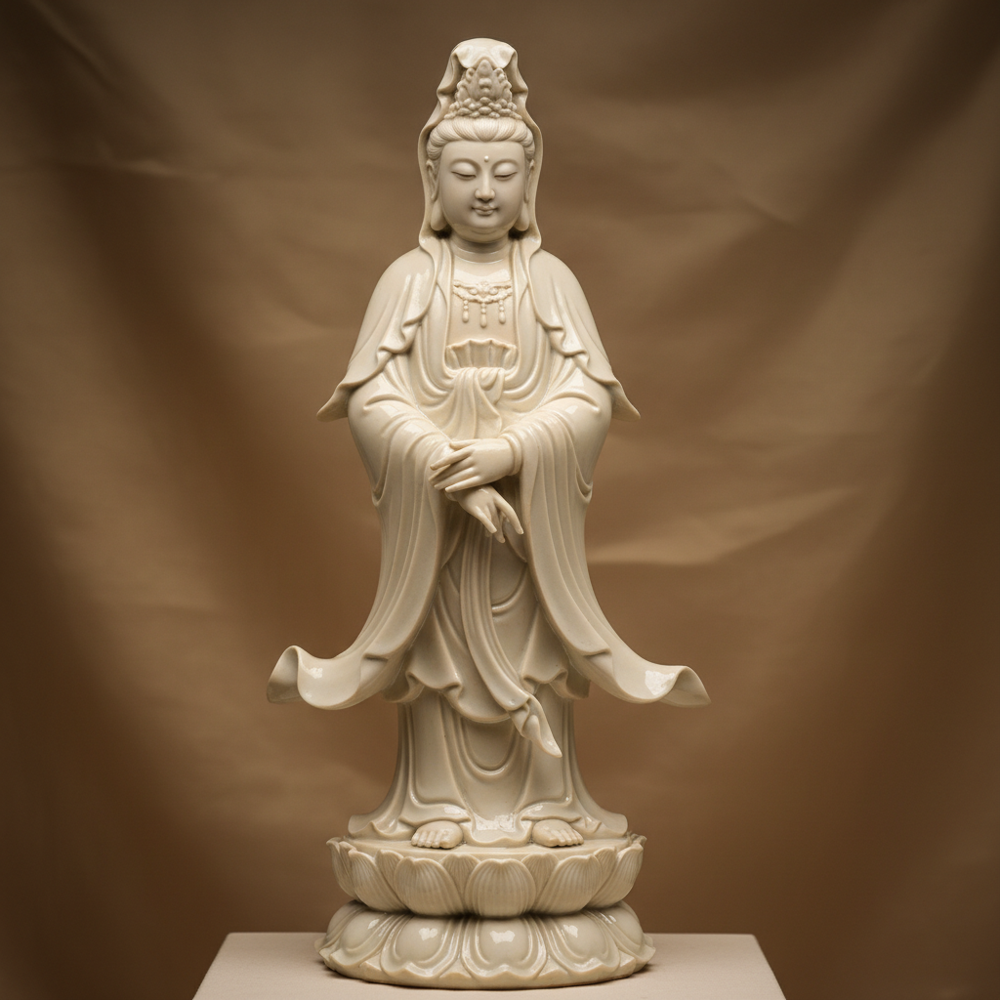

# Blanc de Chine Art 德化白瓷艺术

> "White as jade, thin as paper, bright as mirror, resonant as chime — Dehua porcelain is the purest expression of ceramic art." — Chinese porcelain tradition

## 概述

德化白瓷艺术（Blanc de Chine Art）是中国福建省德化县发展的一种以纯白色著称的瓷器艺术传统。"Blanc de Chine"（中国白）是欧洲人对德化白瓷的称呼——这个法语名称本身就说明了德化白瓷在世界陶瓷史上的独特地位。德化白瓷以其温润如玉的白色质感、精湛的雕塑技艺和独特的"象牙白"色调闻名于世。

德化白瓷的历史可追溯至宋代——但其黄金时代是明代（1368-1644年）。明代德化白瓷达到了技术和艺术的巅峰——特别是何朝宗等雕塑大师创造的观音像、达摩像等宗教雕塑，以其精湛的技艺和深邃的精神内涵成为中国陶瓷雕塑的最高成就。德化白瓷的独特之处在于其瓷土——德化当地的瓷土含铁量极低而含钾量高，烧成后呈现出温暖的乳白色或象牙白色，与景德镇的冷白色形成鲜明对比。

德化白瓷艺术的核心要素包括：1）象牙白——温暖的乳白色或象牙白色调；2）雕塑传统——精湛的瓷塑技艺；3）宗教题材——观音、达摩等宗教雕塑；4）何朝宗——明代雕塑大师的巅峰成就；5）出口传统——大量出口欧洲和东南亚；6）无装饰美学——以纯白色和造型取胜；7）当代传承——活态的传统延续。

## 核心特征

| 特征 | 描述 |
|------|------|
| 象牙白 | 温暖乳白色象牙白色调 |
| 雕塑传统 | 精湛瓷塑技艺 |
| 宗教题材 | 观音达摩宗教雕塑 |
| 何朝宗 | 明代雕塑大师巅峰 |
| 出口传统 | 大量出口欧洲东南亚 |
| 无装饰美学 | 纯白色和造型取胜 |

## 视觉特征

- **象牙白色**：温暖的乳白色调
- **玉质光泽**：如玉般的温润光泽
- **精细雕塑**：衣褶和面部的精细表现
- **薄壁透光**：薄壁处的半透明效果
- **流畅线条**：衣纹的流畅线条
- **宁静表情**：宗教雕塑的宁静神态

## 代表作品

| 作品 | 年代 | 意义 |
|------|------|------|
| *何朝宗观音像* | 明代 | 瓷塑巅峰 |
| *何朝宗达摩像* | 明代 | 宗教雕塑 |
| *德化白瓷杯* | 明清 | 日用精品 |
| *梅花杯* | 明代 | 经典器形 |
| *出口德化白瓷* | 17-18世纪 | 贸易瓷 |
| *当代德化白瓷* | 21世纪 | 传统延续 |

## 历史时间线

| 时期 | 事件 |
|------|------|
| 宋代 | 德化白瓷生产开始 |
| 元代 | 技术发展 |
| 明代 | 黄金时代，何朝宗活跃 |
| 17世纪 | 大量出口欧洲 |
| 清代 | 持续生产，风格变化 |
| 20世纪 | 传统延续和创新 |
| 2006年 | 德化瓷烧制技艺列入国家非遗 |

## 中国语境

德化白瓷是中国陶瓷艺术中最纯粹的表达之一——它不依赖彩绘或复杂的釉色，而是以纯白色的瓷质和精湛的造型取胜。德化白瓷体现了中国美学中"大道至简"的理念——在最少的装饰中追求最高的艺术境界。何朝宗的观音像被认为是中国陶瓷雕塑的最高成就——其衣纹的流畅、面部的宁静、整体的和谐达到了"技进乎道"的境界。德化白瓷在17-18世纪大量出口欧洲——深刻影响了欧洲陶瓷的发展，迈森等欧洲瓷厂都曾模仿德化白瓷的风格。2006年德化瓷烧制技艺被列入国家级非物质文化遗产——当代德化仍有大量陶瓷工匠和艺术家在延续和创新这一传统。

## 概念图

## 与其他风格的关系

- **Parian Ware** → 帕里安瓷（欧洲模仿）
- **Meissen** → 迈森瓷器（受其影响）
- **Jingdezhen** → 景德镇瓷器（中国瓷都）
- **Buddhist Sculpture** → 佛教雕塑
- **Minimalism** → 极简主义（美学共鸣）
- **Export Porcelain** → 外销瓷

---

*浮光艺志 | Chronicle of Artistry*
