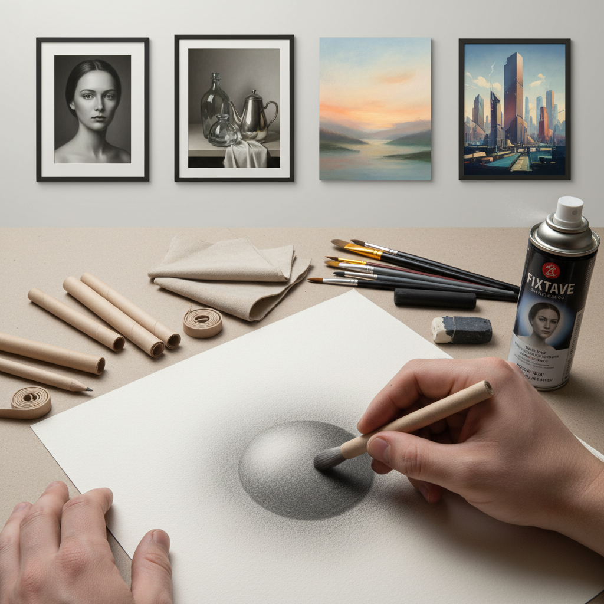

# Blending Technique 混合渐变技法

> "Blending is the art of making boundaries disappear — where one tone melts into another with such seamless grace that the eye perceives not marks or strokes, but the continuous flow of light across form." — Unknown

## 概述

混合渐变技法（Blending Technique）是绘画和素描中用于创造平滑色调过渡的技法——通过各种工具和方法将颜色或色调的边界模糊化，使明暗和色彩之间产生无缝的渐变效果。混合渐变可以使用手指、纸笔（tortillon/blending stump）、软布、刷子、溶剂等工具实现。

混合渐变技法在不同媒介中有不同的实现方式：在铅笔素描中使用纸笔或手指涂抹；在炭笔画中使用软布或纸巾；在油画中使用软毛刷或扇形笔；在粉彩画中使用手指或软布；在数字绘画中使用模糊工具或渐变笔刷。混合渐变技法的核心目标是消除可见的笔触边界，创造照片般平滑的色调过渡——这与保留笔触的印象派风格形成对比。

## 核心特征

| 特征 | 描述 |
|------|------|
| 平滑 | 平滑的色调过渡 |
| 无缝 | 消除可见边界 |
| 渐变 | 渐变的效果 |
| 工具 | 多种混合工具 |
| 写实 | 追求写实效果 |
| 柔和 | 柔和的视觉感受 |

## 视觉特征

- **平滑**：平滑的表面
- **渐变**：无缝的色调渐变
- **柔和**：柔和的边缘
- **写实**：照片般的写实感
- **无痕**：看不到笔触
- **连续**：连续的色调变化

## 代表作品

| 作品 | 艺术家 | 年代 | 意义 |
|------|--------|------|------|
| *Sfumato works* | Leonardo da Vinci | 15世纪 | 混合渐变的极致 |
| *Academic drawings* | Various | 19世纪 | 学院派素描的混合法 |
| *Photorealist paintings* | Various | 20世纪 | 超写实绘画的混合 |
| *Charcoal portraits* | Various | 当代 | 炭笔肖像的混合法 |
| *Digital paintings* | Various | 当代 | 数字绘画的混合 |

## 历史时间线

| 时期 | 事件 |
|------|------|
| 文艺复兴 | 达芬奇的sfumato技法 |
| 17世纪 | 巴洛克绘画中的混合法 |
| 19世纪 | 学院派对混合法的系统化 |
| 20世纪 | 超写实主义中的极致混合 |
| 当代 | 数字工具中的混合功能 |
| 当代 | 混合法在素描教育中的标准化 |

## 中国语境

混合渐变技法在中国的素描和油画教育中有广泛的应用。中国的美术高考素描中，混合渐变是表现物体体积和光影的重要手段。中国的素描教学中，学生会学习使用纸笔、手指和软布进行混合渐变。中国的写实油画传统中，混合渐变技法被广泛使用来创造平滑的肤色和光影效果。中国的数字绘画教育中，混合渐变工具是最常用的功能之一。

## AI生成概念图

## 与其他风格的关系

- **Sfumato** → 晕涂法
- **Hatching** → 排线法
- **Photorealism** → 超写实主义
- **Academic Drawing** → 学院派素描
- **Charcoal Drawing** → 炭笔画
- **Airbrushing** → 喷笔画

---

*浮光艺志 | Chronicle of Artistry*
