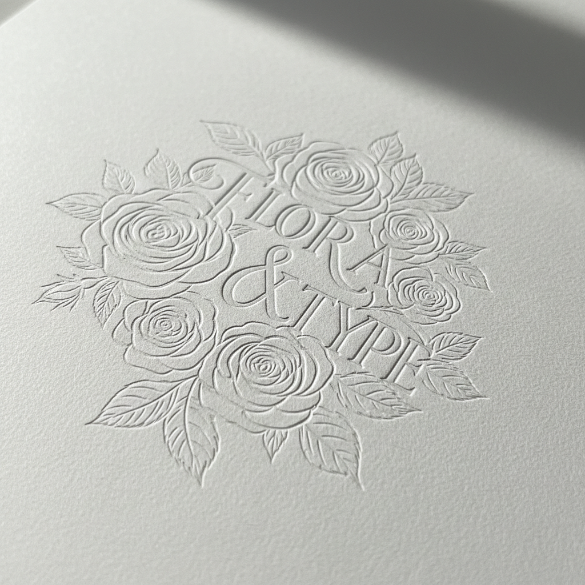

# Blind Embossing Art 无墨压凸艺术

> "Blind embossing is sculpture without color — a metal die pressed into paper from behind raises the design into tactile relief, creating an image visible only through light and shadow. Without ink or foil, the embossed surface speaks through touch and the play of ambient light across its raised contours, making the viewer lean close and tilt the page to read what the fingers already know." — Unknown

## 概述

无墨压凸艺术（Blind Embossing Art）是一种不使用油墨或箔的压印技法——通过金属模具从纸张背面施加压力，使纸面凸起形成浮雕图案。无墨压凸完全依靠光影和触感来呈现图案，是印刷和装帧中最含蓄优雅的装饰方式之一。

无墨压凸艺术的实践包括：1）模具制作——雕刻金属凸版和凹版模具；2）对版——精确对齐凸版和凹版；3）压印——在压力机上施加压力；4）纸张选择——选择适合压凸的厚纸；5）多层压凸——不同深度的压凸创造层次；6）组合压凸——与烫金或印刷结合使用；7）当代无墨压凸——将传统技法与现代设计结合的创作。

## 核心特征

| 特征 | 描述 |
|------|------|
| 无墨 | 不使用油墨或箔 |
| 浮雕 | 纸面凸起的浮雕 |
| 触感 | 依靠触感感知 |
| 光影 | 依靠光影显现 |
| 含蓄 | 含蓄优雅的效果 |
| 精密 | 精密的模具工艺 |

## 视觉特征

- **浮雕**：纸面的浮雕效果
- **光影**：光影创造的图案
- **白色**：纯白的单色美学
- **触感**：丰富的触觉体验
- **精细**：精细的细节表现
- **优雅**：含蓄优雅的气质

## 代表作品

| 作品 | 艺术家/文化 | 年代 | 意义 |
|------|-------------|------|------|
| *Book cover embossing* | 欧洲 | 19世纪 | 书籍封面压凸 |
| *Stationery embossing* | 国际 | 传统 | 信纸和名片压凸 |
| *Contemporary blind emboss* | 国际 | 当代 | 当代无墨压凸设计 |
| *Art print embossing* | 国际 | 当代 | 艺术版画压凸 |
| *Luxury packaging* | 国际 | 当代 | 奢侈品包装压凸 |

## 历史时间线

| 时期 | 事件 |
|------|------|
| 古代 | 印章和浮雕的早期使用 |
| 中世纪 | 书籍装帧中的压凸 |
| 19世纪 | 工业化压凸技术的发展 |
| 20世纪 | 商业设计中的广泛应用 |
| 当代 | 无墨压凸的艺术化发展 |

## 中国语境

无墨压凸在中国的印刷和设计中有广泛的应用。中国的传统印章文化——与压凸有相似的浮雕理念。中国的书籍装帧设计中，无墨压凸作为高端的装饰手法——在精装书和限量版中使用。中国的包装设计中，无墨压凸——是奢侈品和高端产品包装的常用工艺。中国的名片和商务印刷中，无墨压凸——作为高品质的标志被广泛使用。中国的设计教育中，无墨压凸作为印后工艺的重要技法——在平面设计课程中教授。中国的印刷产业中，压凸工艺——是重要的增值服务之一。

## AI生成概念图

## 与其他风格的关系

- **Debossing** → 压凹
- **Foil Stamping** → 烫金
- **Letterpress** → 活版印刷
- **Relief** → 浮雕
- **Paper Art** → 纸艺
- **Typography** → 字体设计

---

*浮光艺志 | Chronicle of Artistry*
