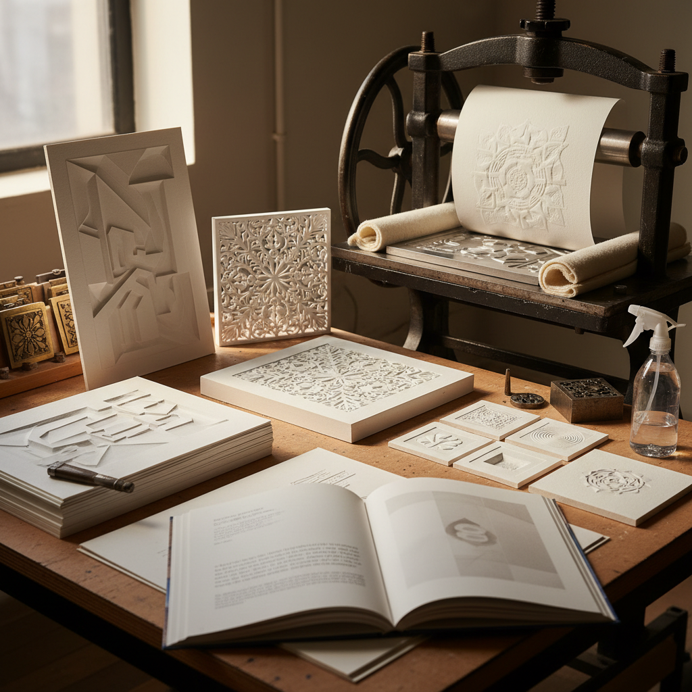

# Blind Embossing 无墨压印

> "Blind embossing is sculpture in paper — no ink, no color, only the pure play of light and shadow across raised and recessed surfaces, revealing form through the subtlest of means and proving that absence can be more powerful than presence." — Unknown

## 概述

无墨压印（Blind Embossing）是一种不使用油墨、仅通过压力在纸张上压出凸起或凹陷图案的版画/纸艺技法。"Blind"意为"无墨的"——与传统版画使用油墨不同，无墨压印完全依靠纸张的物理变形来呈现图像。光线照射在凸起和凹陷的表面上产生的阴影成为唯一的"色彩"。

无墨压印可以使用凹版印刷机（将未上墨的版面压入湿润的纸张）或专门的压印模具。效果从微妙的浅浮雕到深度的立体造型不等。无墨压印常用于：版画作品中的辅助元素、艺术家书籍、高级文具和邀请函、书籍封面设计、当代纸艺术作品。无墨压印的魅力在于其"极简"和"纯粹"——只有纸张本身的白色和光影的变化。

## 核心特征

| 特征 | 描述 |
|------|------|
| 无墨 | 不使用油墨 |
| 压力 | 通过压力成型 |
| 浮雕 | 纸张的浮雕效果 |
| 光影 | 依靠光影呈现 |
| 极简 | 极简的表现方式 |
| 触觉 | 触觉的艺术体验 |

## 视觉特征

- **白色**：纯白的表面
- **浮雕**：凸起和凹陷
- **光影**：光影的变化
- **极简**：极简的美感
- **精细**：精细的细节
- **触觉**：可触摸的质感

## 代表作品

| 作品 | 艺术家 | 年代 | 意义 |
|------|--------|------|------|
| *Embossed prints* | Various | 传统 | 传统无墨压印版画 |
| *Artist books* | Various | 当代 | 艺术家书籍中的应用 |
| *Paper sculptures* | Various | 当代 | 纸雕塑 |
| *Luxury stationery* | Various | 传统 | 高级文具设计 |
| *Contemporary paper art* | Various | 当代 | 当代纸艺术 |

## 历史时间线

| 时期 | 事件 |
|------|------|
| 古代 | 早期压印技术的使用 |
| 中世纪 | 书籍装帧中的压印 |
| 19世纪 | 商业印刷中的压印应用 |
| 20世纪 | 艺术版画中的无墨压印 |
| 当代 | 当代纸艺术中的创新 |
| 当代 | 无墨压印在设计中的应用 |

## 中国语境

无墨压印在中国有独特的文化联系——中国传统的印章文化和拓印传统与压印有相似之处。中国的当代版画教育中，无墨压印作为一种特殊技法被教授。中国的书籍设计和高端包装设计中，压印（凸版/凹版）是常用的工艺。中国的一些当代纸艺术家使用无墨压印创作极简风格的作品。中国的传统纸张（如宣纸）因其柔软性和纤维特性，适合进行无墨压印。

## AI生成概念图

## 与其他风格的关系

- **Intaglio** → 凹版画
- **Relief Printing** → 凸版画
- **Paper Art** → 纸艺术
- **Minimalism** → 极简主义
- **Book Arts** → 书籍艺术
- **Letterpress** → 活版印刷

---

*浮光艺志 | Chronicle of Artistry*
