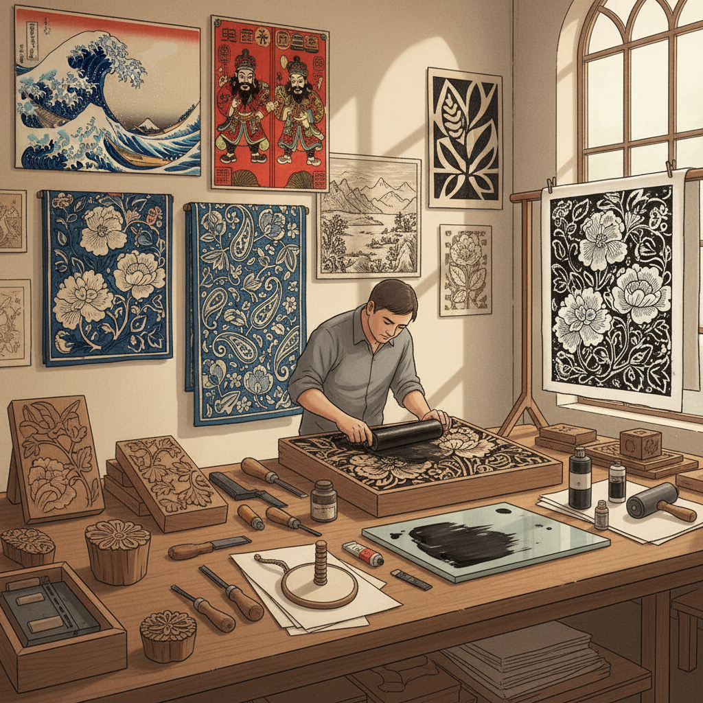

# Block Printing Art 木版印刷艺术

> "Block printing is the mother of all printed images — a carved block of wood pressed against paper or fabric, transferring ink in a single decisive moment. Every print is both identical and unique: identical in design, unique in the subtle variations of pressure, ink density, and grain that make each impression a living thing. The block printer works in reverse, carving away what should remain white, thinking in mirror image, creating absence to produce presence." — Unknown

## 概述

木版印刷艺术（Block Printing Art）是将图案雕刻在木块表面，涂上墨水或颜料后压印到纸张或织物上的印刷艺术——是人类最早的批量复制图像的技术之一。木版印刷在东亚有超过千年的历史，在纺织品印花和书籍插图领域有重要地位。

木版印刷艺术的实践包括：1）凸版木刻——传统的阳刻木版印刷；2）水印木刻——使用水性颜料的木版印刷；3）织物木版印花——在布料上的木版印刷；4）浮世绘——日本多色木版印刷；5）年画——中国传统木版年画；6）当代木版——将传统技法与现代设计结合的创作。

## 核心特征

| 特征 | 描述 |
|------|------|
| 复制 | 可批量复制图像 |
| 手工 | 手工雕刻和印刷 |
| 反转 | 镜像雕刻 |
| 质感 | 独特的印刷质感 |
| 传统 | 深厚的文化传统 |
| 多用 | 纸张和织物皆可 |

## 视觉特征

- **刀痕**：可见的雕刻刀痕
- **平面**：平面化的图像效果
- **对比**：强烈的黑白对比
- **纹理**：木纹的自然纹理
- **边缘**：略带毛边的印刷边缘
- **重复**：可重复的图案

## 代表作品

| 作品 | 艺术家/文化 | 年代 | 意义 |
|------|-------------|------|------|
| *金刚经* | 中国唐代 | 868年 | 现存最早的印刷品 |
| *浮世绘* | 日本江户 | 17-19世纪 | 日本木版画 |
| *Indian block prints* | 印度 | 古代至今 | 印度织物印花 |
| *杨柳青年画* | 中国 | 明清 | 中国木版年画 |
| *Albrecht Dürer woodcuts* | Dürer | 15-16世纪 | 欧洲木刻版画 |

## 历史时间线

| 时期 | 事件 |
|------|------|
| 7世纪 | 中国最早的木版印刷 |
| 868年 | 金刚经——最早的印刷书籍 |
| 15世纪 | 欧洲木版印刷的发展 |
| 17-19世纪 | 日本浮世绘的黄金时代 |
| 当代 | 木版印刷的艺术复兴 |

## 中国语境

木版印刷艺术在中国有最悠久和最辉煌的传统——中国是木版印刷的发源地。中国唐代的《金刚经》（868年）是现存最早的有确切日期的印刷品——标志着人类印刷史的开端。中国的木版年画传统极其丰富——杨柳青、桃花坞、朱仙镇、绵竹等地各有特色。中国的雕版印刷术被列入联合国教科文组织人类非物质文化遗产代表作名录。中国传统的"饾版"和"拱花"技法是多色木版印刷的巅峰——《十竹斋画谱》和《芥子园画传》是其代表。中国当代的一些版画家继续探索木版印刷的艺术可能性——将传统技法与现代艺术理念结合。中国的蓝印花布（靛蓝木版印花）是木版印刷在纺织领域的重要应用——至今仍在一些地区传承。

## AI生成概念图

## 与其他风格的关系

- **Linocut** → 麻胶版画
- **Woodcut** → 木刻版画
- **Ukiyo-e** → 浮世绘
- **Textile Printing** → 纺织印花
- **Letterpress** → 活字印刷
- **Stencil Art** → 模版艺术

---

*浮光艺志 | Chronicle of Artistry*
