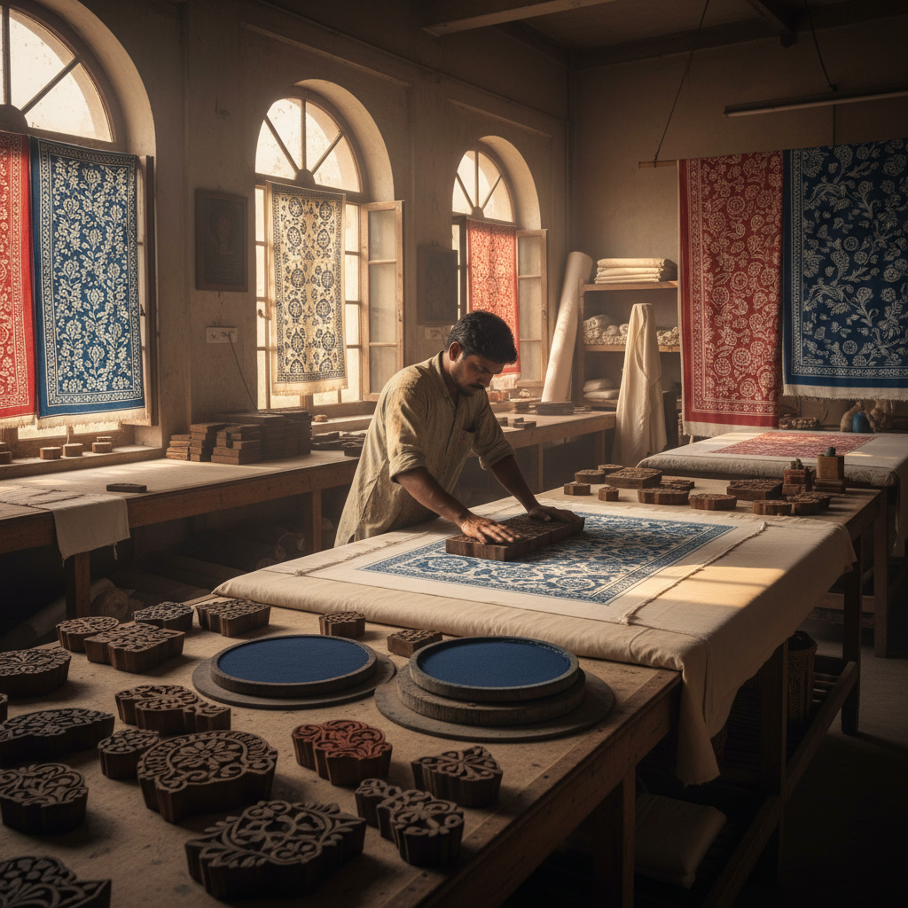

# Block Printing 木版印花

> "Block printing is the rhythm of repetition — stamp after stamp, a single carved block multiplies into infinite pattern." — Unknown

## 概述

木版印花（Block Printing）是使用雕刻有图案的木块蘸取颜料或染料，反复盖印在织物或纸张上形成连续图案的装饰技法。与木版印刷（Woodblock Printing）主要用于书籍和艺术版画不同，木版印花更侧重于纺织品的图案装饰——通过一个图案单元的重复排列创造出大面积的装饰效果。印度的木版印花（Block Printing）是世界上最精美的纺织印花传统之一。

木版印花的魅力在于：重复中的变化——虽然使用同一个印版，但每一次盖印都因为力度、墨量、角度的微小差异而略有不同，创造出机器印刷无法复制的手工温度。

## 核心特征

| 特征 | 描述 |
|------|------|
| 印版 | 使用雕刻木版 |
| 重复 | 图案的重复排列 |
| 手工 | 手工逐一盖印 |
| 纺织 | 主要用于纺织品 |
| 变化 | 重复中的微妙变化 |
| 传统 | 深厚的传统 |

## 视觉特征

- **重复**：规律的图案重复
- **手工**：手工盖印的微妙差异
- **色彩**：多色套印的层次
- **几何**：几何性的图案排列
- **质朴**：质朴的手工感
- **节奏**：视觉的节奏感

## 代表作品

| 作品 | 艺术家 | 年代 | 意义 |
|------|--------|------|------|
| *Indian Ajrakh prints* | 匿名 | 传统 | 印度阿杰拉克印花 |
| *Rajasthani block prints* | 匿名 | 传统 | 拉贾斯坦印花 |
| *William Morris textiles* | William Morris | 19世纪 | 工艺美术运动 |
| *Indonesian batik stamps* | 匿名 | 传统 | 印尼蜡染印花 |
| *Contemporary block prints* | Various | 当代 | 当代木版印花 |

## 历史时间线

| 时期 | 事件 |
|------|------|
| 公元前3000年 | 印度河文明的印花证据 |
| 古代 | 中国和印度的早期印花 |
| 中世纪 | 印度木版印花的成熟 |
| 17-18世纪 | 印度印花布出口欧洲 |
| 19世纪 | 工艺美术运动的复兴 |
| 当代 | 手工印花的艺术复兴 |

## 中国语境

中国有悠久的印花传统——蓝印花布是中国最具代表性的木版印花工艺，被列为国家级非物质文化遗产。蓝印花布使用镂空花版和防染浆料，通过靛蓝染色创造出蓝白两色的图案。江苏南通是中国蓝印花布的主要产地。此外，中国传统的"夹缬"（夹板印花）也是一种独特的木版印花技法。当代中国的纺织设计师正在将传统印花图案与现代设计结合。

## AI生成概念图

## 与其他风格的关系

- **Woodblock Printing** → 木版印刷（书籍版画）
- **Screen Printing** → 丝网印刷
- **Batik** → 蜡染
- **Textile Design** → 纺织设计
- **Pattern Design** → 图案设计
- **Stencil** → 模板印花

---

*浮光艺志 | Chronicle of Artistry*
