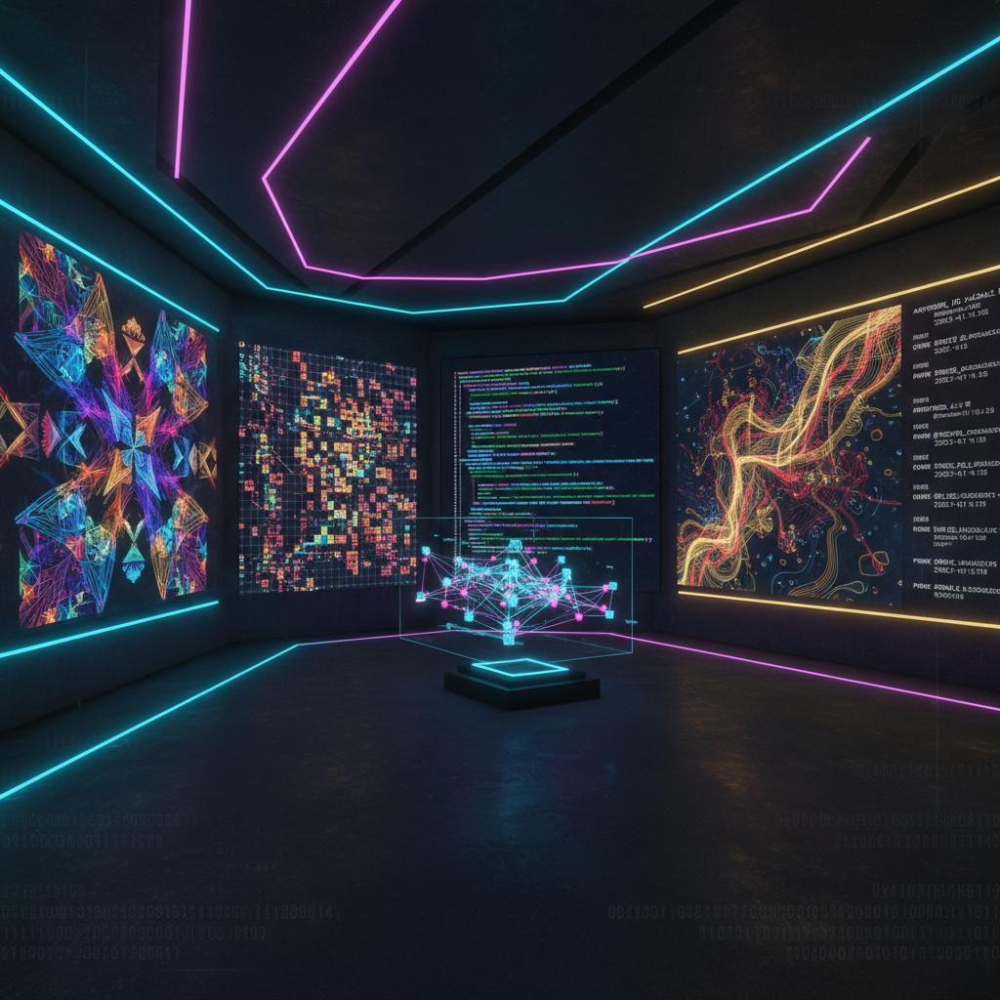

# Blockchain Art 区块链艺术

> "Blockchain art is not merely art sold on a blockchain — it is art that could not exist without the blockchain, art that uses distributed consensus, immutable records, smart contracts, and cryptographic proof as its medium and meaning. The blockchain is not just a marketplace; it is a new kind of canvas — one that is permanent, transparent, trustless, and collectively maintained by thousands of computers around the world." — Unknown

## 概述

区块链艺术（Blockchain Art）是以区块链技术——分布式账本、智能合约、加密证明、去中心化共识——为核心创作媒介和概念框架的艺术实践。区块链艺术不仅仅是在区块链上出售的艺术，而是利用区块链的独特属性（不可篡改性、透明性、去中心化、可编程性）作为艺术表达的本质要素。

区块链艺术的实践包括：1）链上生成艺术——在区块链上运行的算法生成艺术（如Art Blocks）；2）智能合约艺术——以智能合约本身作为艺术作品；3）DAO艺术——通过去中心化自治组织进行集体创作和决策；4）代币经济艺术——探索代币经济学作为艺术媒介；5）链上数据艺术——将区块链交易数据可视化为艺术；6）永久存储艺术——利用区块链的永久性存储创作"永恒"的作品。

## 核心特征

| 特征 | 描述 |
|------|------|
| 不可篡改 | 永久记录 |
| 去中心化 | 无中心控制 |
| 透明 | 公开可验证 |
| 可编程 | 智能合约 |
| 共识 | 集体共识 |
| 稀缺 | 数字稀缺性 |

## 视觉特征

- **代码**：智能合约代码
- **网络**：节点网络图
- **哈希**：加密哈希值
- **区块**：区块链的区块结构
- **生成**：算法生成的图案
- **数据**：链上数据可视化

## 代表作品

| 作品 | 艺术家 | 年代 | 意义 |
|------|--------|------|------|
| *Art Blocks* | Various | 2020 | 链上生成艺术平台 |
| *Autoglyphs* | Larva Labs | 2019 | 完全链上生成艺术 |
| *Plantoid* | Primavera De Filippi | 2015 | DAO艺术生物 |
| *CryptoPunks* | Larva Labs | 2017 | 早期链上收藏品 |
| *Async Art* | Various | 2020 | 可编程艺术 |

## 历史时间线

| 时期 | 事件 |
|------|------|
| 2008 | 比特币白皮书 |
| 2015 | 以太坊和智能合约 |
| 2017 | CryptoPunks和早期NFT |
| 2020 | Art Blocks和链上生成艺术 |
| 2021 | NFT艺术市场爆发 |
| 当代 | 区块链艺术的成熟和反思 |

## 中国语境

区块链艺术在中国有复杂的发展环境。中国在区块链技术研发方面有大量投入——中国的区块链专利数量全球领先，多个城市建立了区块链产业园。中国的"数字藏品"（区别于海外NFT的中国特色数字收藏品）市场在2021-2022年经历了快速发展——各大互联网平台（蚂蚁链、腾讯幻核等）推出了数字藏品平台。中国当代的一些艺术家在探索区块链艺术：在中国的联盟链上创作生成艺术、将中国传统艺术（书法、国画）与区块链技术结合、以及探索区块链在中国文化遗产数字化确权中的应用。中国的监管环境对区块链艺术的形态有重要影响——强调技术应用而非金融投机。

## AI生成概念图

## 与其他风格的关系

- **Crypto Art** → 加密艺术
- **NFT Art** → NFT艺术
- **Generative Art** → 生成艺术
- **Code Art** → 代码艺术
- **Conceptual Art** → 观念艺术
- **Digital Art** → 数字艺术

---

*浮光艺志 | Chronicle of Artistry*
