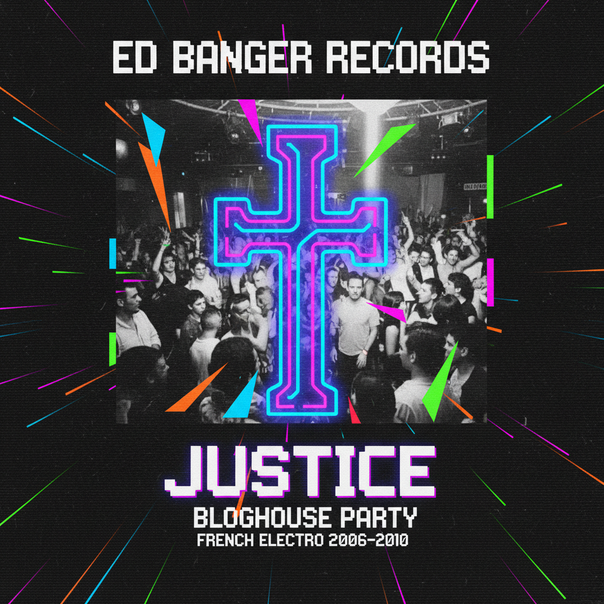
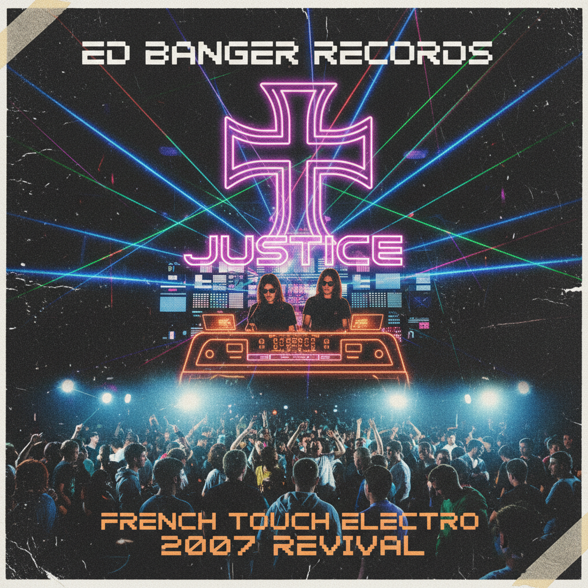

# Bloghouse | 博客浩室

> MySpace 播放器里自动播放的电子节拍——当博客成为舞池的入口。

## 概述

- **时间跨度**：2005 – 2012
- **发源地**：巴黎（Ed Banger Records）、纽约、伦敦
- **核心理念**：通过音乐博客和 MySpace 传播的 Electro House / Fidget House 音乐运动，以及围绕它形成的派对文化与视觉美学
- **别名**：Blog House、Nu-Rave（英国变体）、Fidget House

## 历史背景

### 博客即唱片公司

2005-2008年间，音乐博客（如 Discobelle、The Hype Machine、Palms Out Sounds）取代了传统唱片公司的A&R功能。DJ和制作人通过在博客上免费发布混音带和bootleg remix获得关注，MySpace成为他们的官方主页。

### Ed Banger Records：震中

Pedro Winter（Busy P）在巴黎创立的 Ed Banger Records 是 Bloghouse 的精神中心：
- **Justice**：《†》(Cross) 专辑定义了整个运动的声音
- **SebastiAn**：暴力失真的电子制作
- **Uffie**：说唱+电子的跨界
- So Me（André Saraiva 的搭档）：定义了 Ed Banger 的视觉语言

### 全球节点
- **纽约**：DFA Records、LCD Soundsystem
- **伦敦**：Klaxons、New Rave 运动
- **澳大利亚**：Cut Copy、Van She

### 衰落

2010年后，Bloghouse 被 Dubstep 和 EDM 浪潮取代。博客被 SoundCloud 和 Spotify 取代，MySpace 衰亡，派对文化转向更大型的音乐节。

## 视觉特征

### 平面设计（So Me 风格）
- 粗线条卡通插画
- 荧光色+黑色的高对比
- 骷髅、十字架、闪电等朋克符号
- 手绘感涂鸦字体
- 像素化元素与8-bit游戏引用

### 派对传单美学
- A5尺寸传单（实体张贴+网络传播）
- 大量使用荧光粉、荧光绿、荧光黄
- 拼贴风格（照片+涂鸦+文字叠加）
- 低分辨率/故意粗糙的制作感

### 时尚
- 紧身牛仔裤（男女皆穿）
- 高帮运动鞋（Nike Dunk、Reebok Pump）
- 荧光色配饰（手环、墨镜、腰带）
- 乐队/厂牌T恤
- 美国服饰（American Apparel）基本款
- 飞行员夹克

### 空间
- 小型地下俱乐部（非大型夜店）
- 仓库派对
- 汗水淋漓的舞池
- 闪光灯摄影（高对比、红眼、运动模糊）

## 代表人物与作品

| 类型 | 代表 | 说明 |
|------|------|------|
| 厂牌 | Ed Banger Records | 运动核心 |
| 音乐人 | Justice | 《†》定义了Bloghouse之声 |
| 音乐人 | Simian Mobile Disco | "We Are Your Friends" |
| 音乐人 | MSTRKRFT | 加拿大电子二人组 |
| 音乐人 | Boys Noize | 柏林硬派电子 |
| 设计师 | So Me | Ed Banger视觉总监 |
| 博客 | The Hype Machine | 音乐博客聚合器 |
| 派对 | Institubes (巴黎) | 标志性Bloghouse派对 |

## 与其他风格的关系

| 风格 | 关系 |
|------|------|
| Indie Sleaze | 同时代、同场景，共享派对文化和闪光灯摄影 |
| Electropop 08 | 音乐上有重叠，但Bloghouse更地下、更DIY |
| Scene | 共享MySpace平台，但音乐品味完全不同 |
| Nu-Rave | 英国版本的Bloghouse，更强调荧光色和rave文化 |

## 图片画廊

<!-- 图片存放于 assets/artworks/bloghouse/ -->

| | |
|:---:|:---:|
|  |  |
| *博客浩室概念* | *Ed Banger Records 派对* |

**推荐图片来源**：
- Ed Banger Records 官方视觉档案
- So Me 的插画作品集
- The Cobrasnake 派对摄影
- Pinterest: "Bloghouse aesthetic Ed Banger"
- [Are.na: Bloghouse / Nu-Rave](https://www.are.na/search/bloghouse)

## 延伸阅读

- [Resident Advisor: The Rise and Fall of Blog House](https://ra.co/)
- [Pitchfork: Justice - † Review](https://pitchfork.com/reviews/albums/justice-cross/)
- Ed Banger Records 官网
- [The Hype Machine](https://hypem.com/) — 曾经的Bloghouse传播中枢

---

[← Mall Goth](mall-goth.md) | [→ FantasY2K](fantasy2k.md) | [↑ 返回目录](README.md)
