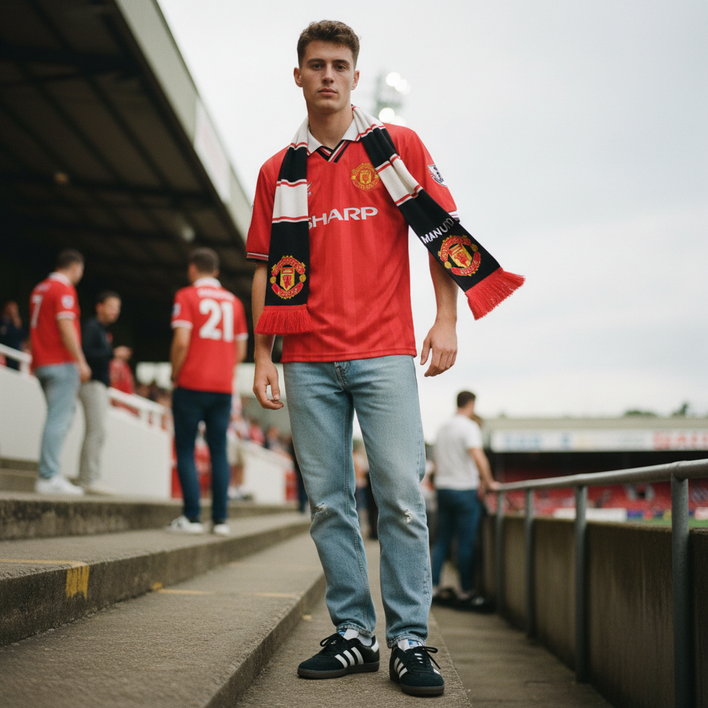

# Blokecore 球迷核



> **"复古球衣、牛仔裤、Adidas Samba——把看台文化穿成高级时装。"**

## 概述

| 维度 | 描述 |
|------|------|
| 时期 | 2022–至今 |
| 别名 | Blokecore, Football Fashion, Terrace Style |
| 核心色彩 | 球队色（红/蓝/白/黑）、牛仔蓝、白色 |
| 关键元素 | 复古球衣、Adidas Samba、牛仔裤、围巾 |
| 代表人物 | 英国足球看台文化、Liam Gallagher |
| 关联风格 | Normcore, Gorpcore, Indie Sleaze, Casuals |

---

## 历史脉络

### 从看台到T台

| 年份 | 事件 |
|------|------|
| 1970s–80s | 英国足球 Casuals 文化 |
| 1990s | Oasis + 足球 = 英伦文化巅峰 |
| 2018 | Gosha Rubchinskiy 将球衣带入高级时装 |
| 2022 | TikTok #Blokecore 爆发 |
| 2023 | Adidas Samba 成为年度鞋款 |
| 2024 | 复古球衣市场价格飙升 |

### 它代表什么？

| 元素 | 含义 |
|------|------|
| 复古球衣 | 怀旧、身份认同、"我属于这里" |
| Adidas Samba | 经典、低调、"我懂" |
| 牛仔裤 | 普通、日常、"不需要特别" |
| 围巾 | 忠诚、归属、社区 |
| 啤酒 | 社交、放松、"lads" |

### 核心哲学

Blokecore 的精神是**"普通男人的穿着也可以是时尚"**：
- 不需要设计师品牌——球衣就够了
- 怀旧是一种品味
- 运动不只是运动——是文化
- "我爸也这么穿"——这就是重点
- 反精英、反做作

---

## 视觉语法

### 色彩系统

```
主色（取决于球队）：
  红色 (#FF0000) — 曼联、利物浦、AC米兰
  蓝色 (#0000FF) — 切尔西、国际米兰
  白色 (#FFFFFF) — 皇马、热刺
  黑色 (#000000) — 尤文图斯

基础色：
  牛仔蓝 (#4169E1) — 牛仔裤
  白色 (#FFFFFF) — T恤、球鞋
  灰色 (#808080) — 运动裤

规则：
  - 球衣是焦点
  - 其余保持简单
  - 不过度搭配
  - 颜色来自球队而非时尚
  - "看起来像要去看球"

质感：
  涤纶 — 球衣面料
  牛仔 — 裤子
  皮革 — 球鞋
  针织 — 围巾
```

### 标志性元素

| 类别 | 元素 |
|------|------|
| 上装 | 复古球衣（90s–00s）、纯色T恤 |
| 下装 | 直筒牛仔裤、运动裤 |
| 鞋 | Adidas Samba、Gazelle、Stan Smith |
| 配饰 | 球队围巾、渔夫帽、腰包 |
| 品牌 | Adidas、Nike、Umbro、Kappa |
| 场景 | 酒吧、看台、街头 |

---

## 与千禧怀旧的关系

### 90s/00s 球衣的怀旧
- 1998世界杯、2002世界杯 = 童年记忆
- 那些球衣代表的不只是球队——是时代
- Beckham、Zidane、Ronaldo = 英雄
- 复古球衣 = "回到那个更简单的时代"

### 与 Normcore 的交叉
- 两者都拒绝"时尚"
- Normcore = "我故意穿得普通"
- Blokecore = "我穿球衣因为我喜欢足球"
- 但 TikTok 让两者都变成了"时尚"

---

## 中国语境

- "球衣穿搭"在小红书/得物的流行
- 中超复古球衣的收藏文化
- 与"运动休闲"/"街头风"的交叉
- 世界杯期间的球衣时尚热潮
- 中国球迷文化与穿搭的结合

---

## 设计应用

| 场景 | 应用方式 |
|------|----------|
| 品牌 | 运动字体+球队色+复古感+社区 |
| 零售 | 复古球衣展示+怀旧氛围 |
| 空间 | 酒吧风格+球队装饰+复古海报 |
| 数字 | 运动风排版+球队色+动态感 |

---

## 相关风格

← [Normcore 正常核](normcore.md) | [Gorpcore 户外核](gorpcore.md) →

↑ [返回千禧怀旧目录](README.md) | [返回总目录](../README.md)
