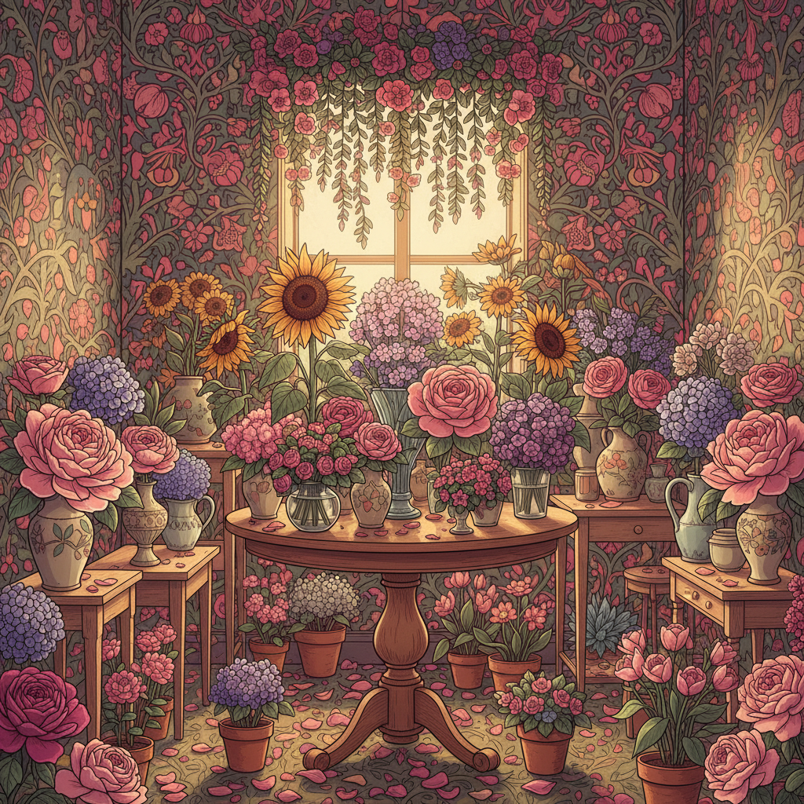

# Bloomcore 花卉核



> **"让花朵占领一切——从裙子到墙纸到餐盘，万物皆可绽放。"**

## 概述

| 维度 | 描述 |
|------|------|
| 时期 | 2021–至今 |
| 别名 | Bloomcore, Floral Maximalism, Garden Aesthetic |
| 核心色彩 | 花朵全色系——玫瑰粉、向日葵黄、薰衣草紫、叶绿 |
| 关键元素 | 大面积花卉印花、花园、花瓶、植物标本 |
| 代表人物 | William Morris、Liberty London、Gucci Garden |
| 关联风格 | Cottagecore, Grandmacore, Maximalism, Light Academia |

---

## 历史脉络

### 2021：后疫情的花朵爆发

Bloomcore 在 2021 年随着人们对自然和色彩的渴望而兴起：

**背景**：
- 疫情封锁期间，人们开始种花、买花
- "植物妈妈/爸爸"文化的兴起
- 对极简主义的疲劳——想要更多色彩和生命力
- 花卉印花从"老气"变成"时髦"

### 文化基因

| 来源 | 贡献 |
|------|------|
| William Morris | Arts & Crafts 运动的花卉壁纸 |
| 荷兰黄金时代 | 花卉静物画传统 |
| Liberty London | 经典碎花面料 |
| 日本花道 | 花卉的艺术化呈现 |
| Gucci (Alessandro Michele) | 花卉极繁主义时尚 |
| 奶奶的花园 | "Grandmacore"的花卉元素 |

### 核心哲学

Bloomcore 的吸引力在于：
- 花朵是最直接的"美"和"生命"的象征
- 在数字化的世界中渴望有机的、生长的东西
- 拒绝极简主义的"少即是多"——花朵越多越好
- 一种对自然的庆祝和对衰败的温柔接受

---

## 视觉语法

### 色彩系统

```
主色（取自真实花朵）：
  玫瑰粉 (#FF007F) — 玫瑰、牡丹
  向日葵黄 (#FFDA03) — 向日葵、雏菊
  薰衣草紫 (#B57EDC) — 薰衣草、紫藤
  叶绿 (#228B22) — 叶片、茎
  白色 (#FFFFFF) — 百合、茉莉

辅色：
  珊瑚 (#FF7F50) — 大丽花
  深红 (#8B0000) — 深色玫瑰
  天蓝 (#87CEEB) — 勿忘我
  奶油 (#FFFDD0) — 背景

质感：
  花瓣 — 柔软、有机
  叶片 — 光泽、纹理
  泥土 — 自然、质朴
  水彩 — 手绘花卉
  印花面料 — 重复图案
```

### 标志性元素

| 类别 | 元素 |
|------|------|
| 花卉 | 玫瑰、牡丹、向日葵、薰衣草、野花 |
| 容器 | 花瓶、花盆、花篮、花冠 |
| 服装 | 大面积花卉印花裙、花卉刺绣 |
| 空间 | 花卉壁纸、花园、温室、花店 |
| 艺术 | 植物标本、花卉水彩、压花 |
| 食物 | 花茶、花卉蛋糕、可食用花 |

---

## 与千禧怀旧的关系

### 奶奶的花园记忆
- 很多人的童年记忆中有"奶奶的花园"
- 碎花窗帘、花卉茶杯、花园里的玫瑰
- Bloomcore 是对这种"被遗忘的美"的重新发现

### 与 Cottagecore 的交叉
- Cottagecore 的花园元素 → Bloomcore 的花卉极繁
- Cottagecore 更关注"生活方式"
- Bloomcore 更关注"视觉图案"

---

## 中国语境

- "碎花"/"花卉"穿搭的回潮
- 中国传统花卉纹样（牡丹、梅花、荷花）
- 花艺/花道在年轻人中的流行
- 小红书上的"花园生活"/"阳台花园"
- 与"新中式"花卉元素的交叉

---

## 设计应用

| 场景 | 应用方式 |
|------|----------|
| 品牌 | 花卉图案+手绘质感+自然色系 |
| 包装 | 花卉印花+水彩风格+有机形态 |
| 空间 | 花卉壁纸+鲜花+植物+自然光 |
| 数字 | 花卉边框+水彩动效+有机布局 |

---

## 相关风格

← [Cottagecore 田园核](cottagecore.md) | [Light Academia 明亮学院](light-academia.md) →

↑ [返回千禧怀旧目录](README.md) | [返回总目录](../README.md)
