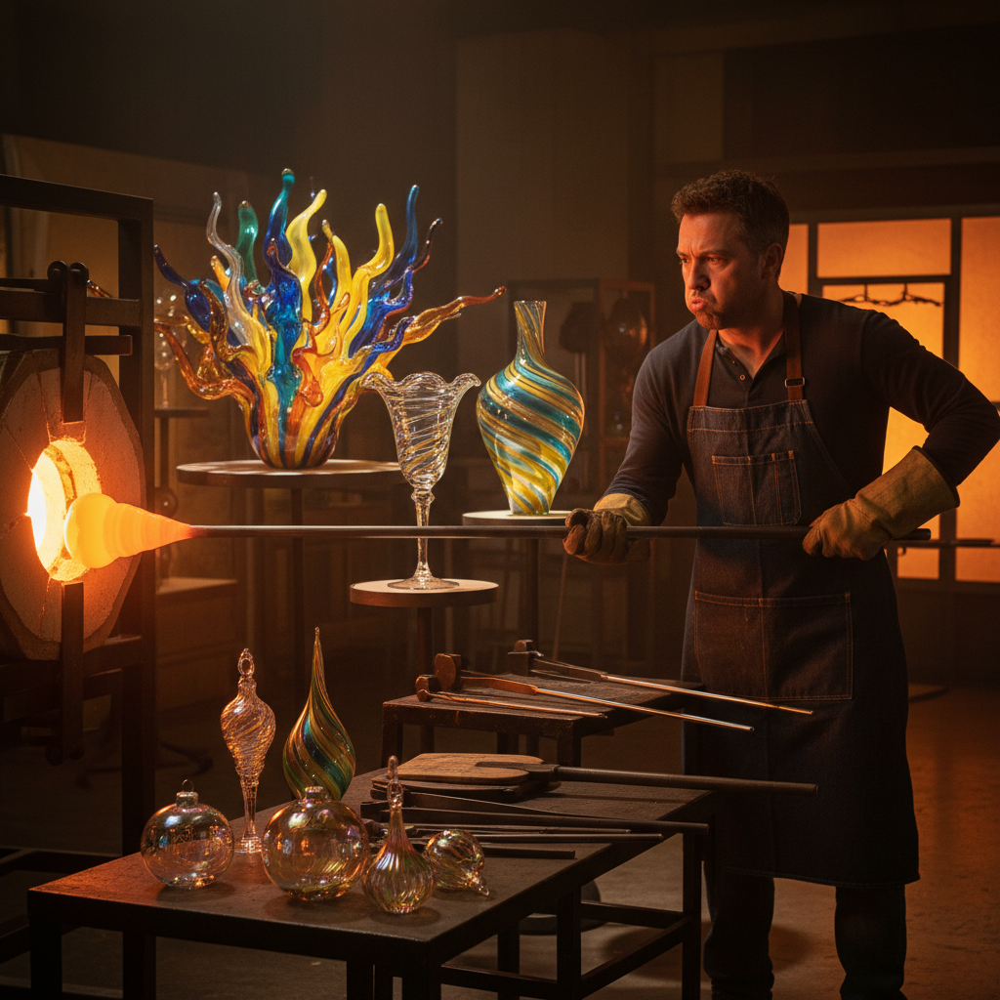

# Blown Glass 吹制玻璃

> "Blown glass is breath made solid — a bubble of molten silica shaped by lung and lip, gravity and centrifugal force, frozen in an instant from liquid fire to crystalline permanence." — Unknown

## 概述

吹制玻璃（Blown Glass / Glassblowing）是通过将空气吹入熔融玻璃来塑造器物的古老技艺。玻璃工匠用一根中空的铁管（吹管，blowpipe）从熔炉中蘸取熔融玻璃（约1100°C），然后通过吹气使其膨胀成空心的球体，再通过旋转、摆动、工具塑形和重力来创造各种形状。吹制玻璃的魅力在于：与熔融材料的即时对话——玻璃在几秒内从可塑变为固定，艺术家必须在极短的时间窗口内做出所有决定。

吹制玻璃分为自由吹制（free-blowing，完全靠手工塑形）和模具吹制（mold-blowing，将玻璃吹入模具中）。当代的Studio Glass运动（1960s起）将吹制玻璃从工业生产提升为独立的艺术形式。

## 核心特征

| 特征 | 描述 |
|------|------|
| 吹制 | 通过吹气成型 |
| 高温 | 1100°C的熔融玻璃 |
| 即时 | 快速的决策和塑形 |
| 透明 | 玻璃的透明性 |
| 光 | 与光的互动 |
| 团队 | 常需团队协作 |

## 视觉特征

- **透明**：玻璃的透明和半透明
- **光**：折射和反射光线
- **色彩**：丰富的色彩可能
- **流动**：凝固的流动感
- **薄壁**：薄而均匀的壁厚
- **圆润**：自然的圆润形态

## 代表作品

| 作品 | 艺术家 | 年代 | 意义 |
|------|--------|------|------|
| *Portland Vase* | 匿名 | 罗马时期 | 古代吹制玻璃 |
| *Venetian goblets* | Murano工匠 | 文艺复兴 | 威尼斯玻璃 |
| *Chihuly installations* | Dale Chihuly | 当代 | 当代玻璃艺术 |
| *Studio glass* | Harvey Littleton | 1960s | Studio Glass运动 |
| *Contemporary blown glass* | Lino Tagliapietra | 当代 | 当代大师 |

## 历史时间线

| 时期 | 事件 |
|------|------|
| 公元前1世纪 | 吹制玻璃的发明（叙利亚） |
| 罗马帝国 | 吹制玻璃的普及 |
| 13世纪+ | 威尼斯穆拉诺岛的玻璃 |
| 17-18世纪 | 欧洲各国的玻璃工业 |
| 1962 | Studio Glass运动的开始 |
| 当代 | 当代玻璃艺术的繁荣 |

## 中国语境

中国的玻璃制造历史悠久——战国时期就有玻璃制品（琉璃），但中国传统上更重视陶瓷和玉器，玻璃艺术的发展相对较晚。清代的料器（内画鼻烟壶等）是中国玻璃艺术的代表。当代中国的玻璃艺术正在快速发展——中国美术学院、清华大学美术学院等设有玻璃艺术专业。一些中国当代玻璃艺术家如庄小蔚、关东海等在国际上获得认可。上海玻璃博物馆等机构推动了公众对玻璃艺术的认知。

## AI生成概念图

## 与其他风格的关系

- **Lampwork** → 灯工玻璃
- **Cast Glass** → 铸造玻璃
- **Stained Glass** → 彩色玻璃
- **Kiln-formed Glass** → 窑制玻璃
- **Murano Glass** → 穆拉诺玻璃
- **Studio Craft** → 工作室工艺

---

*浮光艺志 | Chronicle of Artistry*
