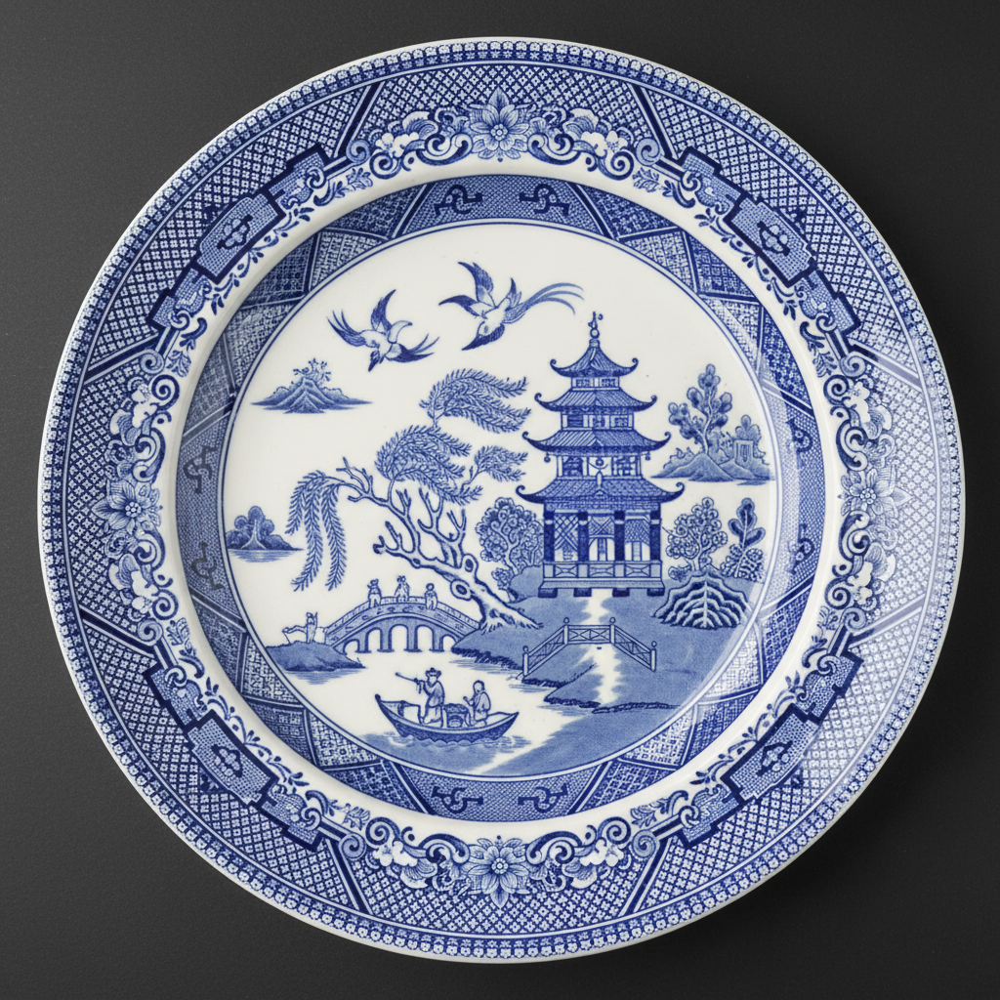

# Blue Willow Pattern 柳树图案 | Willow Pattern / 青花柳

> **"英国人想象中的中国——一个从未存在的爱情故事，印在了全世界的餐盘上。"**

## 概述

Blue Willow Pattern（柳树图案 / Willow Pattern）是18世纪末英国陶瓷工匠模仿中国青花瓷创造的装饰图案，描绘一个虚构的中国爱情悲剧故事——富家小姐与穷书生私奔，被父亲追赶，最终化为一对飞鸟。这个图案从未在中国存在过，完全是英国人对"中国风"（Chinoiserie）的想象产物。然而它成为了世界上最广泛生产的陶瓷图案之一，从1780年代至今仍在生产，累计生产数十亿件。

## 图案元素

| 元素 | 含义 |
|------|------|
| 柳树 | 离别和悲伤 |
| 小桥 | 逃跑的路径 |
| 宝塔 | 富家宅邸 |
| 小船 | 逃亡工具 |
| 两只飞鸟 | 化为鸟的恋人 |
| 围栏 | 囚禁和阻隔 |
| 三个人物 | 追赶的场景 |

## 核心特征

- **蓝白配色**：模仿中国青花瓷
- **虚构故事**：英国人编造的中国故事
- **转印技术**：铜版转印大规模生产
- **标准构图**：固定的元素排列
- **边框装饰**：几何或花卉边框
- **全球传播**：世界最广泛的陶瓷图案

## 视觉特征

- 钴蓝色在白色瓷面上
- 程式化的中国风景
- 柳树的垂枝轮廓
- 拱桥和宝塔的剪影
- 两只飞鸟的经典形象
- 装饰性的边框图案

## 与其他风格的关系

| 风格 | 关系 |
|------|------|
| Chinoiserie中国风 | 柳树图案是中国风的代表 |
| 中国青花瓷 | 柳树图案模仿的对象 |
| Delftware荷兰蓝陶 | 共享蓝白陶瓷传统 |
| 当代陶瓷 | 柳树图案的解构和再创作 |
| 后殖民艺术 | 对柳树图案的批判性反思 |

## 概念图

---

*浮光艺志 | Chronicle of Artistry*
