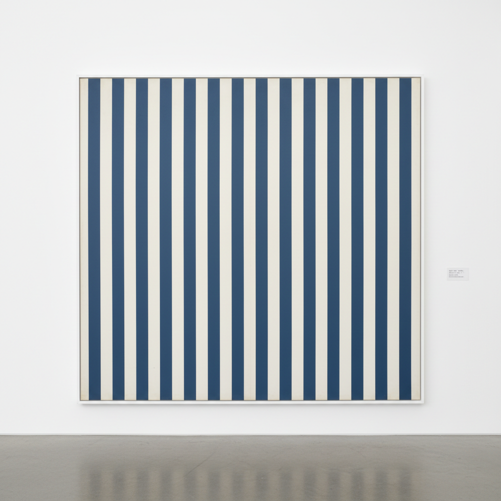

# BMPT Group BMPT小组

> **时期：** 1966年–1967年  
> **关键词：** 法国、绘画零度、重复图案、反表现、集体匿名

## 概述

BMPT Group（BMPT小组）由布伦、莫塞、帕尔芒捷和托罗尼四位法国艺术家于1966年组成，名称取自四人姓氏首字母。他们在巴黎现代艺术博物馆的沙龙上集体展出极度简化的绘画——条纹、圆点、重复印记——并宣布"我们不是画家"。这是对绘画神话的激进解构：如果任何人都能重复这些动作，那么艺术家的天才何在？

## 风格特征

- **极度简化**：条纹、圆点、印记等基本元素
- **重复操作**：机械化的反复动作
- **集体匿名**：拒绝个人风格和签名
- **反表现**：消除情感和主观性
- **制度批判**：质疑艺术体制和市场

## 代表人物与作品

- 丹尼尔·布伦 条纹画
- 奥利维耶·莫塞 圆圈画
- 米歇尔·帕尔芒捷 折叠画
- 尼尔·托罗尼 印记画

## 概念图

