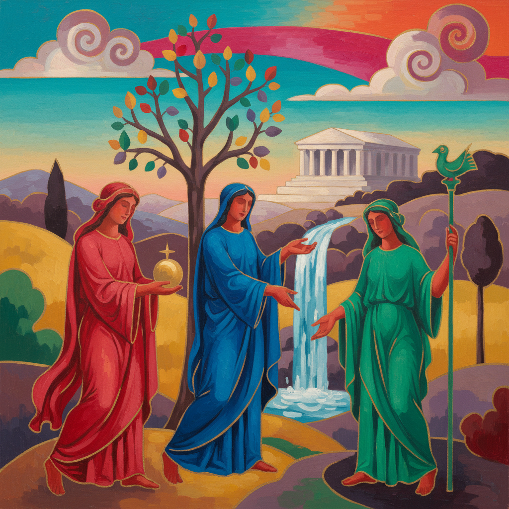

# Bob Thompson 鲍勃·汤普森

> **时期：** 1937–1966  
> **关键词：** 色彩寓言、古典重构、短暂天才、非裔美国表现主义

## 概述

Bob Thompson 是美国画家，在短暂的创作生涯中（仅约8年）创造了大量色彩浓烈的寓言性绘画。他将普桑、戈雅和提香等古典大师的构图重新诠释为鲜艳的色彩场域，用非自然的红、蓝、绿色调赋予经典场景新的情感强度。他于28岁英年早逝。

## 风格特征

- **古典重构**：以文艺复兴和巴洛克大师的构图为起点，进行色彩和情感的重新诠释
- **非自然色彩**：人物和风景以纯粹的红、蓝、绿、黄呈现，拒绝写实色调
- **平面化处理**：将古典的三维空间压缩为近乎平面的色彩层次
- **寓言氛围**：画面具有梦境般的叙事感，人物如同神话中的角色
- **快速执行**：笔触松弛快速，保持即兴的能量和紧迫感

## 代表作品

- *Garden of Music*（1960）
- *Triumph of Bacchus*（1964）
- *Le Roi Soleil*（1964）
- *Homage to Nina Simone*（1965）

## 历史意义

Thompson 证明了非裔美国艺术家可以自由地与欧洲艺术史对话，而不必局限于"黑人题材"。他的早逝使他成为美国艺术史上最大的"如果"之一——如果他活得更久，美国绘画的面貌可能完全不同。

## 概念图

