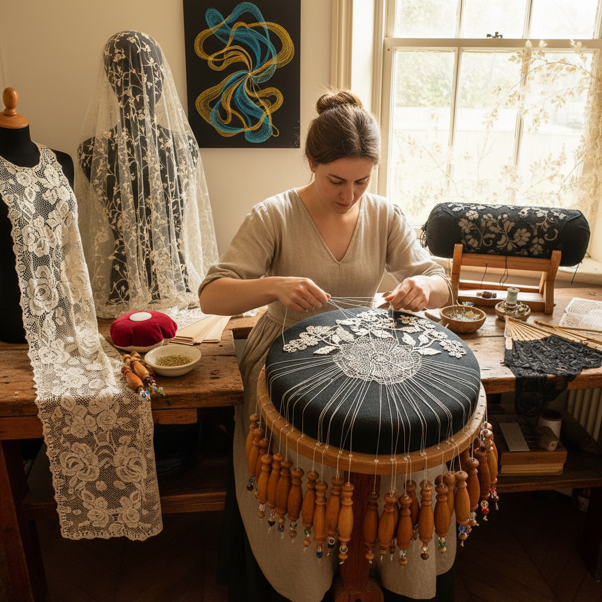

# Bobbin Lace Art 棒槌蕾丝艺术

> "Bobbin lace is weaving freed from the loom — dozens of threads, each wound on its own weighted bobbin, crossing and twisting in patterns guided by pins on a pillow. The lacemaker orchestrates this dance of threads with the precision of a conductor, each movement producing a single crossing that, multiplied by thousands, builds fabric from air — cloth that is more hole than thread, more light than substance." — Unknown

## 概述

棒槌蕾丝艺术（Bobbin Lace Art）是使用多根缠绕在棒槌（bobbins）上的线，通过在枕垫（pillow）上按照图案（pricking）交叉编织而成的蕾丝工艺——通过大量棒槌的有序交叉和扭转，形成精美的镂空织物。棒槌蕾丝是欧洲最重要的蕾丝制作传统之一。

棒槌蕾丝艺术的实践包括：1）连续蕾丝——整幅连续编织的蕾丝；2）拼接蕾丝——分段编织后拼接的蕾丝；3）Torchon蕾丝——几何图案的基础蕾丝；4）Honiton蕾丝——英国花卉蕾丝；5）Brussels蕾丝——比利时精细蕾丝；6）Bruges蕾丝——带状编织的蕾丝；7）当代棒槌蕾丝——将传统技法与现代设计结合的创作。

## 核心特征

| 特征 | 描述 |
|------|------|
| 多线 | 使用大量线同时工作 |
| 交叉 | 线的交叉和扭转 |
| 镂空 | 精美的镂空效果 |
| 图案 | 按照预设图案编织 |
| 精细 | 极其精细的织物 |
| 传统 | 深厚的欧洲传统 |

## 视觉特征

- **镂空**：通透的镂空结构
- **网格**：规律的网格底纹
- **花卉**：精美的花卉图案
- **边饰**：优雅的边饰效果
- **白色**：经典的白色蕾丝
- **精细**：极其精细的线条

## 代表作品

| 作品 | 艺术家/文化 | 年代 | 意义 |
|------|-------------|------|------|
| *Bruges lace* | 比利时布鲁日 | 16世纪至今 | 布鲁日蕾丝 |
| *Honiton lace* | 英国德文郡 | 16世纪至今 | 霍尼顿蕾丝 |
| *Chantilly lace* | 法国尚蒂伊 | 17世纪至今 | 尚蒂伊黑蕾丝 |
| *Maltese lace* | 马耳他 | 16世纪至今 | 马耳他蕾丝 |
| *Contemporary bobbin lace* | Various | 当代 | 当代棒槌蕾丝 |

## 历史时间线

| 时期 | 事件 |
|------|------|
| 15世纪 | 棒槌蕾丝的起源（佛兰德斯/意大利） |
| 16-17世纪 | 蕾丝的黄金时代 |
| 18世纪 | 各地蕾丝风格的分化 |
| 19世纪 | 机器蕾丝的冲击 |
| 当代 | 手工棒槌蕾丝的艺术复兴 |

## 中国语境

棒槌蕾丝艺术在中国有独特的发展历程。中国的棒槌蕾丝（花边）产业始于19世纪末——由西方传教士引入中国沿海地区。山东烟台、浙江萧山等地发展出了规模化的花边产业——中国曾是世界上最大的手工蕾丝出口国之一。中国的棒槌花边以其精细的工艺和低廉的价格在国际市场上具有竞争力——但随着劳动力成本上升，产业规模有所缩小。中国的一些地区（如山东）将棒槌花边列入非物质文化遗产——保护这一传统手工艺。中国当代的一些纺织艺术家重新审视棒槌蕾丝——将其作为当代艺术创作的媒介。中国的婚纱和高级定制服装中也使用手工蕾丝——展示了棒槌蕾丝在时尚领域的应用。

## AI生成概念图

## 与其他风格的关系

- **Tatting** → 梭编艺术
- **Needle Lace** → 针编蕾丝
- **Textile Art** → 纺织艺术
- **Fashion** → 时尚设计
- **Embroidery** → 刺绣
- **Weaving** → 编织艺术

---

*浮光艺志 | Chronicle of Artistry*
