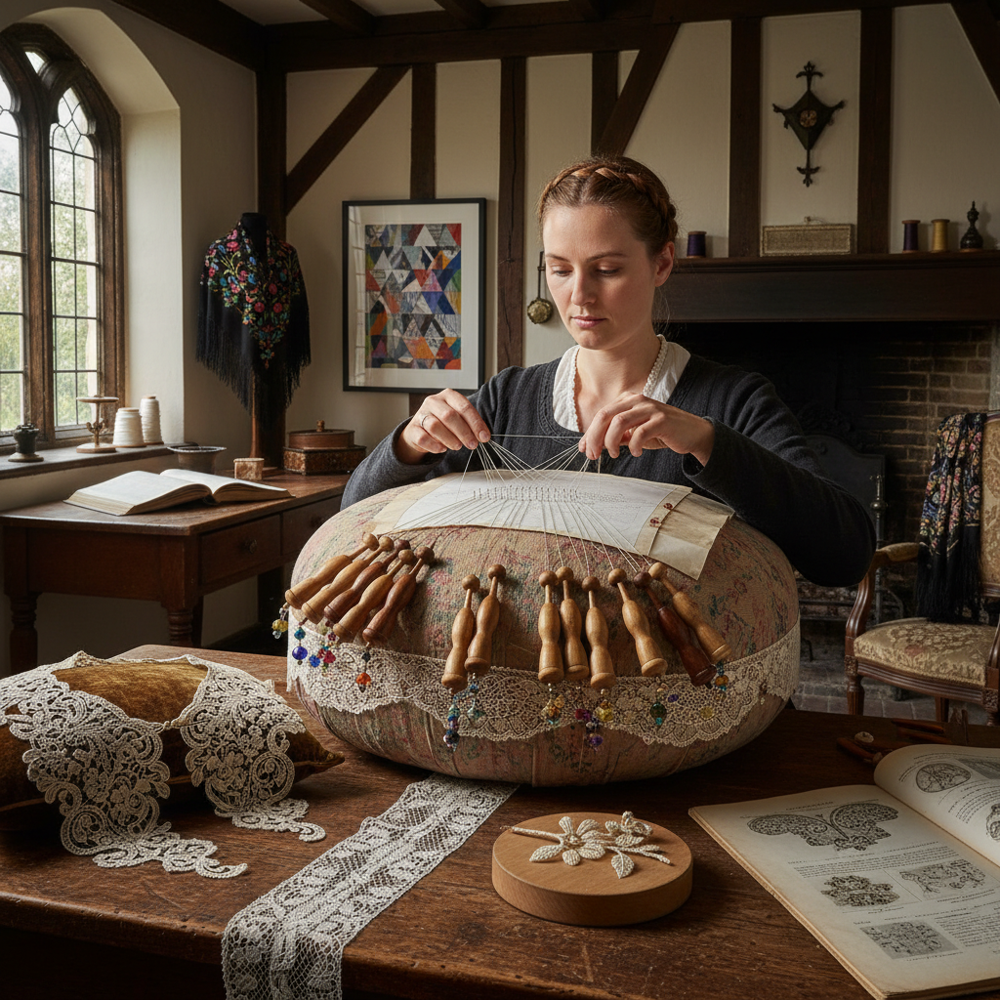

# Bobbin Lace 梭芯蕾丝

> "Bobbin lace is a dance of threads — dozens of weighted bobbins swinging and crossing on a pillow, each movement precisely choreographed by pins placed in a pricked pattern, creating fabric from the systematic intertwining of many threads simultaneously, a textile born from rhythm and mathematics." — Unknown

## 概述

梭芯蕾丝（Bobbin Lace），也称为枕头蕾丝（Pillow Lace），是一种使用多根缠绕在梭芯（bobbins）上的线，在枕头（pillow/bolster）上通过交叉（cross）和扭转（twist）来编织的蕾丝。与针绣蕾丝使用单针单线不同，梭芯蕾丝同时操作数十甚至数百根线——线缠绕在木质或骨质的梭芯上，梭芯的重量提供张力，针固定在纸样上标记交叉点的位置。

梭芯蕾丝起源于16世纪的欧洲（可能是意大利或佛兰德斯），迅速发展出多种地方风格：佛兰德斯蕾丝（Flemish lace）、法国瓦朗谢讷蕾丝（Valenciennes）、英国霍尼顿蕾丝（Honiton）、比利时布鲁日蕾丝（Bruges）等。梭芯蕾丝在16-19世纪是欧洲重要的手工业——整个村庄和地区以蕾丝制作为生。当代梭芯蕾丝在艺术创作和传统工艺保护中仍然活跃。

## 核心特征

| 特征 | 描述 |
|------|------|
| 梭芯 | 使用多个梭芯 |
| 枕头 | 在枕头上编织 |
| 交叉扭转 | 交叉和扭转技法 |
| 多线 | 同时操作多根线 |
| 针固定 | 针标记交叉点 |
| 图案 | 纸样图案引导 |

## 视觉特征

- **网状**：精细的网状结构
- **流动**：线条的流动感
- **透明**：透明的织物质感
- **精细**：极其精细的编织
- **图案**：复杂的花卉图案
- **优雅**：古典的优雅气质

## 代表作品

| 作品 | 艺术家 | 年代 | 意义 |
|------|--------|------|------|
| *Flemish bobbin lace* | 佛兰德斯工匠 | 16-17世纪 | 佛兰德斯蕾丝 |
| *Valenciennes lace* | 法国工匠 | 17-18世纪 | 瓦朗谢讷蕾丝 |
| *Honiton lace* | 英国工匠 | 17-19世纪 | 霍尼顿蕾丝 |
| *Bruges lace* | 比利时工匠 | 传统 | 布鲁日蕾丝 |
| *Contemporary bobbin lace* | Various | 当代 | 当代梭芯蕾丝 |

## 历史时间线

| 时期 | 事件 |
|------|------|
| 16世纪 | 梭芯蕾丝在欧洲的起源 |
| 17世纪 | 各地方风格的形成 |
| 18世纪 | 梭芯蕾丝工业的鼎盛 |
| 19世纪 | 机器蕾丝的冲击 |
| 当代 | 梭芯蕾丝的艺术化复兴 |

## 中国语境

梭芯蕾丝在中国相对小众，但中国有自己的编织蕾丝传统。中国的一些手工爱好者通过网络学习梭芯蕾丝。中国的传统编织技法（如中国结、流苏编织）与梭芯蕾丝有某些技法上的相似性——都涉及多根线的交叉和扭转。当代中国的一些纤维艺术家将梭芯蕾丝技法融入当代艺术创作。中国的婚纱和高端服装行业对蕾丝有持续的需求，推动了对传统蕾丝工艺的关注。

## AI生成概念图

## 与其他风格的关系

- **Needle Lace** → 针绣蕾丝
- **Tatting** → 梭编蕾丝
- **Weaving** → 编织
- **Textile Art** → 纺织艺术
- **Embroidery** → 刺绣
- **Fashion Design** → 时装设计

---

*浮光艺志 | Chronicle of Artistry*
