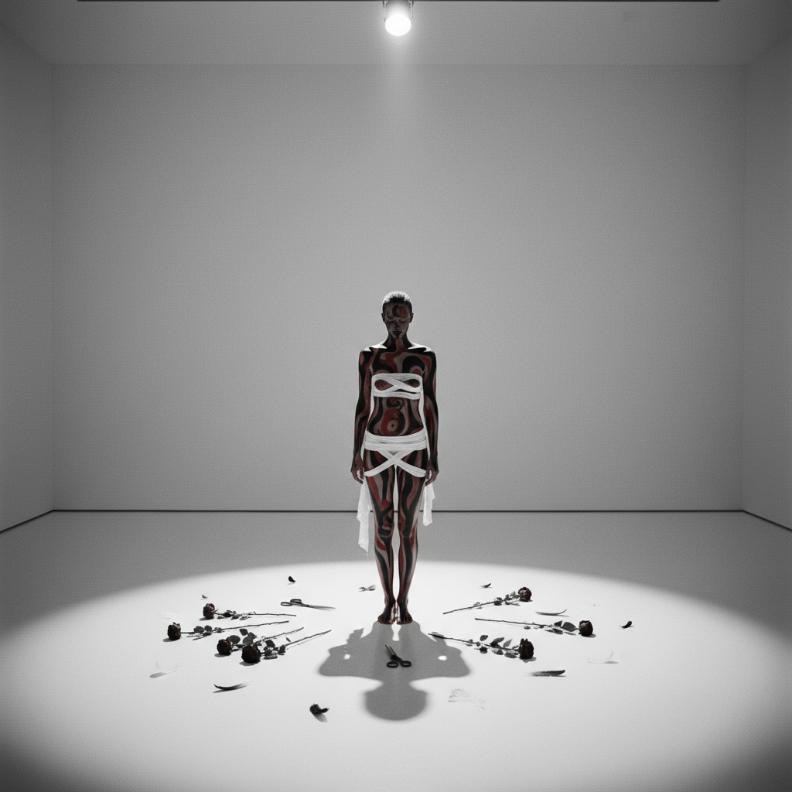

# Body Art 身体艺术

> "I have broken my body so you don't have to break yours." — Marina Abramović

## 概述

身体艺术（Body Art）是1960年代末至1970年代兴起的艺术形式，以艺术家自己的身体作为主要媒介和画布。它将身体置于艺术创作的中心——通过耐力、疼痛、变形、裸露、重复动作等方式，探索身体的极限、社会对身体的规训、以及身体与身份的关系。

身体艺术模糊了艺术与生活、主体与客体、公共与私密的边界，是20世纪最具挑战性的艺术形式之一。

## 核心特征

| 特征 | 描述 |
|------|------|
| 身体即媒介 | 艺术家的身体是作品的材料和画布 |
| 现场性 | 在特定时间和空间中发生 |
| 极限体验 | 常涉及疼痛、耐力、危险 |
| 不可重复 | 每次表演都是唯一的 |
| 政治性 | 挑战性别、种族、阶级对身体的规训 |
| 文档依赖 | 照片和影像成为作品的主要流通形式 |

## 视觉特征

- **媒介**：活的人体——皮肤、血液、汗水、毛发
- **空间**：画廊、街头、私密空间
- **时间**：从几分钟到数天的持续时间
- **记录**：黑白照片、影像、伤疤
- **道具**：刀片、针、镜子、绳索
- **观众**：观者的在场是作品的一部分

## 代表作品

| 作品 | 艺术家 | 年代 | 意义 |
|------|--------|------|------|
| *Rhythm 0* | Marina Abramović | 1974 | 将身体交给观众——人性的测试 |
| *Shoot* | Chris Burden | 1971 | 让人用步枪射击自己的手臂 |
| *Interior Scroll* | Carolee Schneemann | 1975 | 女性身体的自主权宣言 |
| *Trademarks* | Vito Acconci | 1970 | 咬自己身体的每个可及部位 |
| *Cut Piece* | Yoko Ono | 1964 | 观众用剪刀剪去艺术家的衣服 |
| *I'm Too Sad to Tell You* | Bas Jan Ader | 1971 | 哭泣作为艺术行为 |

## 历史时间线

| 时期 | 事件 |
|------|------|
| 1960 | Yves Klein的"人体测量"——用裸体模特作画笔 |
| 1964 | Yoko Ono的Cut Piece——身体艺术的先驱 |
| 1968 | 维也纳行动主义——极端身体表演 |
| 1970-75 | 身体艺术高峰期——Acconci、Burden、Abramović |
| 1975 | Schneemann的Interior Scroll——女性主义身体艺术 |
| 1980s | AIDS危机使身体政治更加紧迫 |
| 1990s-至今 | Orlan的整容手术艺术、Stelarc的赛博格身体 |

## 子类型

| 子类型 | 特征 |
|--------|------|
| 耐力表演 | Abramović、Burden——身体极限的测试 |
| 女性主义身体艺术 | Schneemann、Mendieta——夺回女性身体的自主权 |
| 维也纳行动主义 | Nitsch、Mühl——仪式性的极端身体行为 |
| 赛博格艺术 | Stelarc、Orlan——技术改造身体 |
| 身体政治 | David Wojnarowicz——AIDS时代的身体抗议 |

## 中国语境

身体艺术在中国当代艺术中占有重要位置。1990年代的"行为艺术热"中，张洹（用蜂蜜和苍蝇覆盖身体）、马六明（以女性化形象表演）、何云昌（24小时铸铜）等艺术家创作了大量身体艺术作品。中国身体艺术常带有对集体主义文化中个体身体被压抑的反思。

## 争议与遗产

- **争议**：自我伤害是否是艺术？观众是否成为暴力的共谋？
- **伦理边界**：Chris Burden被射击、Abramović的极端耐力——艺术的边界在哪里？
- **性别政治**：女性身体艺术家面临"展示身体=被物化"的双重困境
- **遗产**：为行为艺术、女性主义艺术、酷儿艺术奠定基础
- **当代回响**：社交媒体上的身体展示、整容文化、虚拟化身

## AI生成概念图

## 与其他风格的关系

- **Performance Art** → 行为艺术是身体艺术的上位概念
- **Feminism** → 女性主义艺术大量使用身体作为媒介
- **Fluxus** → 激浪派的事件性为身体艺术铺路
- **Post-Minimalism** → 后极简主义的身体性延伸到身体艺术
- **Process Art** → 身体的过程（出汗、流血、疲劳）即作品
- **Bio Art** → 生物艺术是身体艺术的科技延伸

---

*浮光艺志 | Chronicle of Artistry*
