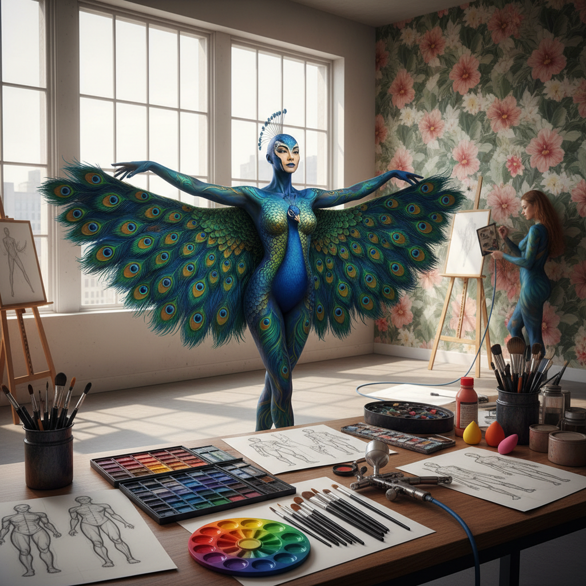

# Body Painting Art 人体彩绘艺术

> "The human body is the oldest canvas — before cave walls, before bark cloth, before paper, humans painted themselves. Body painting transforms the living form into a walking artwork, blurring the boundary between person and image, between the organic and the artistic. Unlike any other canvas, this one breathes, moves, ages, and eventually washes clean." — Unknown

## 概述

人体彩绘艺术（Body Painting Art）是以人体皮肤为画布进行绑画创作的艺术形式——使用安全的颜料、化妆品或临时性染料在人体表面创造图案、图像和视觉幻觉。人体彩绘是最古老的艺术形式之一，也是当代最具视觉冲击力的艺术实践之一。

人体彩绘的实践包括：1）艺术人体彩绘——以艺术表达为目的的全身彩绘；2）伪装彩绘——将人体与背景融为一体的视觉幻觉；3）面部彩绘——脸部的装饰性绘画；4）特效化妆——电影和戏剧中的特效人体彩绘；5）部落彩绘——传统文化中的仪式性身体装饰；6）UV彩绘——在紫外线下发光的人体彩绘；7）孕妇彩绘——在孕妇腹部的创意绘画。

## 核心特征

| 特征 | 描述 |
|------|------|
| 活体 | 活的人体为画布 |
| 临时 | 临时性的创作 |
| 三维 | 三维曲面上的绘画 |
| 互动 | 模特与画的互动 |
| 变形 | 视觉变形和幻觉 |
| 表演 | 表演性的展示 |

## 视觉特征

- **曲面**：适应人体曲面的图案
- **色彩**：鲜艳饱和的色彩
- **幻觉**：视觉幻觉效果
- **融合**：人体与图案的融合
- **动态**：随身体运动变化
- **光影**：利用人体的光影

## 代表作品

| 作品 | 艺术家 | 年代 | 意义 |
|------|--------|------|------|
| *Camouflage* | Johannes Stötter | 当代 | 伪装人体彩绘 |
| *Body painting* | Craig Tracy | 当代 | 艺术人体彩绘 |
| *World Bodypainting Festival* | Various | 1998至今 | 世界人体彩绘节 |
| *Tribal body art* | 传统 | 古代至今 | 部落身体装饰 |
| *UV body painting* | Various | 当代 | 紫外线人体彩绘 |

## 历史时间线

| 时期 | 事件 |
|------|------|
| 史前 | 人类最早的身体装饰 |
| 古代 | 各文化的仪式性身体彩绘 |
| 1960年代 | 人体彩绘作为当代艺术 |
| 1998 | 世界人体彩绘节创办 |
| 当代 | 人体彩绘的多元化发展 |

## 中国语境

人体彩绘艺术在中国有独特的发展轨迹。中国古代有"文身"和"黥面"的传统——从先秦时期的部落纹身到唐代的花钿面饰。中国当代的人体彩绘艺术从2000年代开始快速发展——中国的人体彩绘艺术家在国际比赛中表现出色。中国的人体彩绘常常融入中国传统文化元素——京剧脸谱、水墨画、青花瓷图案、龙凤纹样等。中国的一些艺术院校开设了人体彩绘相关课程。中国的人体彩绘也广泛应用于商业活动、时装秀和影视制作。中国的面部彩绘（脸谱）传统——特别是京剧脸谱——是世界上最精致的面部装饰艺术之一。

## AI生成概念图

## 与其他风格的关系

- **Performance Art** → 表演艺术
- **Tattoo Art** → 纹身艺术
- **Makeup Art** → 化妆艺术
- **Camouflage Art** → 伪装艺术
- **Tribal Art** → 部落艺术
- **Ephemeral Art** → 短暂艺术

---

*浮光艺志 | Chronicle of Artistry*
