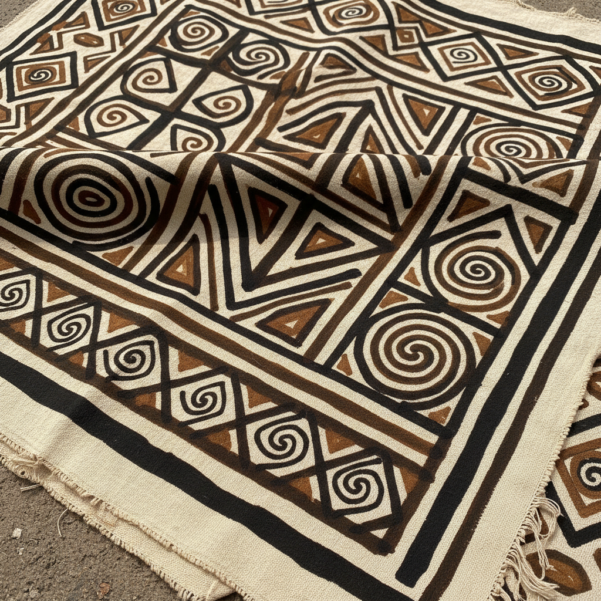

# Bògòlanfini 泥染布 | Mud Cloth

> **"大地的颜色写在布上——马里女性用河泥和树汁书写的密码。"**

## 概述

Bògòlanfini（泥染布 / Mud Cloth）是西非马里共和国班巴拉族（Bambara/Bamana）的传统纺织艺术，"Bògòlan"在班巴拉语中意为"用泥土制成"，"fini"意为"布"。这种独特的染色技法使用发酵的河泥和树叶汁液在手织棉布上创造出深棕色和黑色的几何图案。每种图案都有特定的名称和象征意义，记录着历史事件、社会地位和精神信仰。传统上由女性制作，是马里文化身份的核心视觉符号。

## 制作工艺

1. **手织棉布**：窄条棉布缝合成大幅
2. **树叶浸泡**：将布浸入Ngalama树叶煮出的黄色液体
3. **泥浆绘制**：用发酵河泥绘制图案（泥中铁与单宁反应变黑）
4. **多次涂覆**：反复涂泥和晾干，加深颜色
5. **漂白**：用肥皂或漂白剂去除未涂泥的区域
6. **最终效果**：深棕/黑色图案在浅色/白色底上

## 核心图案及含义

| 图案 | 班巴拉名 | 含义 |
|------|----------|------|
| 十字 | | 勇气、英雄 |
| 锯齿线 | | 鳄鱼背脊、力量 |
| 同心圆 | | 知识、智慧 |
| 菱形 | | 女性、生育 |
| 箭头 | | 勇士、保护 |
| 螺旋 | | 生命循环 |

## 视觉特征

- 深棕/黑色在米白/黄色底上
- 大胆的几何图案
- 手绘的不规则线条
- 条带状的水平分区
- 正负空间的交替
- 泥土的自然质感和色调变化

## 当代影响

| 领域 | 应用 |
|------|------|
| 时装设计 | 非洲时装的标志性面料 |
| 室内设计 | 抱枕、墙饰、地毯 |
| 平面设计 | 非洲主题的品牌设计 |
| 音乐文化 | 嘻哈和非洲音乐的视觉符号 |
| 当代艺术 | Chris Ofili等艺术家的灵感来源 |

## 与其他风格的关系

| 风格 | 关系 |
|------|------|
| Kente（加纳） | 共享西非纺织传统 |
| Adire（尼日利亚） | 共享西非染色传统 |
| 日本绞染 Shibori | 共享抗染技法原理 |
| 极简主义 | 共享几何纯粹性和有限色彩 |
| 当代非洲设计 | 泥染布是泛非洲视觉身份的核心 |

## 概念图

---

*浮光艺志 | Chronicle of Artistry*
