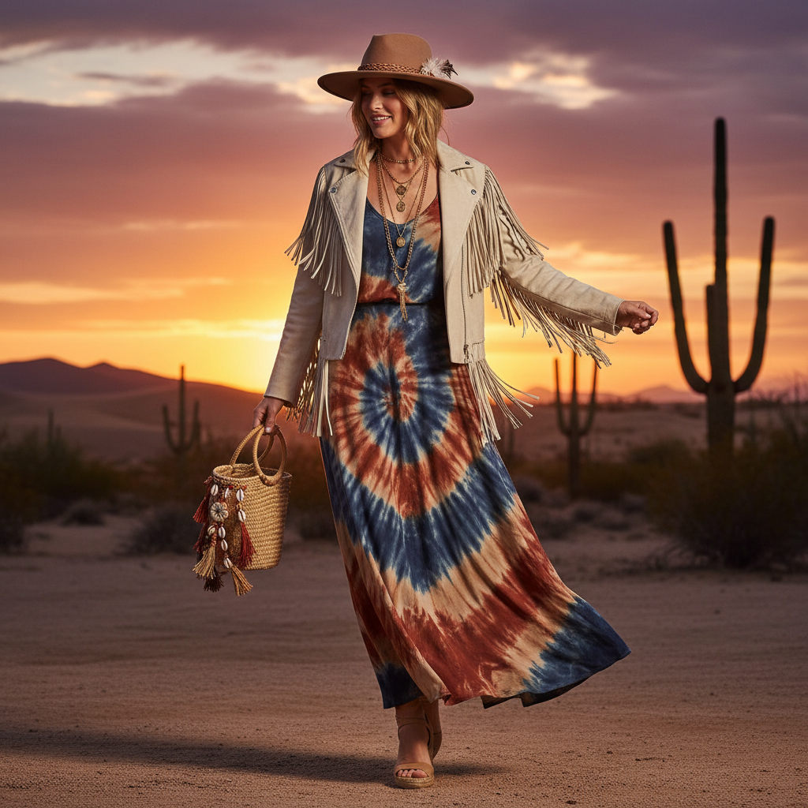

# Boho Chic 波西米亚时尚



> **"流苏、扎染、大地色、层叠首饰——自由灵魂不需要规则。"**

## 概述

| 维度 | 描述 |
|------|------|
| 时期 | 1960s 起源 / 2005–2015 鼎盛 / 至今延续 |
| 别名 | Boho Chic, Bohemian, Boho, Festival Fashion |
| 核心色彩 | 大地色、赭石、靛蓝、米白、铜色 |
| 关键元素 | 流苏、扎染、层叠首饰、麂皮、印花 |
| 代表人物 | Sienna Miller、Free People、Coachella |
| 关联风格 | Hippie, Cottagecore, Coastal Cowgirl, Twee |

---

## 历史脉络

### 从嬉皮到音乐节

| 年份 | 事件 |
|------|------|
| 1960s | 嬉皮运动——波西米亚精神的现代起源 |
| 1970s | 民族风、流苏、扎染成为主流 |
| 2005 | Sienna Miller 定义 "Boho Chic" |
| 2010 | Coachella 音乐节 = Boho 圣地 |
| 2012 | Free People 品牌巅峰 |
| 2015 | 被批评为"文化挪用" |
| 2020s | 以更克制的形式延续 |

### 它代表什么？

| 元素 | 含义 |
|------|------|
| 流苏 | 自由、运动、不受束缚 |
| 扎染 | 手工、独一无二、反工业 |
| 层叠首饰 | 旅行、收集、故事 |
| 大地色 | 自然、接地、有机 |
| 混搭 | "我不遵循规则" |

### 核心哲学

Boho Chic 的精神是**"自由、旅行、不被定义"**：
- 穿衣是自我表达，不是遵循规则
- 每件首饰都有一个旅行故事
- 手工 > 机器
- 自然 > 人工
- "我的风格来自我去过的地方"

---

## 视觉语法

### 色彩系统

```
主色：
  赭石 (#CC7722) — 大地、温暖
  靛蓝 (#1B3A5C) — 扎染、深邃
  米白 (#F5F5DC) — 蕾丝、棉麻
  铜色 (#B87333) — 首饰、金属
  橄榄绿 (#556B2F) — 自然

辅色：
  酒红 (#722F37) — 深秋
  金色 (#DAA520) — 装饰
  天蓝 (#87CEEB) — 天空

质感：
  麂皮 — 流苏、靴子
  棉麻 — 裙子、上衣
  扎染 — 手工、独特
  编织 — 包、腰带
  金属 — 层叠首饰
```

### 标志性元素

| 类别 | 元素 |
|------|------|
| 服装 | 流苏裙、印花长裙、麂皮夹克、宽松上衣 |
| 首饰 | 层叠项链、大耳环、手镯堆叠、戒指 |
| 配饰 | 宽檐帽、编织包、流苏靴 |
| 图案 | 佩斯利、扎染、民族印花、几何 |
| 场景 | 音乐节、沙漠、海滩、旅行 |
| 品牌 | Free People、Anthropologie、Spell |

---

## 与千禧怀旧的关系

### Coachella 一代
- 2010–2015 = Boho Chic 的黄金时代
- Coachella = 千禧一代的"朝圣"
- Instagram 早期 = Boho 滤镜
- 现在回看 = "那个花冠和流苏的时代"

### 文化挪用争议
- 2015年后被广泛批评
- 印第安头饰、bindi = 不再被接受
- Boho 从"自由"变成了"不敏感"
- 2020s 版本更克制、更注意来源

---

## 中国语境

- "波西米亚风"/"民族风"在中国的流行
- 与云南/西藏旅行文化的交叉
- 中国版：民族首饰+棉麻+大地色
- 大理/丽江 = 中国的 Boho 圣地
- 与"文艺青年"/"旅行博主"的交叉

---

## 设计应用

| 场景 | 应用方式 |
|------|----------|
| 品牌 | 大地色+手写字体+民族图案+自然 |
| 空间 | 编织+植物+大地色+层叠纺织品 |
| 时尚 | 流苏+印花+层叠+天然材质 |
| 活动 | 音乐节主题+户外+自然+手工 |

---

## 相关风格

← [Cottagecore 田园核](cottagecore.md) | [Coastal Cowgirl 海岸牛仔女孩](coastal-cowgirl.md) →

↑ [返回千禧怀旧目录](README.md) | [返回总目录](../README.md)
