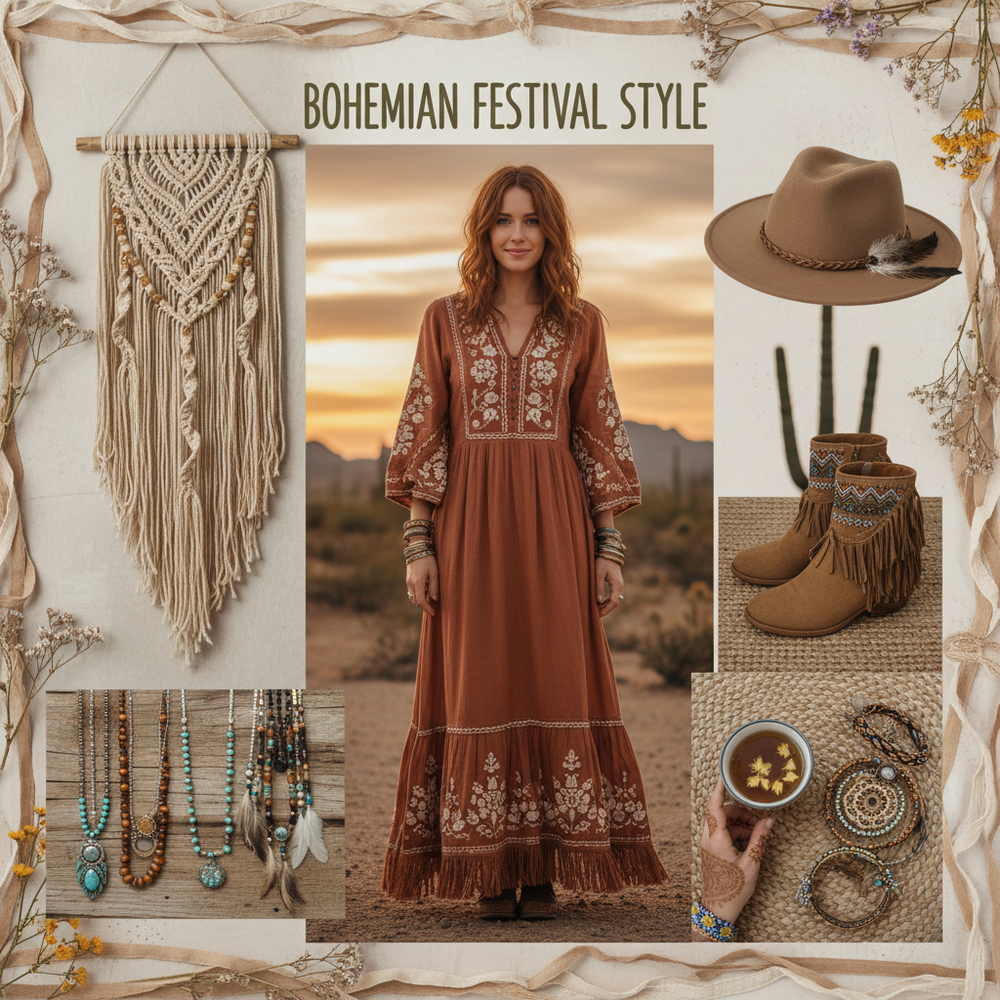

# Boho 波西米亚



> **"流苏、扎染、大地色——自由灵魂不需要规则，只需要一条通往远方的路。"**

## 概述

| 维度 | 描述 |
|------|------|
| 时期 | 1960s 起源 / 2010s 鼎盛 |
| 别名 | Boho, Bohemian, Boho-Chic, Festival Fashion |
| 核心色彩 | 大地色、赭石、焦橙、靛蓝、奶油白 |
| 关键元素 | 流苏、扎染、刺绣、层叠首饰、长裙 |
| 代表人物 | Sienna Miller、Free People、Coachella |
| 关联风格 | Cottagecore, Hippie, Indie Sleaze, Maximalism |

---

## 历史脉络

### 从波西米亚人到 Coachella

| 时代 | 波西米亚表现 |
|------|-------------|
| 19世纪 | 巴黎艺术家的反资产阶级生活方式 |
| 1960s–70s | 嬉皮运动——和平、爱、自由 |
| 2000s | Sienna Miller 定义 "Boho-Chic" |
| 2010s | Coachella 音乐节 = Boho 的年度展示 |
| 2020s | 与 Cottagecore 融合，更偏"安静" |

### 文化基因

| 来源 | 贡献 |
|------|------|
| 嬉皮运动 | 反主流、自由、自然 |
| 摩洛哥/印度 | 刺绣、扎染、图案 |
| 吉普赛文化 | 流浪、层叠、混搭 |
| 音乐节文化 | Coachella、Glastonbury |
| 手工艺 | macramé、编织、天然染料 |

### 核心哲学

Boho 的精神是**"自由、自然、不完美"**：
- 规则是用来打破的
- 混搭 > 配套
- 手工 > 工业
- 旅行 > 定居
- 自然 > 人造

---

## 视觉语法

### 色彩系统

```
主色：
  赭石 (#CC7722) — 大地、陶器
  焦橙 (#CC5500) — 日落、香料
  靛蓝 (#4B0082) — 扎染、牛仔
  奶油白 (#FFFDD0) — 棉麻、蕾丝
  深棕 (#654321) — 皮革、木材

辅色：
  松石绿 (#40E0D0) — 绿松石首饰
  金色 (#DAA520) — 黄铜、首饰
  酒红 (#722F37) — 波斯地毯

质感：
  棉麻 — 自然纤维
  皮革 — 做旧、手工
  macramé — 编织挂毯
  扎染 — 手工染色
  刺绣 — 民族图案
  流苏 — 边缘装饰
```

### 标志性元素

| 类别 | 元素 |
|------|------|
| 服装 | 长裙、流苏背心、刺绣上衣、宽松裤 |
| 配饰 | 层叠项链、绿松石戒指、编织手链、宽檐帽 |
| 空间 | macramé 挂毯、波斯地毯、蒲团、植物 |
| 图案 | 佩斯利、曼陀罗、部落图腾、扎染 |
| 材质 | 棉麻、皮革、黄铜、天然石 |
| 氛围 | 日落、篝火、沙漠、市集 |

---

## 与千禧怀旧的关系

### 2010s Coachella 时代
- Coachella 2012–2019 = Boho 的黄金时代
- 花冠+流苏+短裤 = 千禧一代的音乐节记忆
- Instagram 上的 "festival outfit" 标签

### 与 Cottagecore 的交叉
- 两者都热爱自然和手工
- Boho 更"游牧"，Cottagecore 更"定居"
- 2020s 两者逐渐融合

---

## 中国语境

- "波西米亚风"/"民族风"穿搭
- 云南/西藏旅行穿搭
- 大理/丽江的"文艺青年"美学
- 小红书上的"度假风"/"异域风"
- 与"新中式"的对比

---

## 设计应用

| 场景 | 应用方式 |
|------|----------|
| 品牌 | 大地色+手写字体+民族图案+自然材质 |
| 空间 | macramé+地毯+植物+暖色照明 |
| 包装 | 牛皮纸+棉绳+手工印章+自然色 |
| 摄影 | 金色光线+自然背景+柔焦+暖色调 |

---

## 相关风格

← [Cottagecore 田园核](cottagecore.md) | [Maximalism 极繁主义](maximalism.md) →

↑ [返回千禧怀旧目录](README.md) | [返回总目录](../README.md)
