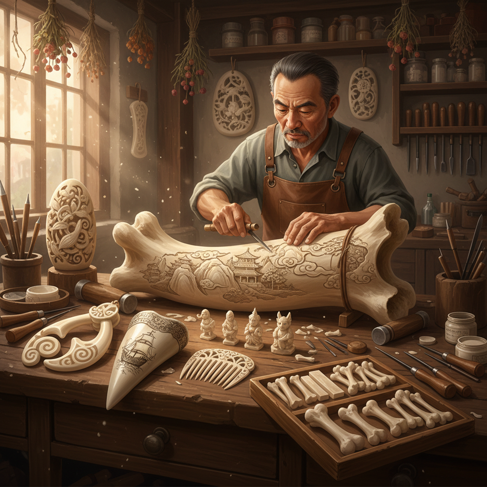

# Bone Carving Art 骨雕艺术

> "Bone carving is humanity's oldest art form — older than painting, older than pottery, older than weaving. When our ancestors first picked up a bone and scratched a mark into it, they were doing what every artist since has done: taking raw material from the world and transforming it into something that carries meaning beyond its physical substance. Bone remembers. It holds the life of the animal it came from, and it holds the life of the artist who shaped it." — Unknown

## 概述

骨雕艺术（Bone Carving Art）是以动物骨骼为材料进行雕刻创作的艺术形式——利用骨骼的天然硬度、纹理和色泽，通过切割、雕刻、打磨等技法创造出精美的艺术品。骨雕是人类最古老的艺术形式之一，有数万年的历史。

骨雕艺术的实践包括：1）传统骨雕——用牛骨、骆驼骨等制作装饰品和实用器物；2）鲸骨雕刻（Scrimshaw）——在鲸骨或鲸牙上进行精细雕刻；3）毛利骨雕——新西兰毛利人的传统骨雕首饰；4）微型骨雕——在极小的骨片上进行微雕；5）骨雕首饰——用骨骼制作的项链、耳环等饰品；6）骨雕建筑装饰——用骨雕作为建筑装饰元素。

## 核心特征

| 特征 | 描述 |
|------|------|
| 古老 | 人类最古老的艺术 |
| 有机 | 天然有机材料 |
| 纹理 | 骨骼的天然纹理 |
| 耐久 | 极其耐久 |
| 温润 | 温润的触感 |
| 文化 | 深厚的文化意义 |

## 视觉特征

- **象牙色**：骨骼的天然色泽
- **纹理**：骨骼的天然纹理
- **光泽**：打磨后的温润光泽
- **精细**：精细的雕刻细节
- **有机**：有机的形态
- **古朴**：古朴的质感

## 代表作品

| 作品 | 艺术家 | 年代 | 意义 |
|------|--------|------|------|
| *Venus of Hohle Fels* | 史前 | 约4万年前 | 最早的人形雕塑 |
| *Scrimshaw* | 捕鲸水手 | 18-19世纪 | 鲸骨雕刻传统 |
| *Maori bone carvings* | 毛利传统 | 古代至今 | 毛利骨雕 |
| *Chinese bone carvings* | 中国传统 | 古代至今 | 中国骨雕 |
| *Contemporary bone art* | Various | 当代 | 当代骨雕艺术 |

## 历史时间线

| 时期 | 事件 |
|------|------|
| 4万年前 | 最早的骨雕作品 |
| 新石器时代 | 骨雕工具和装饰品 |
| 中世纪 | 欧洲宗教骨雕 |
| 18-19世纪 | Scrimshaw鲸骨雕刻 |
| 当代 | 骨雕作为当代艺术媒介 |

## 中国语境

骨雕艺术在中国有极其悠久的历史。中国的骨雕可追溯到新石器时代——河姆渡遗址出土的骨雕（约7000年前）展示了精湛的雕刻技艺。中国商代的甲骨文——在龟甲和兽骨上刻写的文字——本质上也是一种骨雕艺术。中国传统的牛骨雕刻以北京、浙江为代表，能在骨片上雕出极其精细的人物、山水和花鸟。中国的骨雕与象牙雕刻技法相通，在象牙贸易被禁止后，骨雕成为重要的替代材料。中国当代的骨雕艺术家将传统技法与现代设计结合，创作出既有文化底蕴又有当代审美的作品。

## AI生成概念图

## 与其他风格的关系

- **Ivory Carving** → 象牙雕刻
- **Horn Art** → 角雕艺术
- **Shell Art** → 贝壳艺术
- **Scrimshaw** → 鲸骨雕刻
- **Miniature Art** → 微型艺术
- **Jewelry Art** → 首饰艺术

---

*浮光艺志 | Chronicle of Artistry*
