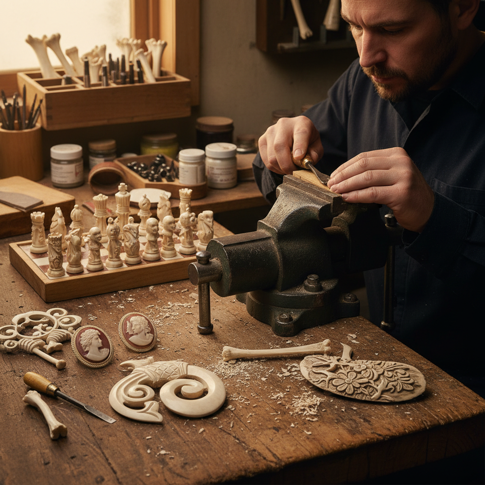

# Bone Carving 骨雕

> "Bone carving transforms the remnants of life into art — the patient hand reveals forms hidden within the dense, layered structure of bone, creating objects that bridge the organic and the eternal." — Unknown

## 概述

骨雕（Bone Carving）是在动物骨骼上进行雕刻和塑形的工艺。骨雕使用的材料主要是牛骨、鹿角、鲸骨等大型动物的骨骼——这些骨骼经过清洁、漂白和干燥后，成为坚硬而细腻的雕刻材料。骨雕是人类最古老的艺术形式之一——早在旧石器时代，人类就开始在骨头上雕刻图案和制作工具。

骨雕的技法包括：浮雕（relief carving）、圆雕（carving in the round）、透雕（pierced carving）和线刻（scrimshaw）。骨头的特性——坚硬但可加工、有天然的纹理和色泽、可以打磨到光滑——使其成为理想的雕刻材料。骨雕作品包括：首饰（吊坠、耳环、胸针）、装饰品、宗教物品、工具手柄、棋子等。

## 核心特征

| 特征 | 描述 |
|------|------|
| 骨骼 | 使用动物骨骼 |
| 古老 | 最古老的艺术之一 |
| 精细 | 可实现精细雕刻 |
| 天然 | 天然的色泽和纹理 |
| 耐久 | 极其耐久 |
| 多技法 | 浮雕、圆雕、透雕 |

## 视觉特征

- **象牙色**：天然的象牙白色
- **光滑**：打磨后的光滑质感
- **精细**：精细的雕刻细节
- **纹理**：骨骼的天然纹理
- **温润**：温润的触感
- **古朴**：古朴的美感

## 代表作品

| 作品 | 艺术家 | 年代 | 意义 |
|------|--------|------|------|
| *Prehistoric bone carvings* | 匿名 | 旧石器时代 | 史前骨雕 |
| *Maori bone pendants* | 毛利工匠 | 传统 | 毛利骨雕吊坠 |
| *Medieval bone chess pieces* | 匿名 | 中世纪 | 中世纪骨雕棋子 |
| *Scrimshaw whale bone* | 水手 | 18-19世纪 | 鲸骨线刻 |
| *Contemporary bone jewelry* | Various | 当代 | 当代骨雕首饰 |

## 历史时间线

| 时期 | 事件 |
|------|------|
| 旧石器时代 | 最早的骨雕证据 |
| 新石器时代 | 骨雕工具和装饰品 |
| 古代文明 | 各文明的骨雕传统 |
| 中世纪 | 欧洲骨雕工艺 |
| 18-19世纪 | 鲸骨线刻（Scrimshaw）的繁荣 |
| 当代 | 骨雕作为当代艺术和首饰 |

## 中国语境

骨雕在中国有着悠久的历史——中国的骨雕传统可以追溯到新石器时代的骨针、骨簪和骨雕装饰品。中国的传统骨雕以牛骨雕刻为主，主要产地包括北京、浙江、福建等地。中国的骨雕作品以精细的浮雕和透雕著称——传统题材包括人物、花鸟、山水等。骨雕是中国传统工艺美术的重要门类之一。当代中国的骨雕艺术家继续传承和创新这一古老技艺。一些地方的骨雕技艺被列为非物质文化遗产。

## AI生成概念图

## 与其他风格的关系

- **Horn Carving** → 角雕
- **Scrimshaw** → 线刻
- **Ivory Alternative** → 象牙替代材料雕刻
- **Wood Carving** → 木雕
- **Jade Carving** → 玉雕
- **Netsuke** → 根付

---

*浮光艺志 | Chronicle of Artistry*
