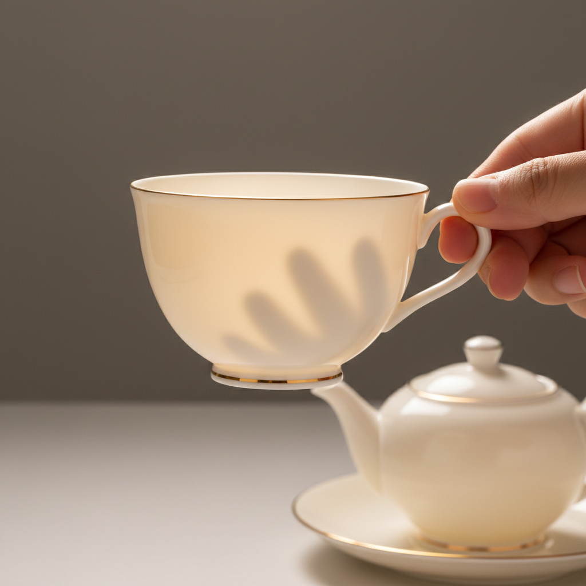

# Bone China Art 骨瓷艺术

> "Bone china is porcelain refined to its most luminous extreme — cattle bone ash mixed with kaolin and feldspar, fired to translucency so complete that a hand held behind the cup casts a shadow through the wall, the phosphate from bone creating a warmth and whiteness no other ceramic body achieves, strength married to delicacy in a material that rings like a bell when struck and glows like a lantern when lit from within." — Unknown

## 概述

骨瓷艺术（Bone China Art）是一种以动物骨灰（主要是牛骨灰）为主要原料之一的高级瓷器艺术。骨瓷的配方通常包含约50%的骨灰、25%的高岭土和25%的长石——骨灰中的磷酸钙赋予骨瓷独特的温暖白色和极高的透光性。骨瓷是所有瓷器中最白、最透、最薄却最坚韧的品种，被誉为"瓷器之王"。

骨瓷艺术的核心要素包括：1）骨灰配方——约50%的动物骨灰；2）极致透光——可透光的超薄瓷壁；3）温暖白色——骨灰带来的独特暖白；4）高强度——比普通瓷器更坚韧；5）轻薄精致——极薄的器壁；6）清脆声音——敲击时发出清脆的铃声；7）高级定位——高端瓷器的代表。

## 核心特征

| 特征 | 描述 |
|------|------|
| 骨灰配方 | 含约50%动物骨灰 |
| 极致透光 | 超高的透光性 |
| 温暖白色 | 独特的乳白色调 |
| 超薄器壁 | 极薄却坚韧的壁厚 |
| 高强度 | 比普通瓷器更耐用 |
| 铃声清脆 | 敲击发出悦耳声音 |

## 视觉特征

- **乳白色调**：温暖的乳白色
- **透光效果**：光线可透过器壁
- **精致薄壁**：极薄的器壁
- **光滑表面**：如丝般光滑的釉面
- **优雅造型**：精致优雅的器形
- **金边装饰**：常配以金边或精细装饰

## 代表作品

| 作品 | 艺术家/文化 | 年代 | 意义 |
|------|-------------|------|------|
| *Spode骨瓷* | Josiah Spode | 1790年代 | 骨瓷配方的完善 |
| *Wedgwood骨瓷* | Wedgwood | 19世纪起 | 英国骨瓷传统 |
| *Royal Crown Derby* | Royal Crown Derby | 19世纪起 | 皇家骨瓷 |
| *日本Noritake骨瓷* | Noritake | 20世纪 | 亚洲骨瓷发展 |
| *当代骨瓷艺术* | 各地陶艺家 | 当代 | 骨瓷的艺术化探索 |

## 历史时间线

| 时期 | 事件 |
|------|------|
| 1748年 | Thomas Frye首次尝试骨灰瓷 |
| 1790年代 | Josiah Spode完善骨瓷配方 |
| 19世纪 | 骨瓷成为英国瓷器的代表 |
| 20世纪 | 骨瓷生产扩展到全球 |
| 当代 | 骨瓷在艺术与工业中的多元发展 |

## 中国语境

骨瓷虽然是英国发明的瓷器品种，但中国现在是世界上最大的骨瓷生产国之一。中国的骨瓷产业主要集中在唐山——唐山骨瓷以其高品质和大规模生产能力闻名。中国骨瓷的发展始于1960年代的技术引进，经过几十年的发展已经形成了完整的产业链。中国当代陶艺家也开始探索骨瓷的艺术可能性——利用骨瓷的透光性创作灯具、装置艺术和雕塑作品。骨瓷的"以骨为瓷"在中国文化中有特殊的意味——将动物骨骼转化为最精致的器物，体现了物质转化的哲学。

## AI生成概念图

## 与其他风格的关系

- **Porcelain** → 瓷器
- **Translucent Ceramics** → 透光陶瓷
- **English Ceramics** → 英国陶瓷
- **Fine China** → 精细瓷器
- **Tableware Design** → 餐具设计
- **Industrial Ceramics** → 工业陶瓷

---

*浮光艺志 | Chronicle of Artistry*
