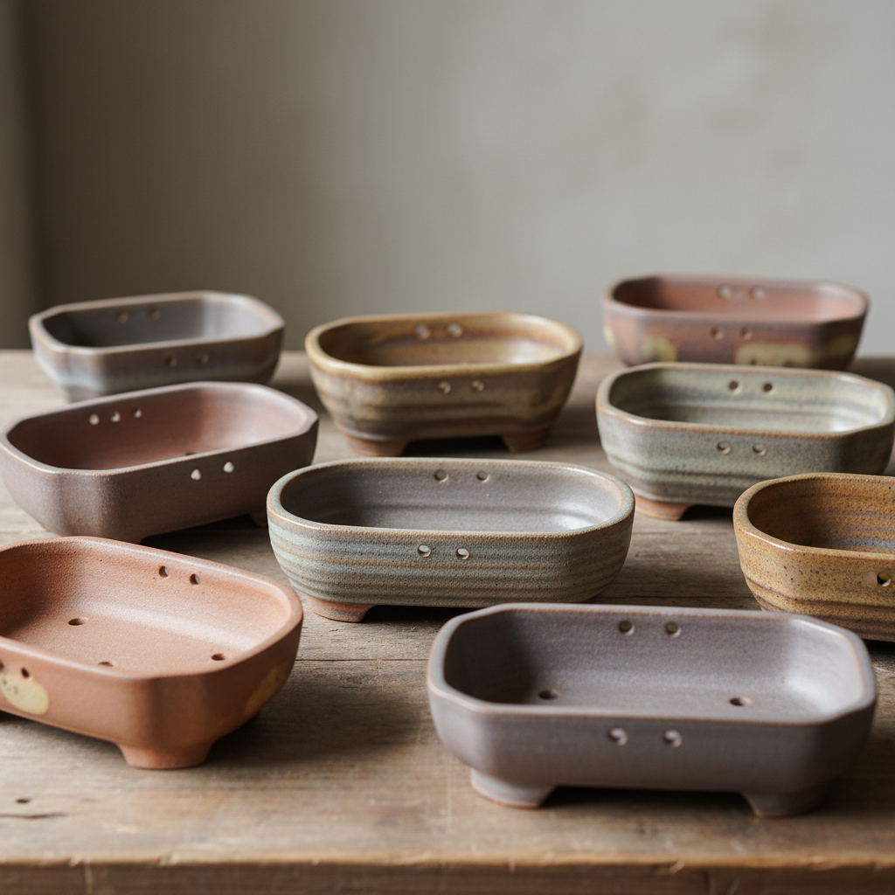

# Bonsai Pot Art 盆景盆艺术

> "The bonsai pot is a frame for living sculpture — a shallow vessel whose proportions, color, and texture must complement without competing, its rim defining the horizon of a miniature landscape, its depth calculated to sustain roots while suggesting vast plains or mountain plateaus, the pot and tree together forming a single composition where ceramic restraint allows botanical drama to speak." — Unknown

## 概述

盆景盆艺术（Bonsai Pot Art）是一种专门为盆景（盆栽）创作陶瓷容器的艺术形式。盆景盆不仅是植物的容器，更是盆景艺术构图的重要组成部分——盆与树的关系如同画框与画的关系。一只好的盆景盆需要在功能（排水、透气、适当深度）和美学（造型、色彩、质感与树的协调）之间取得完美平衡。盆景盆的设计哲学是"衬托而非抢夺"——让树成为主角。

盆景盆艺术的核心要素包括：1）比例协调——盆与树的比例关系；2）色彩搭配——盆色与树的色彩协调；3）功能设计——排水孔、透气性、根部空间；4）造型多样——从方形到圆形到不规则形；5）质感选择——釉面或无釉的质感选择；6）文化传统——中日盆景文化的深厚传统；7）克制美学——衬托而非抢夺的设计哲学。

## 核心特征

| 特征 | 描述 |
|------|------|
| 比例协调 | 盆与树的完美比例 |
| 克制美学 | 衬托而非抢夺 |
| 功能设计 | 排水透气的功能需求 |
| 造型多样 | 丰富的器形选择 |
| 文化深度 | 深厚的东方文化传统 |
| 整体构图 | 盆树一体的构图 |

## 视觉特征

- **浅口造型**：通常较浅的盆体
- **素雅色彩**：不抢夺注意力的素色
- **精致足部**：精心设计的盆足
- **排水孔**：底部的排水设计
- **质感选择**：釉面或粗陶的选择
- **边缘处理**：精细的口沿处理

## 代表作品

| 作品 | 艺术家/文化 | 年代 | 意义 |
|------|-------------|------|------|
| *宜兴紫砂盆* | 中国宜兴 | 明代起 | 中国盆景盆传统 |
| *常滑烧盆* | 日本常滑 | 江户起 | 日本盆景盆传统 |
| *当代手工盆* | 各地陶艺家 | 当代 | 盆景盆的艺术化 |
| *古渡盆* | 中国/日本 | 明清 | 古董盆景盆 |
| *微型盆* | 各地陶艺家 | 当代 | 微型盆景的容器 |

## 历史时间线

| 时期 | 事件 |
|------|------|
| 唐宋 | 中国盆景艺术的形成 |
| 明代 | 宜兴紫砂盆景盆的发展 |
| 江户时代 | 日本盆景盆传统的确立 |
| 20世纪 | 盆景盆作为独立收藏品类 |
| 当代 | 盆景盆的全球化创作 |

## 中国语境

中国是盆景艺术的发源地——盆景（盆栽）起源于中国唐宋时期。中国的盆景盆传统极为丰富：宜兴紫砂盆以其透气性和质朴美感成为盆景盆的首选；景德镇的青花盆和粉彩盆则代表了华丽的装饰传统；石湾的陶盆以其自然质感著称。中国古代文人将盆景视为"缩地成寸"的艺术——在方寸之间再现山水意境，而盆就是这个微缩世界的"大地"。中国当代盆景盆创作正在经历复兴——越来越多的陶艺家开始专注于盆景盆的创作，将传统工艺与当代审美结合。

## AI生成概念图

## 与其他风格的关系

- **Yixing Zisha** → 宜兴紫砂
- **Bonsai Art** → 盆景艺术
- **Garden Ceramics** → 园林陶瓷
- **Miniature Art** → 微型艺术
- **Scholar's Object** → 文房器
- **Landscape Art** → 山水艺术

---

*浮光艺志 | Chronicle of Artistry*
