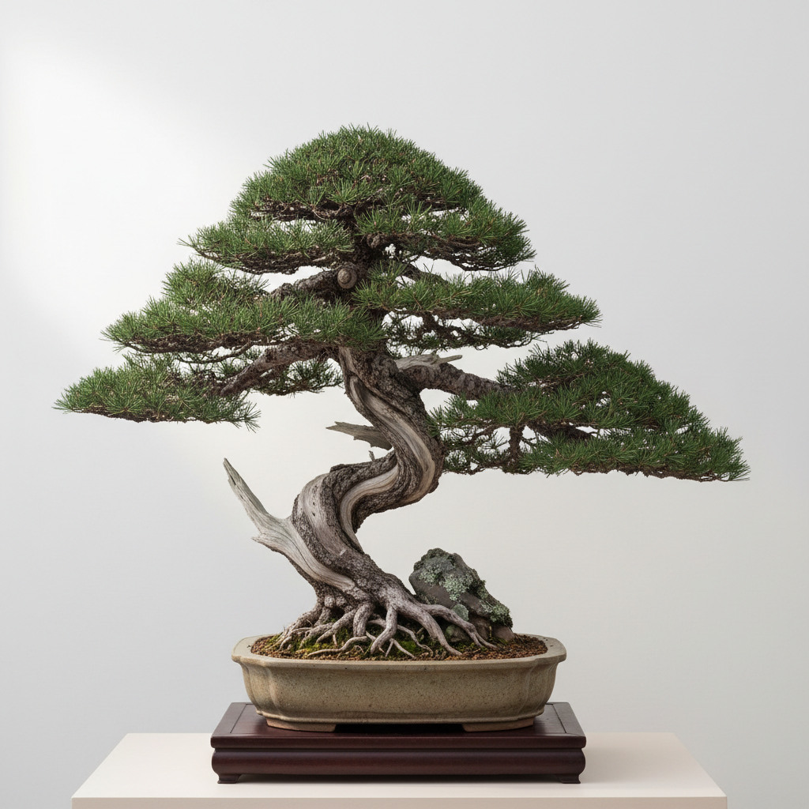

# Bonsai 盆景艺术

> "A bonsai is not a small tree — it is a universe contained in a pot." — John Naka

## 概述

盆景艺术（Bonsai/盆栽）是将树木种植在浅盆中，通过修剪、蟠扎、造型等技法使其呈现自然大树的形态和意境的活体艺术。从中国唐代的"盆景"到日本的"盆栽"，从文人的案头清供到当代的国际盆景展，盆景以其将自然浓缩于方寸之间的魔力成为东方美学最具代表性的艺术形式之一。

盆景的哲学在于：以小见大——一棵盆中的松树可以让你看到悬崖上的千年古松，一块石头可以让你想象整座山脉。

## 核心特征

| 特征 | 描述 |
|------|------|
| 活体 | 活的植物作为艺术媒介 |
| 微缩 | 将自然微缩于盆中 |
| 时间 | 需要数年甚至数十年的培育 |
| 造型 | 通过修剪和蟠扎造型 |
| 意境 | 追求自然的意境 |
| 养护 | 需要持续的养护 |

## 视觉特征

- **形态**：模拟自然大树的形态
- **比例**：精确的比例缩小
- **枝干**：优美的枝干线条
- **根盘**：露出的根系
- **盆器**：盆与树的和谐
- **苔藓**：苔藓和配石的点缀

## 代表作品

| 作品 | 艺术家 | 年代 | 意义 |
|------|--------|------|------|
| *Imperial bonsai collection* | 日本皇室 | 数百年 | 皇室盆栽收藏 |
| *Goshin* | John Naka | 1948-至今 | 美国盆景的代表 |
| *Chinese penjing* | 各流派 | 传统 | 中国盆景传统 |
| *Suzhou penjing* | 苏州盆景 | 传统 | 苏派盆景 |
| *Contemporary bonsai* | Various | 2000s+ | 当代盆景艺术 |

## 历史时间线

| 时期 | 事件 |
|------|------|
| 唐代 | 中国盆景的起源 |
| 宋代 | 文人盆景的发展 |
| 12世纪 | 盆景传入日本 |
| 明清 | 中国盆景的黄金时代 |
| 20世纪 | 盆景的国际化 |
| 当代 | 盆景作为全球艺术形式 |

## 中国语境

盆景是中国原创的艺术形式——中国盆景（盆景/盆栽）有超过1300年的历史。中国盆景分为多个流派：苏派、扬派、岭南派、川派等，各有特色。中国盆景强调"诗情画意"，追求文人画的意境。与日本盆栽相比，中国盆景更注重意境和文化内涵，形式更加自由多样。中国盆景被列为国家级非物质文化遗产。

## AI生成概念图

## 与其他风格的关系

- **Ikebana** → 花道与盆景是姐妹艺术
- **Chinese Garden** → 园林与盆景有"以小见大"的共同哲学
- **Sculpture** → 盆景是活的雕塑
- **Landscape Painting** → 山水画是盆景的精神来源
- **Zen Art** → 禅宗美学的生活实践
- **Living Art** → 活体艺术的代表

---

*浮光艺志 | Chronicle of Artistry*
