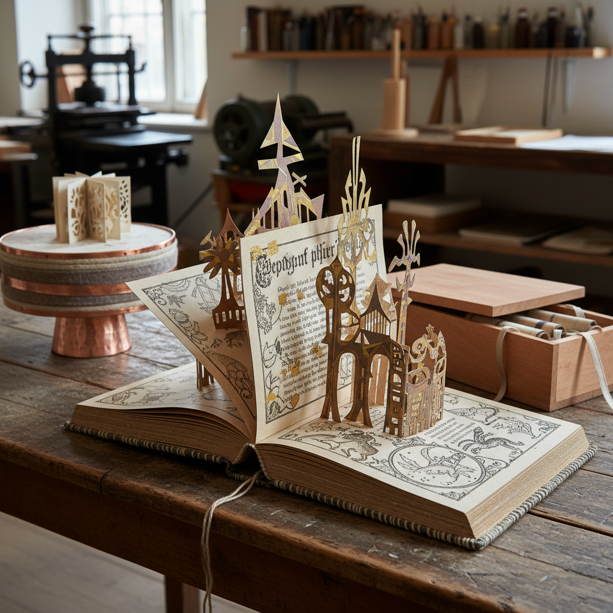

# Book Art 书籍艺术

> "A book is a sequence of spaces." — Ulises Carrión

## 概述

书籍艺术（Book Art / Artists' Books / Livre d'Artiste）是将书籍本身——而非仅仅书中的内容——作为艺术媒介的创作实践。艺术家书籍不是"有插图的书"，而是将书的物理形态（翻页、折叠、装订、序列）作为表达手段的独立艺术形式。

从马拉美的"Un Coup de Dés"到Ed Ruscha的摄影书、从Dieter Roth的腐烂书到徐冰的"天书"，书籍艺术探索了书作为物体、作为时间序列、作为概念容器的无限可能。

## 核心特征

| 特征 | 描述 |
|------|------|
| 书作为媒介 | 书的物理形态本身是艺术表达 |
| 序列性 | 翻页创造的时间和叙事序列 |
| 触觉性 | 需要用手翻阅——触觉体验 |
| 亲密性 | 一对一的私密观看体验 |
| 多重性 | 可以是唯一的也可以是版本的 |
| 跨界性 | 融合视觉、文字、雕塑、版画 |

## 视觉特征

- **形态**：传统书形、手风琴折、卷轴、异形
- **材料**：纸、布、金属、木、塑料——任何可折叠的材料
- **装订**：线装、胶装、螺旋、无装订——结构即内容
- **印刷**：活字、丝网、石版、数字、手写
- **尺度**：微型书到巨型书
- **互动**：翻页、展开、拉出——读者的身体参与

## 代表作品

| 作品 | 艺术家 | 年代 | 意义 |
|------|--------|------|------|
| *Twentysix Gasoline Stations* | Ed Ruscha | 1963 | 概念摄影书的先驱 |
| *天书 (Book from the Sky)* | 徐冰 | 1987-91 | 4000个伪汉字的巨型书籍装置 |
| *Daily Mirror* | Dieter Roth | 1961 | 报纸的物质性解构 |
| *Codex Seraphinianus* | Luigi Serafini | 1981 | 虚构世界的百科全书 |
| *Un Coup de Dés* | Stéphane Mallarmé | 1897 | 页面空间作为诗的先驱 |
| *Fluxkit* | George Maciunas | 1964 | Fluxus的盒装艺术品集 |

## 历史时间线

| 时期 | 事件 |
|------|------|
| 1897 | Mallarmé的*Un Coup de Dés*——页面空间革命 |
| 1910s | 未来主义和达达的实验书籍 |
| 1920s | 俄国构成主义的摄影书 |
| 1960s | Ed Ruscha——概念艺术家书籍 |
| 1960s | Fluxus——盒装和邮寄的艺术品集 |
| 1970s | 女性主义艺术家书籍运动 |
| 1980s | 徐冰*天书*——书籍作为装置 |
| 1990s | Zine文化——DIY出版的民主化 |
| 2000s-至今 | 数字时代的手工书复兴 |

## 子类型

| 子类型 | 特征 |
|--------|------|
| Livre d'Artiste | Matisse、Picasso——画家与诗人的合作 |
| 概念书 | Ruscha——摄影和概念的序列 |
| 雕塑书 | 书作为三维物体和雕塑 |
| 手工书 | 手工制作的唯一或限量版 |
| 改造书 | 对现有书籍的切割、折叠、改造 |
| Zine | DIY自出版的小册子 |

## 中国语境

中国有世界上最悠久的书籍传统——从竹简到卷轴、从线装书到经折装。徐冰的"天书"和"地书"是中国当代书籍艺术的最高成就。中国的独立出版和Zine文化在近年快速发展，北京、上海的艺术书展吸引了大量年轻创作者。中国传统的书籍形态（经折装、蝴蝶装、线装）为当代书籍艺术提供了独特的结构灵感。

## 争议与遗产

- **争议**：书籍艺术是视觉艺术还是文学？属于图书馆还是美术馆？
- **展示困境**：书需要翻阅，但美术馆只能展示一页
- **数字时代**：电子书时代，物理书籍的艺术价值反而上升
- **遗产**：证明了最日常的物品形态可以承载最深刻的艺术实验
- **当代回响**：独立出版、Zine文化、艺术书展、手工书工坊

## AI生成概念图

## 与其他风格的关系

- **Conceptual Art** → 概念艺术的去物质化在书籍中找到理想载体
- **Mail Art** → 邮件艺术与书籍艺术共享小尺度和流通性
- **Fluxus** → 激浪派的盒装作品是书籍艺术的重要分支
- **Typography** → 字体排印是书籍艺术的视觉基础
- **Calligraphy Art** → 书法与书籍在东方传统中密不可分
- **Print Art** → 版画技术是书籍艺术的重要制作手段

---

*浮光艺志 | Chronicle of Artistry*
