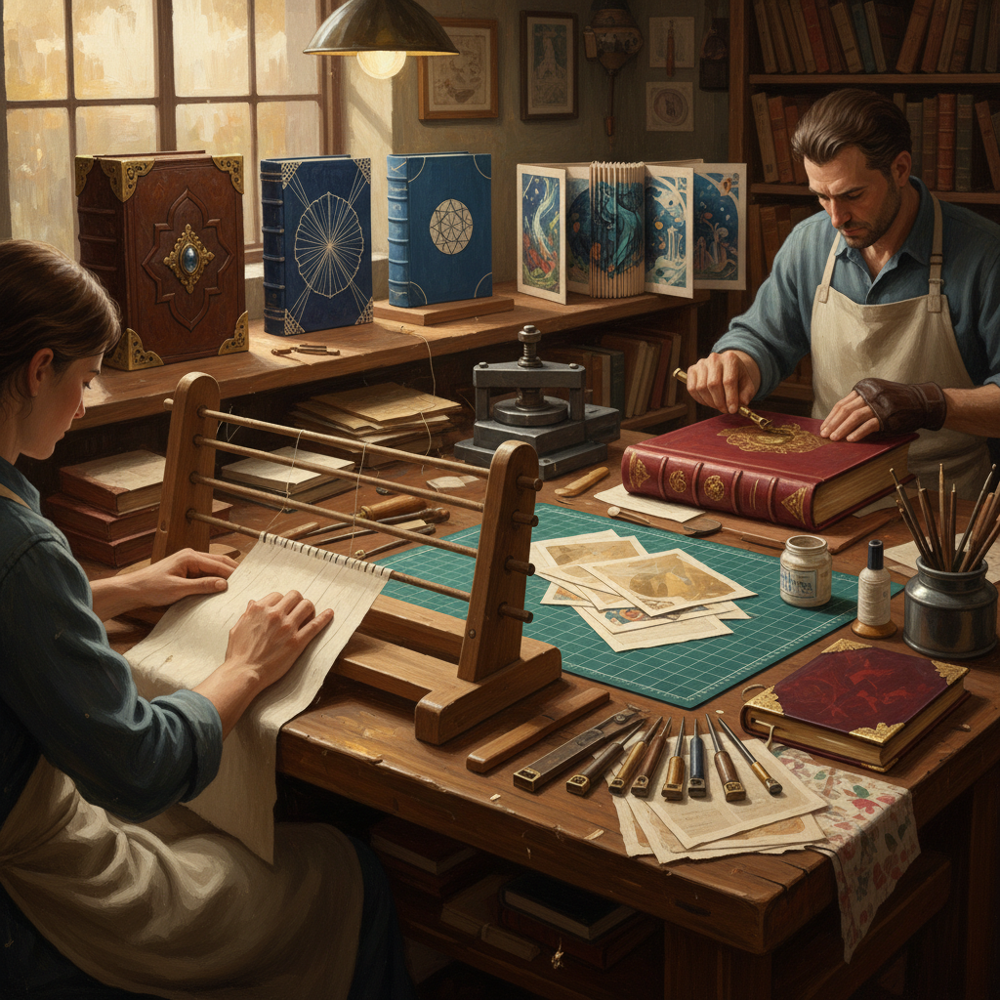

# Bookbinding Art 装帧艺术

> "Bookbinding is architecture in miniature — paper gathered into signatures, sewn onto cords, encased in boards and covered in leather or cloth, each structural decision both functional and aesthetic, transforming loose leaves into an object that invites the hand as much as the eye." — Unknown

## 概述

装帧艺术（Bookbinding Art）是将散页纸张通过折叠、缝合、粘贴和装饰等工艺制作成书籍的手工艺术。装帧不仅是功能性的（保护和组织内容），更是一种独立的艺术形式——从中世纪的镶宝石福音书封面到当代的艺术家手工书（artist's book），装帧艺术贯穿了整个书籍文明史。

装帧艺术包括多种结构和风格：西方传统装帧（科普特装帧、中世纪装帧、现代精装）、东方传统装帧（中国线装、日本和装、经折装）、当代创意装帧（隧道书、旋转书、手风琴书、星形书等）。装帧材料包括：纸张、布料、皮革、木板、金属配件、丝线等。当代装帧艺术家将传统技法与现代设计理念结合，创作从功能性书籍到纯艺术雕塑的各种作品。

## 核心特征

| 特征 | 描述 |
|------|------|
| 结构 | 精密的书籍结构 |
| 缝合 | 手工缝合技术 |
| 材料 | 多种材料组合 |
| 功能 | 功能与美学结合 |
| 传统 | 悠久的传统 |
| 触感 | 强调触感体验 |

## 视觉特征

- **结构**：精密的结构美感
- **材料**：丰富的材料质感
- **工艺**：精湛的手工工艺
- **细节**：精细的装饰细节
- **触感**：邀请触摸的质感
- **叙事**：书籍的叙事性

## 代表作品

| 作品 | 艺术家 | 年代 | 意义 |
|------|--------|------|------|
| *Book of Kells binding* | Unknown | 中世纪 | 中世纪装帧 |
| *Arts & Crafts bindings* | William Morris | 19世纪末 | 工艺美术运动装帧 |
| *Contemporary artist books* | Various | 当代 | 当代艺术家手工书 |
| *Japanese stab bindings* | 日本工匠 | 传统 | 日本和装 |
| *Chinese thread bindings* | 中国工匠 | 传统 | 中国线装 |

## 历史时间线

| 时期 | 事件 |
|------|------|
| 古代 | 卷轴和早期装帧 |
| 中世纪 | 欧洲手抄本装帧的鼎盛 |
| 15世纪 | 印刷术推动装帧的发展 |
| 19世纪 | 工艺美术运动的装帧复兴 |
| 20世纪 | 艺术家手工书的兴起 |
| 当代 | 装帧艺术的多样化发展 |

## 中国语境

装帧艺术在中国有极其悠久的传统——中国是世界上最早发明纸张和印刷术的国家。中国传统的装帧形式包括：卷轴装、经折装、蝴蝶装、包背装、线装等。中国的线装书是东方装帧的代表——用丝线在书脊外侧缝合。当代中国的装帧设计在出版业中有重要地位——中国的"最美的书"评选推动了装帧设计的发展。中国的手工书艺术家和独立出版者也在探索创意装帧。

## AI生成概念图

## 与其他风格的关系

- **Calligraphy** → 书法
- **Paper Art** → 纸艺
- **Leather Craft** → 皮革工艺
- **Typography** → 字体设计
- **Printmaking** → 版画
- **Mixed Media** → 混合媒介

---

*浮光艺志 | Chronicle of Artistry*
