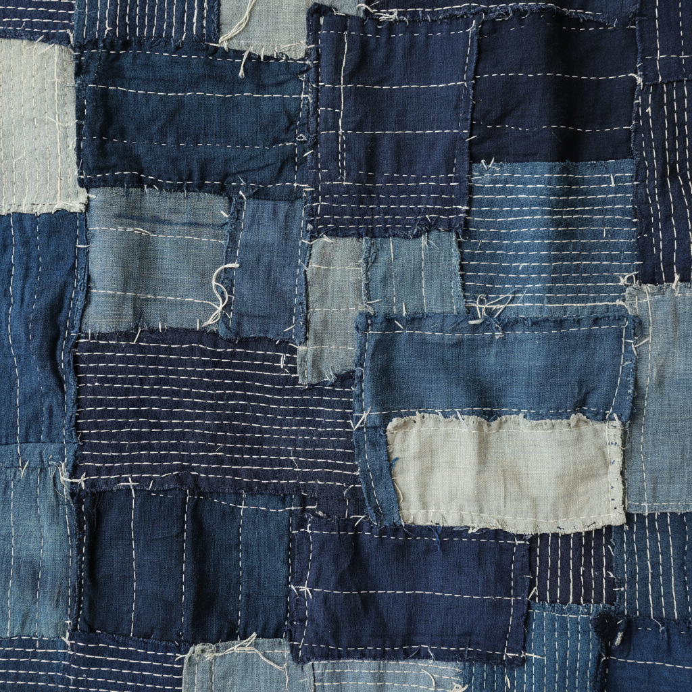

# Boro Art 缝补艺术

> "Boro is the beauty of necessity — layers of indigo cloth patched, mended, and stitched together over generations until the original fabric is barely visible beneath its history of repairs. Each patch tells a story of scarcity and resourcefulness, each stitch a small act of preservation. What was once a mark of poverty is now recognized as an aesthetic of profound beauty: the art of making do, elevated to philosophy." — Unknown

## 概述

缝补艺术（Boro Art）是一种日本传统的织物修补和再利用技法——通过反复缝补、叠加和拼接碎布来延长织物的使用寿命。Boro（ぼろ）在日语中意为"破布"或"碎片"，这种技法源于日本北方贫困农民对珍贵织物的珍惜和再利用，现在被视为一种具有深刻哲学意义的美学形式。

缝补艺术的实践包括：1）补丁——在破损处覆盖布片并缝合；2）叠层——多层布料的叠加缝合；3）刺子绣加固——用刺子绣针法加固补丁；4）拼接——将多块碎布拼接成新的织物；5）渐进修补——随时间不断添加新的修补；6）当代boro——将传统美学与现代设计结合的创作。

## 核心特征

| 特征 | 描述 |
|------|------|
| 修补 | 修补和再利用的哲学 |
| 叠层 | 多层织物的叠加 |
| 时间 | 时间积累的痕迹 |
| 靛蓝 | 靛蓝染色的传统 |
| 朴素 | 朴素之美的哲学 |
| 可持续 | 可持续的生活方式 |

## 视觉特征

- **补丁**：可见的补丁和缝合
- **靛蓝**：深浅不一的靛蓝色
- **层次**：多层织物的层次感
- **针迹**：可见的刺子绣针迹
- **时间**：时间留下的痕迹
- **朴素**：朴素自然的美感

## 代表作品

| 作品 | 艺术家/文化 | 年代 | 意义 |
|------|-------------|------|------|
| *Tohoku boro textiles* | 日本东北 | 江户-明治 | 东北缝补织物 |
| *Boro futon covers* | 日本 | 传统 | 缝补被褥 |
| *Boro work clothes* | 日本 | 传统 | 缝补工作服 |
| *Amuse Museum collection* | 日本 | 收藏 | 浅草博物馆收藏 |
| *Contemporary boro* | 当代 | 当代 | 当代缝补艺术 |

## 历史时间线

| 时期 | 事件 |
|------|------|
| 江户时代 | Boro作为生存必需的发展 |
| 明治-大正 | Boro的持续使用 |
| 昭和时代 | Boro的消失和被遗忘 |
| 1990年代 | Boro的重新发现和收藏 |
| 当代 | Boro的全球认知和艺术化 |

## 中国语境

缝补艺术在中国有深厚的文化共鸣。中国传统的"百衲衣"与boro有相似的哲学——将碎布拼接成完整的衣物。中国佛教的"百衲袈裟"体现了与boro相同的朴素美学——以碎布缝合象征对物质的超越。中国传统的"补丁"文化在物资匮乏的年代是普遍的生活方式——与日本boro有相同的社会背景。中国当代的可持续时尚运动中，boro美学获得了广泛关注——作为反对快时尚的哲学表达。中国的一些设计师将boro的修补美学与中国传统拼布结合——创造具有中国特色的缝补艺术作品。中国的手工艺社区中，boro作为一种慢生活和可持续的手工实践正在流行——与中国传统的惜物文化产生共鸣。

## AI生成概念图

## 与其他风格的关系

- **Sashiko** → 刺子绣
- **Kintsugi** → 金缮
- **Wabi-Sabi** → 侘寂美学
- **Sustainable Design** → 可持续设计
- **Patchwork** → 拼布艺术
- **Japanese Art** → 日本艺术

---

*浮光艺志 | Chronicle of Artistry*
