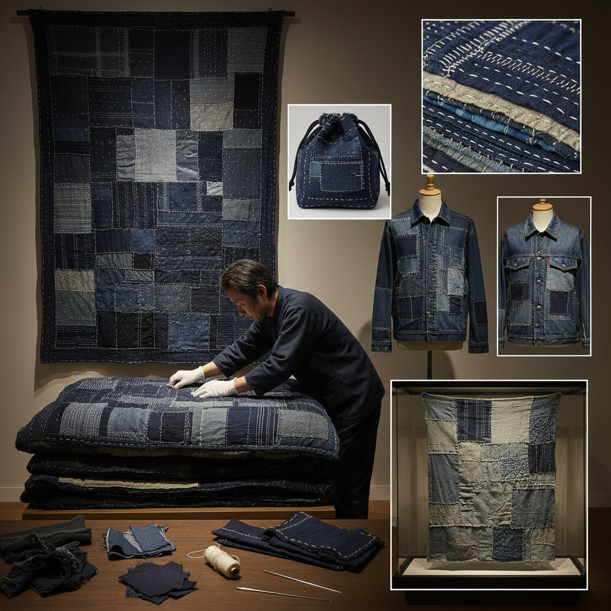

# Boro Textile 襤褸织物

> "Boro is poverty made poetry — layers of indigo cloth patched and stitched together over generations, each repair a record of survival, each patch a chapter in a family's story, transforming necessity into an aesthetic that celebrates imperfection, endurance, and the beauty of a life fully lived in cloth." — Unknown

## 概述

襤褸织物（Boro/ぼろ）是日本传统的修补拼接织物——将破损的布料用补丁和刺子绣针法反复修补、叠加，形成多层的拼接织物。"Boro"在日语中意为"破布"或"碎布"。Boro不是一种刻意的艺术创作，而是贫困生活的产物——日本北部（东北地区）的农民家庭因为物资匮乏，将每一块布料都反复使用、修补，直到布料变成多层叠加的拼接物。

Boro织物通常以靛蓝染色的棉布和麻布为主——蓝色的深浅不一的补丁层层叠加，用白色棉线以刺子绣针法固定。一件Boro衣物或被褥可能经过数代人的修补，记录了一个家庭数十年甚至上百年的生活痕迹。20世纪后期，Boro被重新发现为一种独特的美学——它体现了日本的"侘寂"（wabi-sabi）美学和"勿体無い"（mottainai/不浪费）精神。当代Boro在时尚、艺术和可持续设计中有重要影响。

## 核心特征

| 特征 | 描述 |
|------|------|
| 修补 | 反复修补的痕迹 |
| 叠加 | 多层布料叠加 |
| 靛蓝 | 靛蓝色调为主 |
| 刺子 | 刺子绣固定 |
| 时间 | 时间的积累 |
| 侘寂 | 侘寂美学 |

## 视觉特征

- **靛蓝**：深浅不一的靛蓝
- **拼接**：不规则的拼接补丁
- **层次**：多层叠加的厚度
- **针迹**：可见的刺子绣针迹
- **磨损**：自然磨损的痕迹
- **故事**：时间和生活的故事

## 代表作品

| 作品 | 艺术家 | 年代 | 意义 |
|------|--------|------|------|
| *Boro futon covers* | 日本农民 | 江户-昭和 | 襤褸被褥 |
| *Boro work garments* | 日本农民 | 江户-昭和 | 襤褸工作服 |
| *Amuse Museum collection* | 田中忠三郎收藏 | 收藏 | 重要的Boro收藏 |
| *Contemporary boro fashion* | Various | 当代 | 当代Boro时尚 |
| *Boro-inspired art* | Various | 当代 | Boro启发的艺术 |

## 历史时间线

| 时期 | 事件 |
|------|------|
| 江户时代 | Boro在日本北部的普遍实践 |
| 明治-昭和 | Boro的持续使用 |
| 战后 | Boro的消失和遗忘 |
| 1960-80年代 | 田中忠三郎的收集保护 |
| 2000年代后 | Boro的全球美学影响 |

## 中国语境

Boro在中国有广泛的认知和影响。中国的传统也有类似的"补丁"文化——"新三年旧三年缝缝补补又三年"的节俭传统。中国的百衲衣（百家衣）与Boro有相似的拼接美学。当代中国的时装设计师（如上官喆/Sankuanz等）在设计中引用Boro美学。中国的可持续时尚运动中，Boro的"修补美学"有重要影响。中国的手工社区中，Boro风格的拼接和可见修补（visible mending）非常流行。

## AI生成概念图

## 与其他风格的关系

- **Sashiko** → 刺子绣
- **Visible Mending** → 可见修补
- **Patchwork** → 拼布
- **Wabi-Sabi** → 侘寂美学
- **Sustainable Fashion** → 可持续时尚
- **Folk Art** → 民间艺术

---

*浮光艺志 | Chronicle of Artistry*
