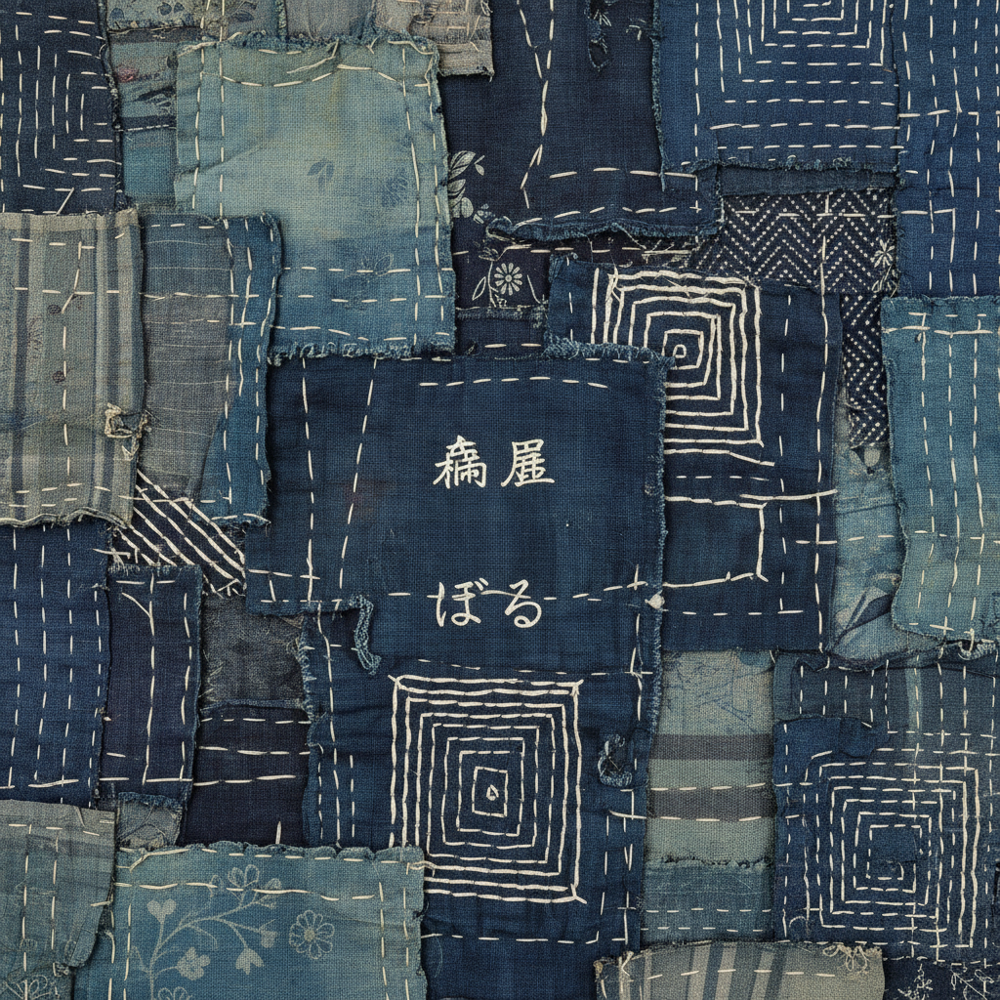

# Boro 襤褸 | ぼろ

> **"贫穷的诗意——日本农民用一块块碎布缝补出比锦缎更动人的蓝色风景。"**

## 概述

Boro（襤褸 ぼろ）是日本北部（东北地区）农民的传统补丁布艺术，将破旧的棉布和麻布用刺子绣（Sashiko）针法层层缝补、拼接，使衣物和被褥能够代代相传。"ぼろ"意为"破烂"或"碎布"。这种艺术诞生于极度贫困——江户时代的北方农民买不起新布料，只能反复修补。然而，数代人的缝补使这些织物积累了独特的美——靛蓝色的深浅层次、不规则的补丁拼贴、刺子绣的白色针迹。21世纪，Boro被重新发现为一种深刻的美学——它是侘寂（wabi-sabi）的极致体现。

## 核心特征

- **层层缝补**：多层碎布叠加缝合
- **刺子绣固定**：白色运针固定补丁
- **靛蓝色调**：以蓝染棉布为主
- **代代相传**：一件衣物传数代
- **不规则美**：补丁的随机拼贴
- **贫穷的产物**：物资匮乏的创造力

## 视觉特征

- 深浅不一的靛蓝色层次
- 白色刺子绣针迹的节奏
- 不规则补丁的拼贴美
- 磨损和时间的痕迹
- 多层织物的厚重质感
- 朴素而深沉的蓝色世界

## 当代影响

| 领域 | 特征 |
|------|------|
| 牛仔文化 | Boro影响了日本牛仔裤修补 |
| 可持续时尚 | 修补而非丢弃的理念 |
| 当代纤维艺术 | Boro的艺术转化 |
| 室内设计 | Boro风格的家居纺织 |
| 奢侈品牌 | Kapital等品牌的Boro美学 |

## 与其他风格的关系

| 风格 | 关系 |
|------|------|
| Wabi-Sabi侘寂 | Boro是侘寂的极致体现 |
| Kintsugi金缮 | 共享"修复之美"哲学 |
| Sashiko刺子绣 | Boro的核心技法 |
| 当代可持续设计 | Boro的环保理念 |
| Patchwork拼布 | 共享碎布拼接传统 |

## 概念图

---

*浮光艺志 | Chronicle of Artistry*
