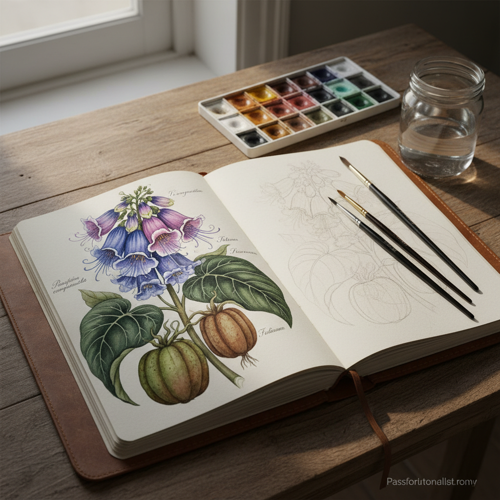

# Botanical Art 植物绘画

> "Botanical art is where science meets beauty — every petal is both truth and poetry." — Margaret Mee

## 概述

植物绘画（Botanical Art / Botanical Illustration）是以科学精确性描绘植物的艺术形式。它要求艺术家同时具备科学观察力和艺术表现力——每一片叶子的脉络、每一朵花的结构都必须准确无误，同时又要具有审美价值。植物绘画是科学与艺术最完美的结合。

植物绘画的独特价值在于它比照片更"真实"——它可以在一幅画中展示植物不同生长阶段的特征，这是任何单张照片都无法做到的。

## 核心特征

| 特征 | 描述 |
|------|------|
| 科学精确 | 植物学上的准确描绘 |
| 艺术美感 | 同时具有审美价值 |
| 细节极致 | 极其精细的观察和描绘 |
| 教育功能 | 服务于植物学研究和教育 |
| 白色背景 | 传统上使用白色背景 |
| 水彩媒介 | 传统上以水彩为主要媒介 |

## 视觉特征

- **精确**：每个细节都科学准确
- **细腻**：极其精细的笔触
- **色彩**：自然的、准确的色彩
- **白底**：通常在白色背景上
- **多角度**：展示植物的不同部分和角度
- **标注**：有时包含科学标注

## 代表作品

| 作品 | 艺术家 | 年代 | 意义 |
|------|--------|------|------|
| *Botanical studies* | Leonardo da Vinci | 1490s | 科学观察与艺术的结合 |
| *Hortus Eystettensis* | Basilius Besler | 1613 | 早期植物图谱的巅峰 |
| *Banks' Florilegium* | Sydney Parkinson | 1768-71 | 库克船长航行的植物记录 |
| *Redouté roses* | Pierre-Joseph Redouté | 1817-24 | "花之拉斐尔"——玫瑰画 |
| *Amazon paintings* | Margaret Mee | 1956-88 | 亚马逊植物的记录 |
| *Contemporary botanical* | Rory McEwen | 1960s-80s | 当代植物绘画的革新 |

## 历史时间线

| 时期 | 事件 |
|------|------|
| 古代 | 草药学手稿中的植物插图 |
| 15-16世纪 | 大航海时代——新植物的记录需求 |
| 17世纪 | 植物图谱的黄金时代 |
| 18-19世纪 | 林奈分类学——系统性植物绘画 |
| 19世纪 | Redouté——植物绘画的艺术巅峰 |
| 20世纪 | 摄影的挑战——植物绘画的转型 |
| 当代 | 植物绘画作为独立艺术形式的复兴 |

## 中国语境

中国有悠久的植物绘画传统——从《本草纲目》的药用植物插图到宫廷画家的花卉写生，从工笔花鸟画到当代的科学植物绘画。中国的工笔花鸟画在精细程度上与西方植物绘画有相似之处，但更强调意境和笔墨。当代中国的植物绘画在科学插画和艺术创作两个方向都有发展。

## AI生成概念图

## 与其他风格的关系

- **Watercolor Art** → 水彩是植物绘画的传统媒介
- **Realism** → 植物绘画追求极致的写实
- **Scientific Illustration** → 科学插画是植物绘画的上位概念
- **Still Life** → 静物画中的花卉题材
- **Naturalism** → 自然主义的精确观察
- **Miniature Painting** → 植物绘画的精细与细密画相通

---

*浮光艺志 | Chronicle of Artistry*
