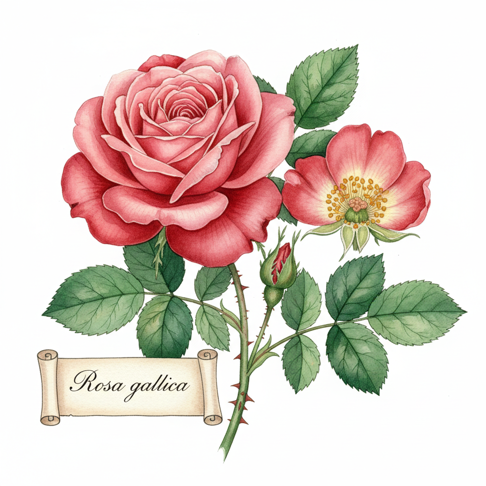

# Botanical Illustration 植物科学插画



> **"每一片叶脉、每一根花蕊都精确到毫米——科学与艺术最优雅的交汇。"**

## 概述

| 维度 | 描述 |
|------|------|
| 时期 | 15世纪–至今 |
| 别名 | Botanical Art, Scientific Botanical Illustration, 植物画 |
| 核心色彩 | 自然绿色系、花卉色、羊皮纸底色、水彩透明色 |
| 关键元素 | 精确描绘、水彩渲染、白色/奶油色背景、解剖细节、标本式构图 |
| 代表人物 | Maria Sibylla Merian, Pierre-Joseph Redouté, Margaret Mee |
| 关联风格 | Scientific Illustration, Naturalism, Art Nouveau, Cottagecore |

---

## 历史脉络

| 年份 | 事件 |
|------|------|
| 1485 | 早期草药学手稿——植物插画的起源 |
| 1600s | Maria Sibylla Merian——昆虫与植物的精确记录 |
| 1799 | Redouté《玫瑰图谱》——植物插画的巅峰 |
| 1800s | 植物猎人时代——探险+记录+插画 |
| 1900s | 摄影出现——但植物插画依然不可替代 |
| 2010s | 植物插画复兴——Instagram+手工+慢生活 |
| 2020s | 作为"治愈系"艺术+品牌设计元素 |

### 核心哲学

植物科学插画的精神是**"用画笔做科学家做不到的事——让植物的美被永远记住"**：
- 精确 = 尊重（"每一个细节都是对自然的致敬"）
- 美 = 科学（"最精确的描绘就是最美的艺术"）
- 耐心 = 修行（"一朵花可能需要画100小时"）
- 记录 = 永恒（"花会凋谢——但画不会"）
- "植物插画是唯一能同时发表在科学期刊和美术馆的艺术"

---

## 视觉语法

### 色彩系统

```
主色：
  叶绿 (#228B22) — 叶片、茎
  花瓣粉 (#FFB7C5) — 玫瑰、樱花
  土黄 (#DAA520) — 种子、根
  天蓝 (#87CEEB) — 浆果、花

辅色：
  羊皮纸 (#F5F5DC) — 传统背景
  纯白 (#FFFFFF) — 现代背景
  棕色 (#8B4513) — 树皮、枝干

规则：
  - 自然色为主
  - 水彩透明层叠
  - 白色/奶油色背景
  - 无阴影或极少阴影

质感：
  水彩 — 透明、层叠、精细
  铅笔 — 底稿、细节
  纸张 — 热压水彩纸
  干笔 — 毛发、纹理
```

### 标志性元素

| 类别 | 元素 |
|------|------|
| 构图 | 标本式排列、解剖分解、生长阶段 |
| 细节 | 叶脉、花蕊、种子剖面、根系 |
| 技法 | 水彩层叠、干笔细节、铅笔底稿 |
| 背景 | 白色/奶油色、无环境 |
| 标注 | 比例尺、拉丁学名、部位标注 |
| 态度 | 精确、耐心、科学、美、永恒 |

---

## 与千禧怀旧的关系

### "慢生活"美学的核心
- 植物插画 = Cottagecore/慢生活的视觉语言
- Instagram上的植物插画账号——百万粉丝
- "在快节奏的数字时代——画一朵花需要100小时的事实本身就是反叛"
- 植物插画工作坊 = 都市人的"治愈"

### 品牌设计中的应用
- 护肤品、茶叶、有机食品——植物插画是"天然"的视觉暗号
- "如果包装上有植物插画——消费者会觉得更'健康'"
- 从科学工具到商业美学的转变

---

## 中国语境

- 中国传统花鸟画与植物插画的对话
- 中国植物科学插画的传统（《本草纲目》插图）
- 中国当代植物插画师的作品
- 中国品牌设计中的植物插画应用

---

## 设计应用

| 场景 | 应用方式 |
|------|----------|
| 品牌 | 护肤+茶叶+有机+天然+高端 |
| 出版 | 图鉴+画册+限量版+收藏 |
| 家居 | 装饰画+壁纸+织物+陶瓷 |
| 教育 | 科学教材+博物馆+自然教育 |

---

## 相关风格

← [Golden Age Illustration 黄金时代插画](golden-age-illustration.md) | [Art Nouveau 新艺术运动](art-nouveau.md) →

↑ [返回千禧怀旧目录](README.md) | [返回总目录](../README.md)
