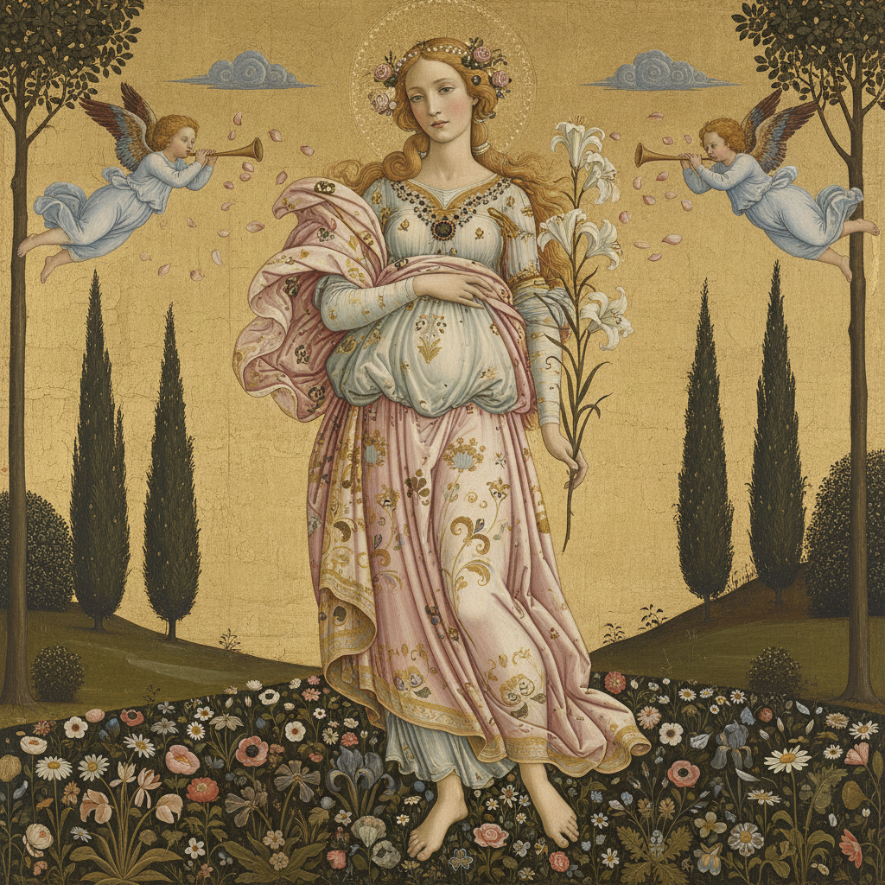

# Sandro Botticelli 波提切利

> "Every painting is a voyage into a sacred harbour." — Sandro Botticelli

## 概述

桑德罗·波提切利（Sandro Botticelli，1445–1510）是意大利文艺复兴早期佛罗伦萨画派的代表人物。他以优雅的线条、理想化的美和神话题材闻名，创造了西方艺术史上最具辨识度的形象——维纳斯的诞生。

波提切利的艺术融合了新柏拉图主义哲学与基督教神秘主义，他笔下的人物拥有一种超凡脱俗的、忧郁的美。

## 核心特征

| 特征 | 描述 |
|------|------|
| 线条至上 | 优美流畅的轮廓线定义形体 |
| 理想化美 | 拉长的比例、椭圆面庞、忧郁眼神 |
| 装饰性 | 精致的衣褶、花卉和金色装饰 |
| 神话与寓言 | 古典神话的诗意再现 |
| 平面化空间 | 弱化透视，强调画面的装饰性 |
| 新柏拉图主义 | 美即通往神圣的阶梯 |

## 视觉特征

- **线条**：流畅的、舞蹈般的轮廓线
- **人物**：修长的身体比例，小头、长颈
- **色彩**：柔和的粉色、金色、淡蓝和翠绿
- **衣褶**：飘逸的、风中飞舞的薄纱
- **背景**：花园、海洋、金色天空
- **表情**：含蓄的忧郁和沉思

## 代表作品

| 作品 | 年代 | 意义 |
|------|------|------|
| *The Birth of Venus* | c.1485 | 文艺复兴最著名的画作之一 |
| *Primavera* | c.1482 | 最复杂的寓言画 |
| *Venus and Mars* | c.1485 | 爱与战争的寓言 |
| *The Adoration of the Magi* | 1475 | 美第奇家族的群像 |
| *Mystic Nativity* | 1500 | 晚期宗教狂热的体现 |

## 真实作品（公共领域）

| 作品 | 来源 |
|------|------|
| *The Birth of Venus* | [Uffizi](https://www.uffizi.it/en/artworks/birth-of-venus) |
| *Primavera* | [Uffizi](https://www.uffizi.it/en/artworks/spring) |
| *Venus and Mars* | [National Gallery](https://www.nationalgallery.org.uk/paintings/sandro-botticelli-venus-and-mars) |

> ⚠️ 本条目优先使用真实作品。

## AI生成概念图

## 与其他风格的关系

- **Early Renaissance** → 佛罗伦萨画派的巅峰
- **Pre-Raphaelite** → 拉斐尔前派直接崇拜波提切利
- **Art Nouveau** → 线条的装饰性影响了新艺术运动
- **Mannerism** → 拉长比例预示了矫饰主义
