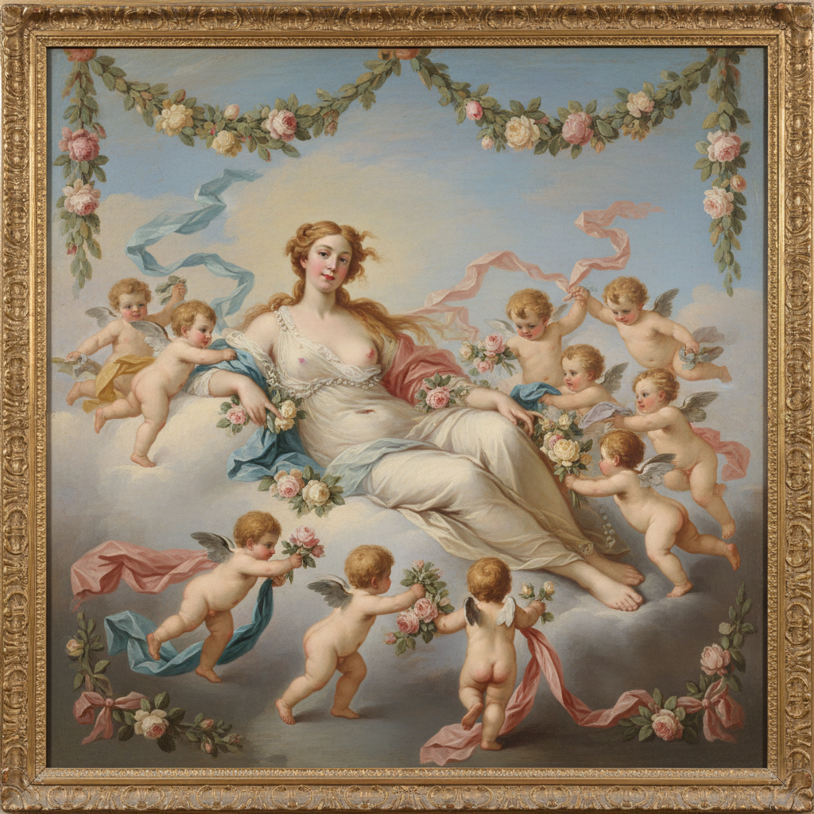

# François Boucher 布歇

> "Where does one find such models in nature? I find nature too green and badly lit." — François Boucher

## 概述

弗朗索瓦·布歇（François Boucher，1703–1770）是法国洛可可绘画的巅峰代表，路易十五时代的首席宫廷画家。他以甜美的神话场景、粉嫩的裸体女神和精致的田园幻想闻名，将洛可可的感官愉悦推向极致。

## 核心特征

| 特征 | 描述 |
|------|------|
| 粉色肉体 | 珍珠般光泽的理想化裸体 |
| 神话题材 | 维纳斯、丘比特、牧羊女 |
| 甜美色调 | 粉红、天蓝、珍珠白 |
| 装饰性 | 为宫殿和挂毯设计 |
| 田园幻想 | 理想化的乡村爱情 |
| 精致细节 | 丝带、花朵、云彩的精雕细琢 |

## 代表作品

| 作品 | 年代 | 意义 |
|------|------|------|
| *The Toilet of Venus* | 1751 | 洛可可女性美的极致 |
| *Diana Leaving Her Bath* | 1742 | 神话与感官的完美结合 |
| *Madame de Pompadour* | 1756 | 国王情妇的优雅肖像 |
| *The Triumph of Venus* | 1740 | 海上维纳斯的甜美诞生 |

## AI生成概念图

## 与其他风格的关系

- **Rococo** → 洛可可绘画的巅峰代表
- **Watteau** → 继承华托的优雅传统
- **Fragonard** → 直接影响了弗拉戈纳尔
- **Neoclassicism** → 被大卫一代视为堕落的象征
