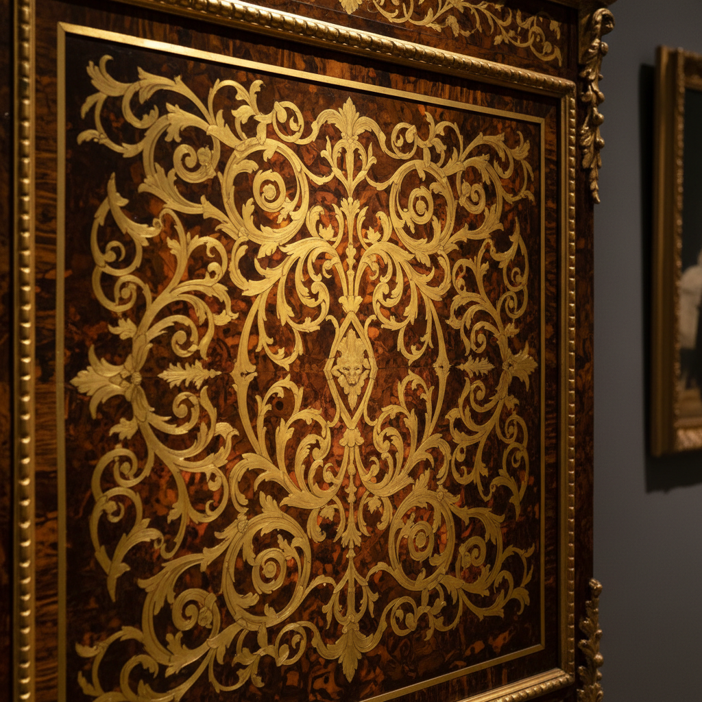

# Boulle Art 布尔镶嵌艺术

> "Boulle work is furniture as jewelry — sheets of tortoiseshell and brass are cut together in a single operation, then separated and recombined so that one piece receives brass inlay on a tortoiseshell ground while its twin receives tortoiseshell on brass, creating a matched pair of surfaces that shimmer with the warmth of shell and the cool gleam of metal." — Unknown

## 概述

布尔镶嵌艺术（Boulle Art）是一种以法国家具匠安德烈-夏尔·布尔（André-Charles Boulle）命名的精美家具镶嵌技法——将龟甲（或其他材料）与黄铜薄片叠放在一起同时切割，然后将切割出的图案互换镶嵌，创造出两种互补的装饰面板：première partie（龟甲底黄铜图案）和contre-partie（黄铜底龟甲图案）。

布尔镶嵌艺术的实践包括：1）材料准备——将龟甲和黄铜薄片叠放；2）同时切割——用细锯同时切割两层材料；3）互换镶嵌——将切割出的图案互换嵌入；4）première partie——龟甲底黄铜图案；5）contre-partie——黄铜底龟甲图案；6）镀金铜饰——配合镀金铜装饰件；7）当代布尔——将传统技法与现代设计结合的创作。

## 核心特征

| 特征 | 描述 |
|------|------|
| 互换 | 两种材料互换镶嵌 |
| 龟甲 | 使用龟甲材料 |
| 黄铜 | 使用黄铜薄片 |
| 成对 | 创造互补的一对 |
| 路易十四 | 路易十四时期风格 |
| 华丽 | 极其华丽的效果 |

## 视觉特征

- **光泽**：黄铜和龟甲的光泽
- **对比**：金属与有机材料的对比
- **精密**：极其精密的切割
- **华丽**：巴洛克式的华丽
- **温暖**：龟甲的温暖色调
- **互补**：两种面板的互补

## 代表作品

| 作品 | 艺术家/文化 | 年代 | 意义 |
|------|-------------|------|------|
| *André-Charles Boulle cabinets* | 法国 | 1680-1720年 | 布尔的经典家具 |
| *Louis XIV furniture* | 法国 | 17-18世纪 | 路易十四风格家具 |
| *Boulle clocks* | 法国 | 18世纪 | 布尔风格座钟 |
| *Napoleon III revival* | 法国 | 19世纪 | 拿破仑三世复兴 |
| *Contemporary Boulle* | 国际 | 当代 | 当代布尔镶嵌 |

## 历史时间线

| 时期 | 事件 |
|------|------|
| 1672年 | 布尔成为路易十四的御用家具匠 |
| 1680-1720年 | 布尔镶嵌的黄金时代 |
| 18世纪 | 布尔风格的延续和变化 |
| 19世纪 | 拿破仑三世时期的复兴 |
| 当代 | 作为传统工艺的保护 |

## 中国语境

布尔镶嵌与中国的传统家具镶嵌有一定的可比性。中国的螺钿镶嵌（将贝壳薄片镶嵌在漆器或木器上）——与布尔镶嵌有相似的材料组合理念。中国的百宝嵌——将多种珍贵材料镶嵌在家具上——与布尔的华丽追求相似。中国的传统家具中，铜饰件的使用——与布尔家具的镀金铜饰有对应关系。中国的古典家具收藏中，布尔风格家具——作为西方古典家具的代表被收藏。中国的工艺美术教育中，布尔镶嵌作为西方家具装饰的经典——在相关课程中介绍。

## AI生成概念图

## 与其他风格的关系

- **Marquetry** → 木镶嵌
- **Intarsia** → 木嵌画
- **Tortoiseshell** → 龟甲工艺
- **Baroque** → 巴洛克
- **French Furniture** → 法国家具
- **Decorative Arts** → 装饰艺术

---

*浮光艺志 | Chronicle of Artistry*
