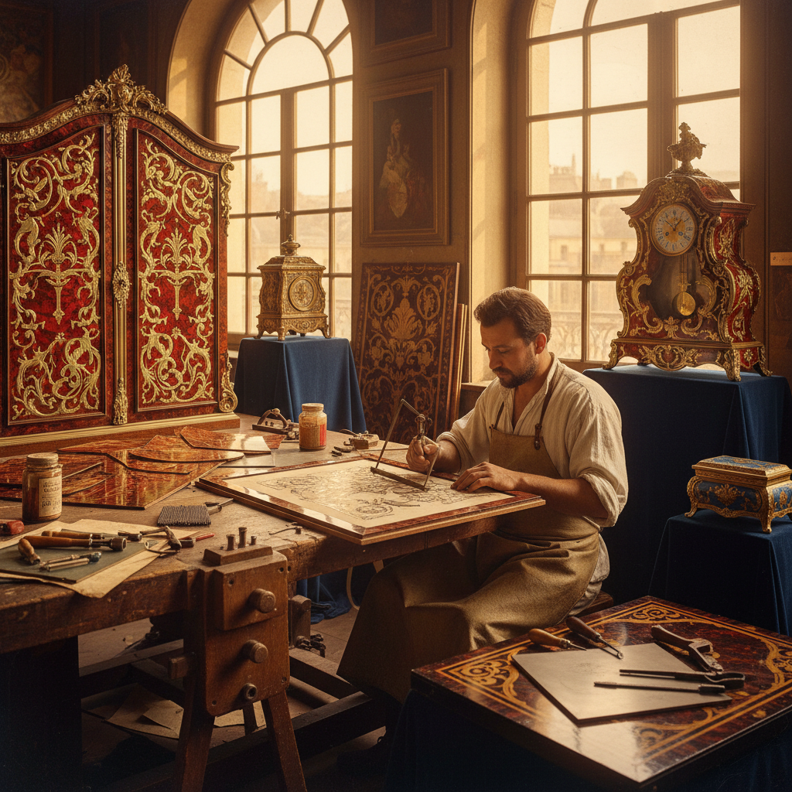

# Boulle Work Art 布尔镶嵌艺术

> "Boulle work is marquetry raised to the level of alchemy — tortoiseshell and brass cut together in a single operation, then separated and recombined so that what was cut from one becomes the inlay of the other. André-Charles Boulle perfected this technique for Louis XIV, creating furniture of such opulence that it defined French luxury for three centuries. The interplay of warm tortoiseshell and cool brass creates surfaces that shimmer like captured sunlight." — Unknown

## 概述

布尔镶嵌艺术（Boulle Work Art）是以法国宫廷家具大师安德烈-夏尔·布尔（André-Charles Boulle）命名的一种精美镶嵌技法——将龟甲（玳瑁壳）和黄铜（或锡、银等金属）薄片叠在一起同时切割，然后将切下的部分互相交换嵌入，形成"正嵌"（première partie）和"反嵌"（contre-partie）两种互补的装饰面。

布尔镶嵌艺术的实践包括：1）正嵌——龟甲为底、黄铜为纹的镶嵌；2）反嵌——黄铜为底、龟甲为纹的镶嵌；3）红底布尔——在龟甲下衬红色颜料；4）蓝底布尔——在龟甲下衬蓝色颜料；5）锡布尔——使用锡代替黄铜；6）当代布尔——将传统技法与现代设计结合的创作。

## 核心特征

| 特征 | 描述 |
|------|------|
| 对偶 | 正嵌和反嵌的对偶 |
| 奢华 | 极其奢华的效果 |
| 精密 | 极其精密的切割 |
| 材料 | 龟甲与金属的搭配 |
| 宫廷 | 法国宫廷艺术 |
| 永恒 | 经久不衰的美感 |

## 视觉特征

- **光泽**：龟甲的温润半透明光泽
- **金属**：黄铜的冷金属光泽
- **对比**：有机与无机的对比
- **精细**：极其精细的曲线切割
- **对称**：精确的对称图案
- **奢华**：极其奢华的视觉效果

## 代表作品

| 作品 | 艺术家/文化 | 年代 | 意义 |
|------|-------------|------|------|
| *Boulle armoires* | André-Charles Boulle | 1680-1720 | 布尔镶嵌的巅峰 |
| *Louis XIV furniture* | 法国宫廷 | 17-18世纪 | 法国宫廷家具 |
| *Boulle clocks* | 法国 | 18世纪 | 布尔镶嵌钟表 |
| *Napoleon III revival* | 法国 | 19世纪 | 布尔风格复兴 |
| *Contemporary Boulle* | 当代 | 当代 | 当代布尔创作 |

## 历史时间线

| 时期 | 事件 |
|------|------|
| 1672年 | Boulle成为路易十四的宫廷家具师 |
| 17-18世纪 | 布尔镶嵌的黄金时代 |
| 法国大革命 | 宫廷家具的破坏和流散 |
| 19世纪 | 拿破仑三世时期的布尔复兴 |
| 当代 | 布尔技法的保护和传承 |

## 中国语境

布尔镶嵌艺术虽然是法国宫廷艺术，但与中国有间接的文化联系。中国的螺钿镶嵌（贝壳镶嵌）与布尔镶嵌有技术上的相似之处——都是将有机材料与其他材料结合的镶嵌技法。中国清代宫廷家具中的"百宝嵌"技法与布尔镶嵌有审美上的相通——都追求多种珍贵材料的华丽组合。中国的漆器镶嵌传统（如扬州漆器）与布尔镶嵌有工艺上的对话——都是在平面上创造精美的镶嵌图案。中国的一些家具修复师学习布尔镶嵌技法——用于修复进入中国的欧洲古董家具。中国的一些高端家具品牌将布尔镶嵌的美学元素融入设计——创造中西合璧的奢华家具。中国的艺术品拍卖市场中，布尔镶嵌家具是重要的收藏品类——高品质的布尔家具在拍卖中价值不菲。

## AI生成概念图

## 与其他风格的关系

- **Marquetry** → 镶嵌细工
- **French Furniture** → 法国家具
- **Tortoiseshell Art** → 龟甲艺术
- **Brass Work** → 黄铜工艺
- **Decorative Art** → 装饰艺术
- **Baroque** → 巴洛克风格

---

*浮光艺志 | Chronicle of Artistry*
