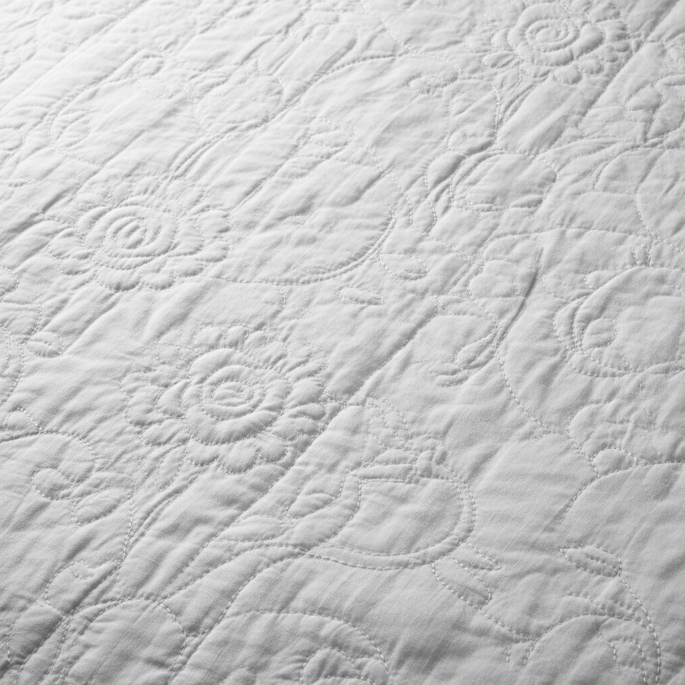

# Boutis Art 普罗旺斯白绣艺术

> "Boutis is sculpture in cloth — two layers of fine white fabric stitched together along drawn channels, then stuffed from behind with cotton wicking threaded through a stiletto hole, raising the design into soft relief while the background remains flat. The result is a monochrome textile bas-relief where light alone creates the pattern, casting shadows across padded vines, flowers, and wheat sheaves." — Unknown

## 概述

普罗旺斯白绣艺术（Boutis Art）是一种起源于法国普罗旺斯地区的白色浮雕刺绣技法——通过在两层白色细布之间缝制图案轮廓，然后从背面用棉芯填充使图案凸起，创造出纯白色的浮雕效果。Boutis是法国南部的传统手工艺，以其精致的白色浮雕和光影效果著称。

普罗旺斯白绣艺术的实践包括：1）双层缝合——在两层细布上缝制图案轮廓；2）棉芯填充——从背面用棉芯穿入通道使图案凸起；3）回针缝——用细密的回针缝制轮廓；4）图案设计——传统的花卉、藤蔓和麦穗图案；5）婚礼用品——传统的婚礼被褥和衣物；6）白色美学——纯白色的单色美学；7）当代Boutis——将传统技法与现代设计结合的创作。

## 核心特征

| 特征 | 描述 |
|------|------|
| 白色 | 纯白色的单色 |
| 浮雕 | 凸起的浮雕效果 |
| 填充 | 棉芯填充技法 |
| 双层 | 两层布的结构 |
| 光影 | 依靠光影显现图案 |
| 普罗旺斯 | 法国南部传统 |

## 视觉特征

- **白色**：纯白的单色美学
- **浮雕**：柔和的浮雕效果
- **光影**：光影创造的图案
- **精细**：精细的缝线轮廓
- **优雅**：优雅含蓄的美感
- **触感**：丰富的触觉质感

## 代表作品

| 作品 | 艺术家/文化 | 年代 | 意义 |
|------|-------------|------|------|
| *Provençal wedding quilts* | 法国 | 18世纪 | 普罗旺斯婚礼被褥 |
| *Boutis petticoats* | 法国 | 18-19世纪 | 白绣衬裙 |
| *Marseille quilting* | 法国 | 17-18世纪 | 马赛绗缝 |
| *Contemporary boutis* | 法国 | 当代 | 当代白绣作品 |
| *Boutis baby garments* | 法国 | 传统 | 白绣婴儿服 |

## 历史时间线

| 时期 | 事件 |
|------|------|
| 17世纪 | Boutis技法的发展 |
| 18世纪 | 普罗旺斯白绣的黄金时代 |
| 19世纪 | 工业化后的衰落 |
| 20世纪末 | 传统工艺的复兴运动 |
| 当代 | Boutis的艺术化和国际化 |

## 中国语境

Boutis与中国的一些白色刺绣传统有相似之处。中国的白绣（如温州白绣）同样是在白色织物上进行白色刺绣——追求纯净素雅的美学效果。中国的绗缝传统中，填充棉花创造立体效果——与Boutis的填充技法有相似之处。中国的婚嫁用品中，白色刺绣被褥——与普罗旺斯的婚礼白绣有功能上的对应。中国当代的纤维艺术家对Boutis技法有所关注——将其与中国白绣传统进行比较和融合。中国的手工教育中，Boutis作为法国传统白绣的代表——在刺绣课程中有所介绍。

## AI生成概念图

## 与其他风格的关系

- **Trapunto** → 浮雕绗缝
- **Whitework** → 白绣
- **Quilting** → 绗缝
- **Marseille Quilting** → 马赛绗缝
- **Textile Art** → 纺织艺术
- **Bas-Relief** → 浅浮雕

---

*浮光艺志 | Chronicle of Artistry*
