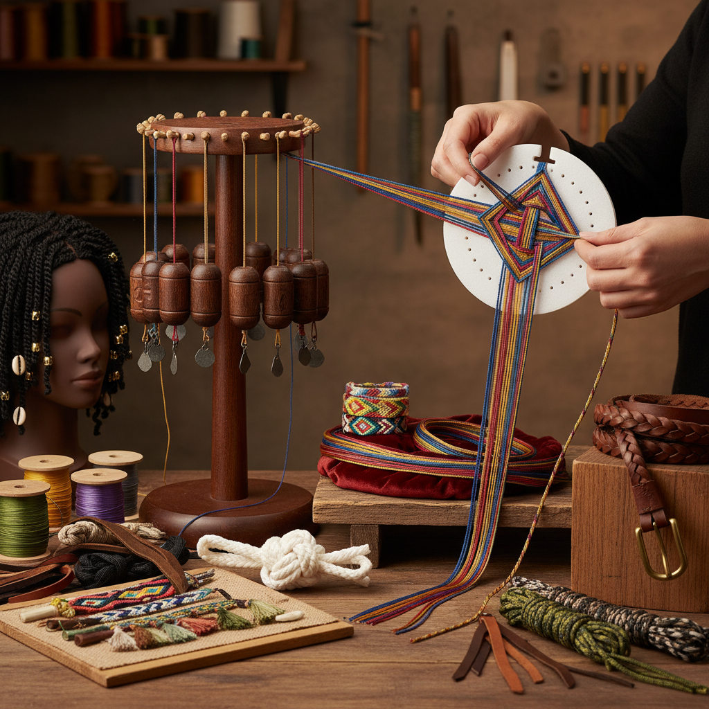

# Braiding 编绳

> "Braiding is mathematics made tactile — strands crossing over and under in sequences that produce flat bands, round cords, and complex structures from the simplest of operations repeated with precision." — Unknown

## 概述

编绳（Braiding）是将三根或更多的线、绳、带或其他柔性材料按特定的交叉模式编织在一起形成绳索、带子或装饰物的工艺。编绳是人类最基本的技术之一——从实用的绳索到装饰性的辫子，编绳无处不在。编绳的基本原理是：多根线材按规则的"过-下"（over-under）模式交叉，形成稳定的结构。

编绳的形式极其多样：从最简单的三股辫到复杂的多股圆编（如日本的组紐kumihimo）、平编（flat braids）、方编（square braids）和螺旋编（spiral braids）。编绳的材料也极其广泛——从天然纤维（棉、麻、丝、毛）到合成材料（尼龙、聚酯）、金属线、皮革条等。

## 核心特征

| 特征 | 描述 |
|------|------|
| 交叉 | 线材的规则交叉 |
| 多股 | 三股或更多 |
| 结构 | 形成稳定结构 |
| 多样 | 形式极其多样 |
| 基础 | 最基本的技术之一 |
| 通用 | 适用于多种材料 |

## 视觉特征

- **交叉**：可见的交叉图案
- **节奏**：规则的节奏感
- **圆/扁**：圆形或扁平截面
- **色彩**：多色的配色
- **质感**：编织的质感
- **螺旋**：螺旋的视觉效果

## 代表作品

| 作品 | 艺术家 | 年代 | 意义 |
|------|--------|------|------|
| *Kumihimo braids* | 日本工匠 | 传统 | 日本组紐 |
| *Sailor's knots and braids* | 水手 | 传统 | 水手编绳 |
| *African hair braiding* | 匿名 | 传统 | 非洲编发 |
| *Friendship bracelets* | Various | 当代 | 友谊手链 |
| *Contemporary fiber braids* | Various | 当代 | 当代编绳艺术 |

## 历史时间线

| 时期 | 事件 |
|------|------|
| 史前 | 最早的编绳证据 |
| 古代 | 各文明的编绳传统 |
| 中世纪 | 欧洲编绳行会 |
| 传统 | 日本组紐的精致发展 |
| 工业革命 | 机械编绳的出现 |
| 当代 | 手工编绳的复兴 |

## 中国语境

编绳在中国有着极其悠久和丰富的传统——中国结（Chinese knotting）是世界上最精美的编绳艺术之一，其历史可追溯到数千年前。中国结不仅是装饰品，还承载着吉祥寓意。中国传统的编绳还包括：草编（编草鞋、草帽）、竹编、藤编等。当代中国的手工编绳爱好者群体非常活跃——从传统中国结到现代Macramé、Kumihimo等各种编绳形式都有爱好者。中国结被列为国家级非物质文化遗产。

## AI生成概念图

## 与其他风格的关系

- **Kumihimo** → 组紐
- **Macramé** → 编结
- **Chinese Knotting** → 中国结
- **Rope Making** → 制绳
- **Textile Art** → 纺织艺术
- **Basket Weaving** → 编篮

---

*浮光艺志 | Chronicle of Artistry*
