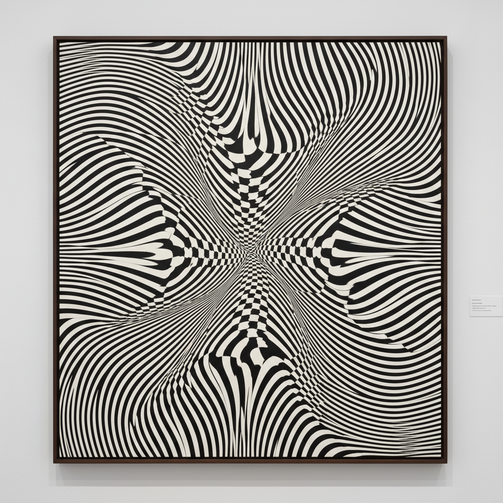

# Bridget Riley 布里奇特·赖利

> "Perception is the medium." — Bridget Riley

## 概述

布里奇特·赖利（Bridget Riley，1931–）是英国欧普艺术（Op Art）的领军人物，以精确的几何图案创造出强烈的视觉振动和运动幻觉。她的画面让观者的眼睛"跳舞"——黑白条纹波动、色彩条带闪烁，将绘画变成一种知觉体验。

## 核心特征

| 特征 | 描述 |
|------|------|
| 视觉振动 | 精确图案产生的运动幻觉 |
| 黑白时期 | 早期纯粹的黑白波纹 |
| 色彩条带 | 后期平行色条的光学混合 |
| 数学精确 | 严格计算的渐变与重复 |
| 知觉体验 | 观看本身成为作品主题 |
| 大尺幅 | 巨型画面包围观者 |

## 代表作品

| 作品 | 年代 | 意义 |
|------|------|------|
| *Movement in Squares* | 1961 | 黑白欧普的经典 |
| *Fall* | 1963 | 波纹产生的眩晕感 |
| *Cataract 3* | 1967 | 色彩条带的光学振动 |
| *Nataraja* | 1993 | 印度舞蹈的色彩翻译 |

## AI生成概念图

## 与其他风格的关系

- **Op Art** → 欧普艺术的最重要代表
- **Vasarely** → 欧普艺术的另一位先驱
- **Seurat** → 受点彩派光学混色启发
- **Minimalism** → 共享对系统性和重复的兴趣
