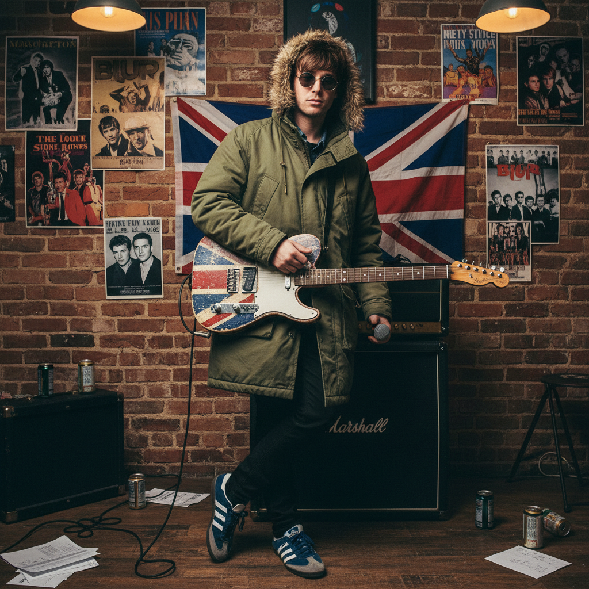

# Britpop 英伦流行



> **"Union Jack吉他、Adidas运动鞋、工人阶级骄傲——90年代英国的文化自信。"**

## 概述

| 维度 | 描述 |
|------|------|
| 时期 | 1993–1997 |
| 别名 | Britpop, Cool Britannia |
| 核心色彩 | 红白蓝（英国国旗）、卡其、海军蓝 |
| 关键元素 | Union Jack、Adidas/Puma运动鞋、Parka外套、Mod复兴 |
| 代表人物 | Oasis, Blur, Pulp, Suede, Elastica |
| 关联风格 | Mod, Indie, Lad Culture, Cool Britannia |

---

## 历史脉络

| 年份 | 事件 |
|------|------|
| 1993 | Suede "Animal Nitrate"——Britpop 先声 |
| 1994 | Oasis "Definitely Maybe" / Blur "Parklife" |
| 1995 | "Battle of Britpop"——Blur vs Oasis |
| 1996 | Oasis Knebworth 演唱会——25万人 |
| 1997 | Tony Blair 当选——"Cool Britannia" |
| 1998 | Britpop 衰落——但影响延续 |

### 核心哲学

Britpop 的精神是**"我们是英国人，我们为此骄傲——不需要模仿美国"**：
- 英国 = 骄傲（对 Grunge/美国摇滚的回应）
- 工人阶级 = 真实（"我们不装"）
- 旋律 = 重要（"歌要能唱"）
- 日常 = 诗意（"超市、酒吧、足球也是艺术"）
- "我们不需要西雅图——我们有曼彻斯特和伦敦"

---

## 视觉语法

### 色彩系统

```
主色：
  红色 (#FF0000) — Union Jack
  白色 (#FFFFFF) — Union Jack
  蓝色 (#00247D) — Union Jack
  卡其 (#C3B091) — Parka

辅色：
  海军蓝 (#000080) — Fred Perry
  黑色 (#000000) — 基础
  灰色 (#808080) — 英国天气

质感：
  尼龙 — Parka、运动服
  棉 — T恤、Polo
  牛仔 — 裤子
  皮革 — 靴子
```

### 标志性元素

| 类别 | 元素 |
|------|------|
| 服装 | Parka外套、Fred Perry、Adidas运动鞋 |
| 符号 | Union Jack、靶心标志、三叶草 |
| 发型 | Beatles式刘海、Liam式侧分 |
| 配饰 | 墨镜（室内也戴）、铃鼓 |
| 音乐 | 吉他流行、英式旋律、工人阶级歌词 |
| 态度 | 自信、英国骄傲、工人阶级、旋律 |

---

## 与千禧怀旧的关系

### 90s 英国文化的巅峰
- Britpop = 90s 英国的"文化自信时刻"
- 与 YBA (Young British Artists) 同时代
- Trainspotting (1996) = 视觉交叉
- "90s 的英国觉得自己是世界中心"

### Indie 的直接前身
- Britpop (1993-1997) → Post-Britpop → Indie (2000s)
- Arctic Monkeys = Britpop 的精神继承者
- "每个英国吉他乐队都欠 Britpop 一笔债"

---

## 中国语境

- Oasis 在中国的巨大影响力
- 中国独立摇滚中的 Britpop 元素
- "英伦风"在中国时尚中的地位
- 与中国"文艺青年"音乐品味的交叉

---

## 设计应用

| 场景 | 应用方式 |
|------|----------|
| 音乐 | 吉他流行+英伦+海报+唱片封面 |
| 时尚 | Parka+运动鞋+Union Jack+Mod |
| 品牌 | 英国+自信+经典+工人阶级+真实 |
| 活动 | 90s 怀旧+英伦主题+音乐节 |

---

## 相关风格

← [Mod 摩德文化](mod.md) | [Indie Sleaze 独立邋遢](indie-sleaze.md) →

↑ [返回千禧怀旧目录](README.md) | [返回总目录](../README.md)
