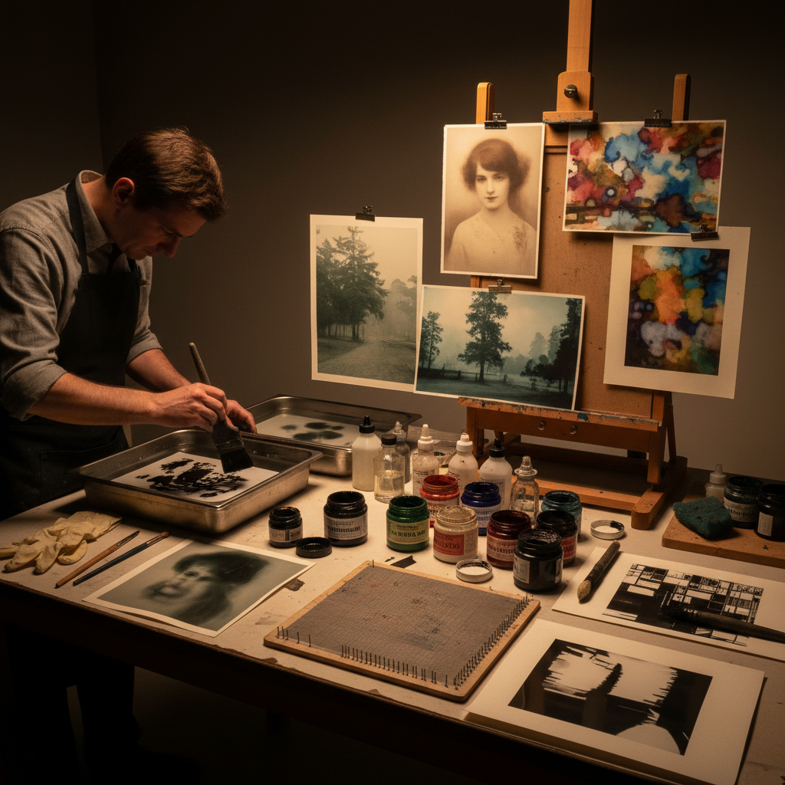

# Bromoil 溴油印刷

> "Bromoil transforms a photograph into a painting — the silver image bleached away and replaced with greasy lithographic ink applied by brush, each stroke a conscious artistic decision that turns mechanical reproduction into handcrafted interpretation, bridging the gap between photography and printmaking." — Unknown

## 概述

溴油印刷（Bromoil）是一种将银盐照片转化为油墨手工印刷品的摄影-版画混合技法。过程：首先制作一张普通的银盐照片（溴化银相纸），然后将照片浸入漂白液中去除银影像，只留下硬化的明胶浮雕（暗部明胶硬化程度高，亮部明胶柔软）。将漂白后的照片浸水——柔软的明胶（原亮部）吸水膨胀排斥油墨，硬化的明胶（原暗部）不吸水接受油墨。

艺术家用特制的刷子将油性印刷油墨涂抹在湿润的明胶表面上——油墨只附着在不吸水的硬化区域（原暗部），被吸水膨胀的区域（原亮部）排斥。通过控制刷子的力度和方向，艺术家可以精确控制图像的色调和质感。溴油印刷品可以直接作为成品，也可以通过转印（bromoil transfer）将油墨图像转印到另一张纸上。

## 核心特征

| 特征 | 描述 |
|------|------|
| 漂白 | 去除银影像 |
| 明胶 | 利用明胶浮雕 |
| 油墨 | 手工涂抹油墨 |
| 手工 | 手工控制色调 |
| 混合 | 摄影与版画混合 |
| 转印 | 可转印到其他纸张 |

## 视觉特征

- **绘画性**：绘画般的笔触
- **质感**：油墨的质感
- **柔和**：柔和的色调过渡
- **手工**：明显的手工痕迹
- **温暖**：油墨的温暖色调
- **艺术性**：高度的艺术性

## 代表作品

| 作品 | 艺术家 | 年代 | 意义 |
|------|--------|------|------|
| *Pictorialist bromoils* | Various | 1900-20s | 画意摄影时代的溴油 |
| *Robert Demachy bromoils* | Robert Demachy | 1900s | 早期溴油大师 |
| *Contemporary bromoils* | Various | 当代 | 当代溴油印刷 |
| *Bromoil transfers* | Various | 当代 | 溴油转印 |
| *Color bromoils* | Various | 当代 | 彩色溴油印刷 |

## 历史时间线

| 时期 | 事件 |
|------|------|
| 1907年 | C. Welborne Piper发明bromoil |
| 1900-20年代 | 画意摄影运动中的流行 |
| 1930-80年代 | 技法的衰落 |
| 1990年代 | 替代摄影运动中的复兴 |
| 当代 | 溴油印刷的持续实践 |

## 中国语境

溴油印刷在中国属于非常小众的历史性摄影技法。中国早期的摄影艺术（民国时期的画意摄影）中可能有溴油印刷的实践，但文献记录较少。当代中国的替代摄影社区中，溴油印刷作为一种"将摄影转化为手工艺术品"的技法有潜在的吸引力。中国的一些暗房摄影爱好者和实验摄影艺术家开始探索溴油印刷。

## AI生成概念图

## 与其他风格的关系

- **Pictorialism** → 画意摄影
- **Gum Bichromate** → 重铬酸胶印
- **Oil Printing** → 油印
- **Alternative Photography** → 替代摄影
- **Lithography** → 石版印刷
- **Darkroom Art** → 暗房艺术

---

*浮光艺志 | Chronicle of Artistry*
