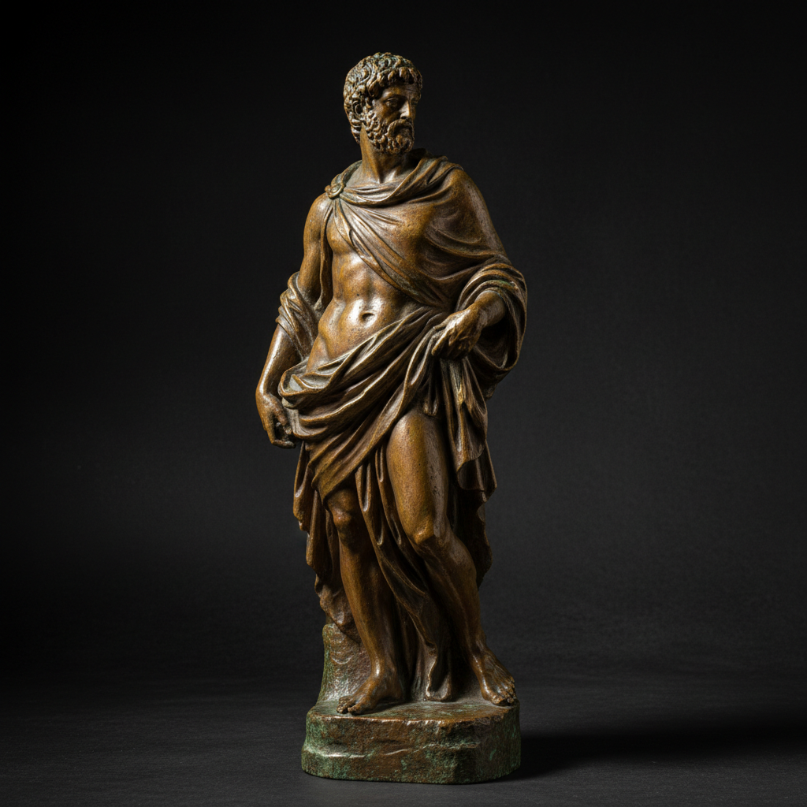

# Bronze Casting Art 青铜铸造艺术

> "Bronze casting is thought made permanent in metal — a sculptor's vision, first modeled in clay or wax, is translated through the lost-wax process into an alloy of copper and tin that will endure for millennia, capturing every fingerprint of the original modeling while adding the warm golden-brown patina that only bronze develops with age, making it the supreme medium for monumental sculpture across all civilizations." — Unknown

## 概述

青铜铸造艺术（Bronze Casting Art）是一种将铜锡合金（青铜）通过铸造工艺制成雕塑和器物的古老技法——最常用的是失蜡法（lost-wax/cire perdue），先用蜡制作模型，然后用耐火材料包裹，加热使蜡流出，再将熔化的青铜浇入空腔。青铜铸造是人类最古老的金属铸造技术之一，从古代文明到当代雕塑一直是最重要的艺术媒介。

青铜铸造艺术的实践包括：1）建模——用粘土或蜡制作原始模型；2）制模——制作铸造用的模具；3）失蜡——失蜡法的蜡模制作和脱蜡；4）浇注——将熔化的青铜浇入模具；5）清理——去除浇口和修整表面；6）着色——通过化学方法形成铜绿色泽；7）当代青铜——将传统铸造与现代雕塑创作结合。

## 核心特征

| 特征 | 描述 |
|------|------|
| 失蜡 | 失蜡法铸造 |
| 永恒 | 极其耐久的材料 |
| 铜绿 | 独特的铜绿色泽 |
| 雕塑 | 雕塑的首选材料 |
| 古老 | 数千年的历史 |
| 纪念 | 纪念性雕塑的传统 |

## 视觉特征

- **铜绿**：绿色或棕色的铜绿
- **温暖**：温暖的金属色调
- **细节**：精细的表面细节
- **厚重**：厚重的材料感
- **光泽**：抛光部分的光泽
- **永恒**：永恒的质感

## 代表作品

| 作品 | 艺术家/文化 | 年代 | 意义 |
|------|-------------|------|------|
| *Shang Dynasty bronzes* | 中国 | 公元前16-11世纪 | 商代青铜器 |
| *Greek bronze sculptures* | 古希腊 | 公元前5世纪 | 希腊青铜雕塑 |
| *Benin Bronzes* | 尼日利亚 | 13-19世纪 | 贝宁青铜 |
| *Rodin bronzes* | 法国 | 19世纪 | 罗丹青铜雕塑 |
| *Contemporary bronze sculpture* | 国际 | 当代 | 当代青铜雕塑 |

## 历史时间线

| 时期 | 事件 |
|------|------|
| 公元前3000年 | 青铜时代的开始 |
| 公元前16世纪 | 中国商代青铜器的高峰 |
| 公元前5世纪 | 古希腊青铜雕塑的黄金时代 |
| 文艺复兴 | 欧洲青铜雕塑的复兴 |
| 当代 | 青铜铸造的持续实践 |

## 中国语境

青铜铸造在中国有极其重要的历史地位。中国的青铜器——是中国古代文明的标志性成就，商周青铜器代表了世界青铜铸造的最高水平。中国的失蜡法——在春秋战国时期已经高度发达。中国的青铜器铭文——是研究中国古代历史的重要资料。中国当代的青铜雕塑——在公共艺术和纪念性雕塑中广泛使用。中国的铸造技术——在世界铸造史上有举足轻重的地位。中国的博物馆——收藏有大量精美的古代青铜器。中国的考古发现——不断揭示新的青铜铸造技术和艺术成就。

## AI生成概念图

## 与其他风格的关系

- **Lost Wax** → 失蜡法
- **Sculpture** → 雕塑
- **Cast Iron** → 铸铁
- **Metalwork** → 金属工艺
- **Patina** → 铜绿
- **Monumental Art** → 纪念性艺术

---

*浮光艺志 | Chronicle of Artistry*
