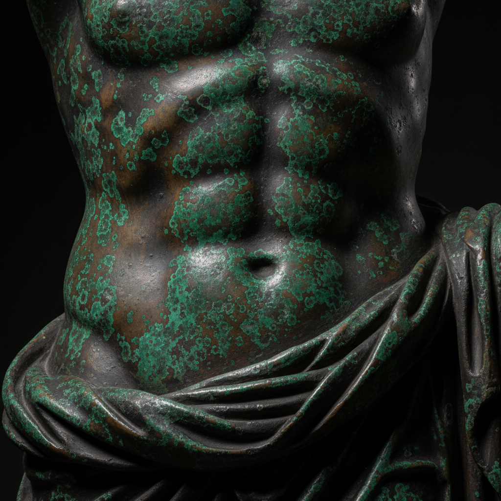

# Bronze Patina Art 青铜着色艺术

> "Patina is time made visible on metal — the slow chemical transformation of a bronze surface into layers of color that range from deep black through rich brown to vivid green, blue, and red. The patinator accelerates what nature takes centuries to achieve, using heat, chemicals, and patience to coax color from the metal itself. Every patina is a controlled corrosion, a beautiful decay arrested at precisely the right moment." — Unknown

## 概述

青铜着色艺术（Bronze Patina Art）是一种通过化学反应在青铜或其他铜合金表面创造各种颜色和质感的金属表面处理技法——利用酸、碱、盐和热的组合使金属表面产生氧化物和硫化物层，形成从黑色、棕色到绿色、蓝色、红色的丰富色彩。着色（Patination）既是雕塑完成的最后一步，也是一门独立的艺术。

青铜着色艺术的实践包括：1）热着色——加热金属后涂覆化学溶液；2）冷着色——在室温下浸泡或涂覆化学品；3）埋土着色——将金属埋入含化学物质的土中；4）烟熏着色——用硫化物烟熏；5）多层着色——叠加多种化学反应创造复杂色彩；6）封蜡保护——用蜡封固着色层；7）当代着色——将传统技法与现代表达结合的创作。

## 核心特征

| 特征 | 描述 |
|------|------|
| 化学 | 化学反应产生色彩 |
| 时间 | 模拟时间的效果 |
| 色彩 | 丰富的色彩变化 |
| 控制 | 可控的腐蚀过程 |
| 保护 | 保护金属表面 |
| 独特 | 每件作品的独特性 |

## 视觉特征

- **色彩**：丰富的金属色彩
- **层次**：多层化学反应的层次
- **质感**：独特的表面质感
- **深度**：色彩的深度和变化
- **自然**：模拟自然氧化的效果
- **庄严**：庄严古朴的气质

## 代表作品

| 作品 | 艺术家/文化 | 年代 | 意义 |
|------|-------------|------|------|
| *Statue of Liberty* | 美国 | 1886年 | 自然铜绿着色 |
| *Japanese bronze vessels* | 日本 | 传统 | 日本青铜着色 |
| *Renaissance bronzes* | 意大利 | 文艺复兴 | 文艺复兴青铜 |
| *Richard Serra sculptures* | 美国 | 当代 | 当代钢铁着色 |
| *Contemporary patina art* | 国际 | 当代 | 当代着色艺术 |

## 历史时间线

| 时期 | 事件 |
|------|------|
| 古代 | 自然着色的发现和利用 |
| 文艺复兴 | 人工着色技法的发展 |
| 18-19世纪 | 着色化学的系统化 |
| 20世纪 | 着色作为独立艺术形式 |
| 当代 | 着色的多元化发展 |

## 中国语境

青铜着色在中国有极其悠久的传统。中国古代青铜器上的铜绿（patina）是鉴定文物真伪的重要依据——自然形成的铜绿被视为时间和历史的见证。中国传统的铜器制作中有人工着色的传统——如宣德炉的着色技法是中国金属工艺的巅峰。中国当代的雕塑家广泛使用着色技法——为青铜雕塑赋予丰富的色彩和质感。中国的文物修复中，着色是重要的修复技法——用于恢复或模拟文物的原始表面。中国的一些金属工艺大师专注于着色研究——探索传统和创新的着色配方。中国的美术院校中，着色作为雕塑和金属工艺的重要课程——培养学生对金属表面处理的理解。

## AI生成概念图

## 与其他风格的关系

- **Bronze Casting** → 青铜铸造
- **Sculpture** → 雕塑艺术
- **Metalwork** → 金属工艺
- **Verdigris** → 铜绿
- **Oxidation Art** → 氧化艺术
- **Surface Treatment** → 表面处理

---

*浮光艺志 | Chronicle of Artistry*
