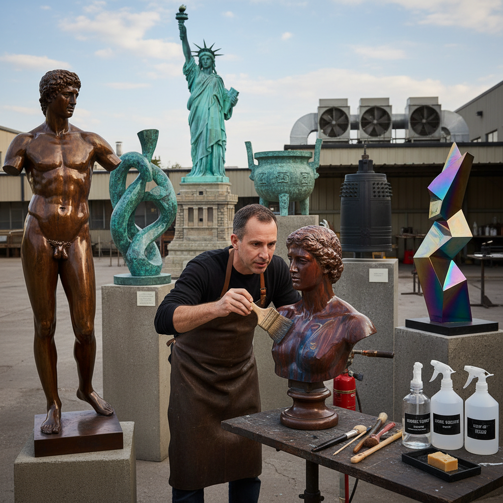

# Bronze Patina 青铜锈色

> "Patina is time made visible on metal — the slow chemistry of air, water, and minerals transforming bright bronze into a living surface of greens, browns, and blues, each color a record of the environment that created it, turning sculpture into a collaboration between the artist who shaped the form and the atmosphere that painted it over decades and centuries." — Unknown

## 概述

青铜锈色（Bronze Patina）是指青铜（铜合金）表面在自然环境或人工处理下形成的氧化层和化学反应层。Patina不仅是一种自然现象，也是一种被艺术家有意控制和创造的装饰技法。通过使用各种化学试剂（如肝硫、氯化铵、硝酸铁、醋酸铜等），艺术家可以在青铜表面创造出丰富多样的颜色效果——从深棕色到绿色、蓝色、红色、黑色等。

Patina在雕塑艺术中极其重要——几乎所有的青铜雕塑都需要经过patina处理来赋予最终的色彩和质感。自然patina需要数十年甚至数百年才能形成（如自由女神像的绿色铜锈），而人工patina可以在数小时内完成。Patina不仅提供美学效果，还能保护金属表面免受进一步腐蚀。

## 核心特征

| 特征 | 描述 |
|------|------|
| 氧化 | 金属表面的氧化反应 |
| 化学 | 化学试剂的应用 |
| 色彩 | 丰富的色彩变化 |
| 保护 | 保护金属表面 |
| 时间 | 自然patina需要时间 |
| 控制 | 人工patina可控制 |

## 视觉特征

- **绿色**：经典的铜绿色
- **棕色**：温暖的棕色调
- **斑驳**：斑驳的色彩变化
- **层次**：多层次的色彩
- **质感**：丰富的表面质感
- **古老**：古老的时间感

## 代表作品

| 作品 | 艺术家 | 年代 | 意义 |
|------|--------|------|------|
| *Statue of Liberty* | Frédéric Bartholdi | 1886 | 自由女神像的自然铜绿 |
| *Rodin bronzes* | Auguste Rodin | 19-20世纪 | 罗丹青铜雕塑的锈色 |
| *Chinese ritual bronzes* | 商周工匠 | 公元前16-3世纪 | 中国青铜器的锈色 |
| *Contemporary patina sculpture* | Various | 当代 | 当代锈色雕塑 |
| *Japanese bronze temple bells* | 日本工匠 | 传统 | 日本寺庙铜钟的锈色 |

## 历史时间线

| 时期 | 事件 |
|------|------|
| 青铜时代 | 自然patina的观察 |
| 古代 | 人工patina的早期实践 |
| 文艺复兴 | 雕塑patina技法的发展 |
| 19世纪 | 化学patina的系统化 |
| 当代 | patina作为独立艺术形式 |

## 中国语境

青铜锈色在中国有极其重要的文化意义。中国的商周青铜器经过数千年形成的自然锈色（铜绿、铁锈红、蓝绿色等）被视为珍贵的"包浆"——是文物真伪鉴定的重要依据。中国的青铜器收藏传统中，"生坑"（出土后未清理的自然锈色）和"熟坑"（经过把玩形成的包浆）都有独特的审美价值。当代中国的雕塑家在青铜雕塑创作中广泛使用人工patina技法。中国的仿古青铜器制作中，patina处理是关键的"做旧"工序。

## AI生成概念图

## 与其他风格的关系

- **Bronze Casting** → 青铜铸造
- **Sculpture** → 雕塑
- **Verdigris** → 铜绿
- **Metalwork** → 金属工艺
- **Oxidation Art** → 氧化艺术
- **Wabi-Sabi** → 侘寂美学

---

*浮光艺志 | Chronicle of Artistry*
