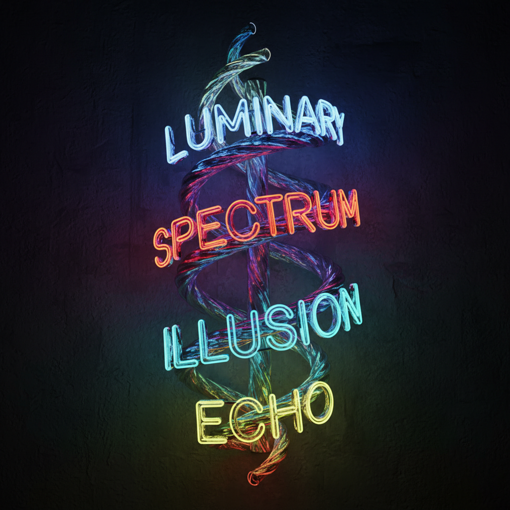

# Bruce Nauman 布鲁斯·瑙曼

> **时期：** 1941–至今  
> **关键词：** 多媒介实验、霓虹灯文字、身体极限、观念艺术

## 概述

Bruce Nauman 被广泛认为是在世最重要的美国艺术家之一，以拒绝固定风格和媒介而闻名。他的作品跨越霓虹灯文字雕塑、录像装置、行为记录、声音作品和建筑性走廊，统一的线索是对语言、身体、空间和观者心理的持续探索。

## 风格特征

- **媒介多变**：霓虹灯、录像、雕塑、声音、行为、建筑空间
- **语言游戏**：文字的双关、倒置和重复揭示语言的物质性
- **身体极限**：早期作品探索身体在工作室中的重复动作和极限状态
- **观者操控**：走廊和房间装置控制观者的身体体验和心理状态
- **不适感**：作品常制造焦虑、幽闭恐惧或认知失调

## 代表作品

- *The True Artist Helps the World by Revealing Mystic Truths*（1967）
- *Walk with Contrapposto*（1968）
- *One Hundred Live and Die*（1984）
- *Clown Torture*（1987）

## 历史意义

Nauman 是后极简主义和观念艺术的奠基人之一，他证明了艺术家不需要固定的风格或媒介，只需要持续的智识探索。他对语言、身体和空间的实验影响了此后几乎所有当代艺术的分支。

## 概念图

