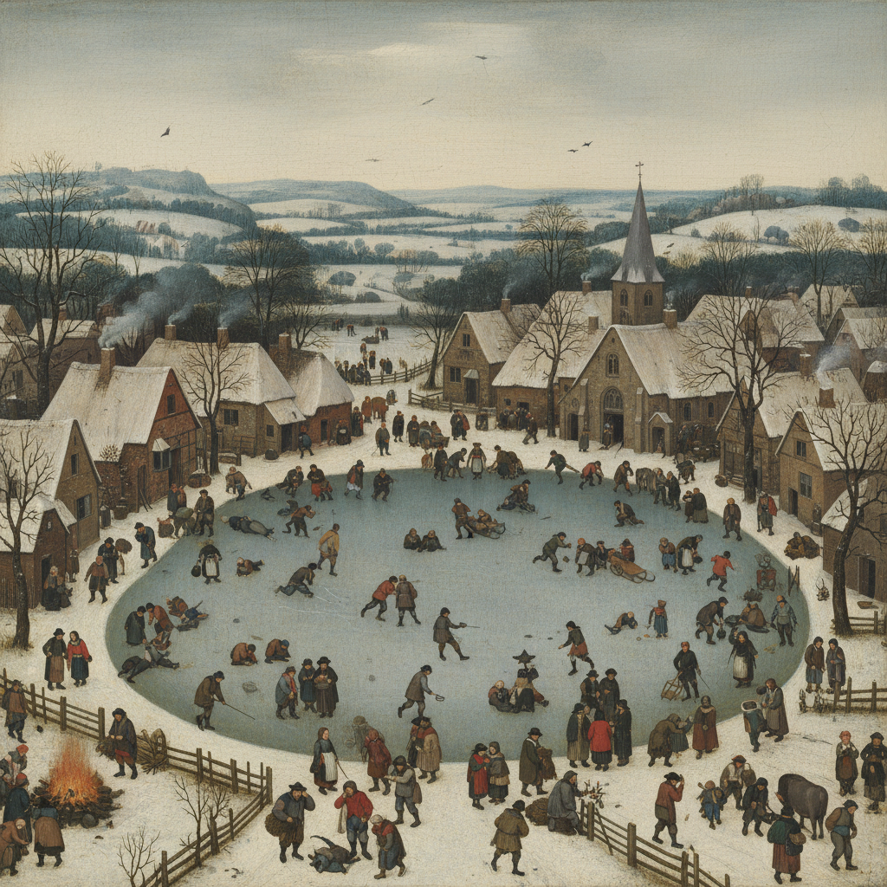

# Pieter Bruegel the Elder 老彼得·勃鲁盖尔

> "Bruegel painted the world as it is, not as it should be." — Art historian

## 概述

老彼得·勃鲁盖尔（Pieter Bruegel the Elder，c.1525–1569）是尼德兰文艺复兴最伟大的画家，以全景式的农民生活场景、季节风景和寓言画闻名。他的画面如同一部百科全书——数百个人物在广阔的风景中各自忙碌，每个角落都有故事。

勃鲁盖尔是"农民画家"，但他本人是受过良好教育的城市知识分子——他以一种既亲切又超然的目光观察人类的愚蠢、欢乐和苦难。

## 核心特征

| 特征 | 描述 |
|------|------|
| 全景构图 | 高视点俯瞰的广阔场景 |
| 群像叙事 | 数百个人物各自活动——无单一主角 |
| 农民生活 | 节庆、劳动、游戏的真实描绘 |
| 季节风景 | 四季变化中的尼德兰风景 |
| 寓言讽刺 | 谚语和寓言的视觉化 |
| 细节密度 | 每个角落都有可发现的细节 |

## 视觉特征

- **视角**：高视点鸟瞰——全景式构图
- **人物**：小而众多——蚂蚁般忙碌的人群
- **风景**：广阔的尼德兰平原和山丘
- **色彩**：自然的土色调——随季节变化
- **细节**：极其丰富的叙事细节
- **氛围**：既欢乐又忧郁——人类喜剧

## 代表作品

| 作品 | 年代 | 意义 |
|------|------|------|
| *Hunters in the Snow* | 1565 | 西方风景画的巅峰 |
| *The Tower of Babel* | 1563 | 人类野心的寓言 |
| *Netherlandish Proverbs* | 1559 | 100多个谚语的视觉化 |
| *The Peasant Wedding* | 1567 | 农民生活的尊严 |
| *The Fall of Icarus* | c.1558 | 悲剧在日常中被忽视 |

## 真实作品（公共领域）

| 作品 | 来源 |
|------|------|
| *Hunters in the Snow* | [Kunsthistorisches Museum](https://www.khm.at/en/) |
| *The Tower of Babel* | [Kunsthistorisches Museum](https://www.khm.at/en/) |
| *Netherlandish Proverbs* | [Gemäldegalerie Berlin](https://www.smb.museum/en/museums-institutions/gemaeldegalerie/) |

> ⚠️ 本条目优先使用真实作品。

## AI生成概念图

## 与其他风格的关系

- **Northern Renaissance** → 尼德兰文艺复兴的巅峰
- **Genre Painting** → 风俗画的奠基人
- **Landscape Painting** → 独立风景画的先驱
- **Bosch** → 继承了博斯的幻想传统
