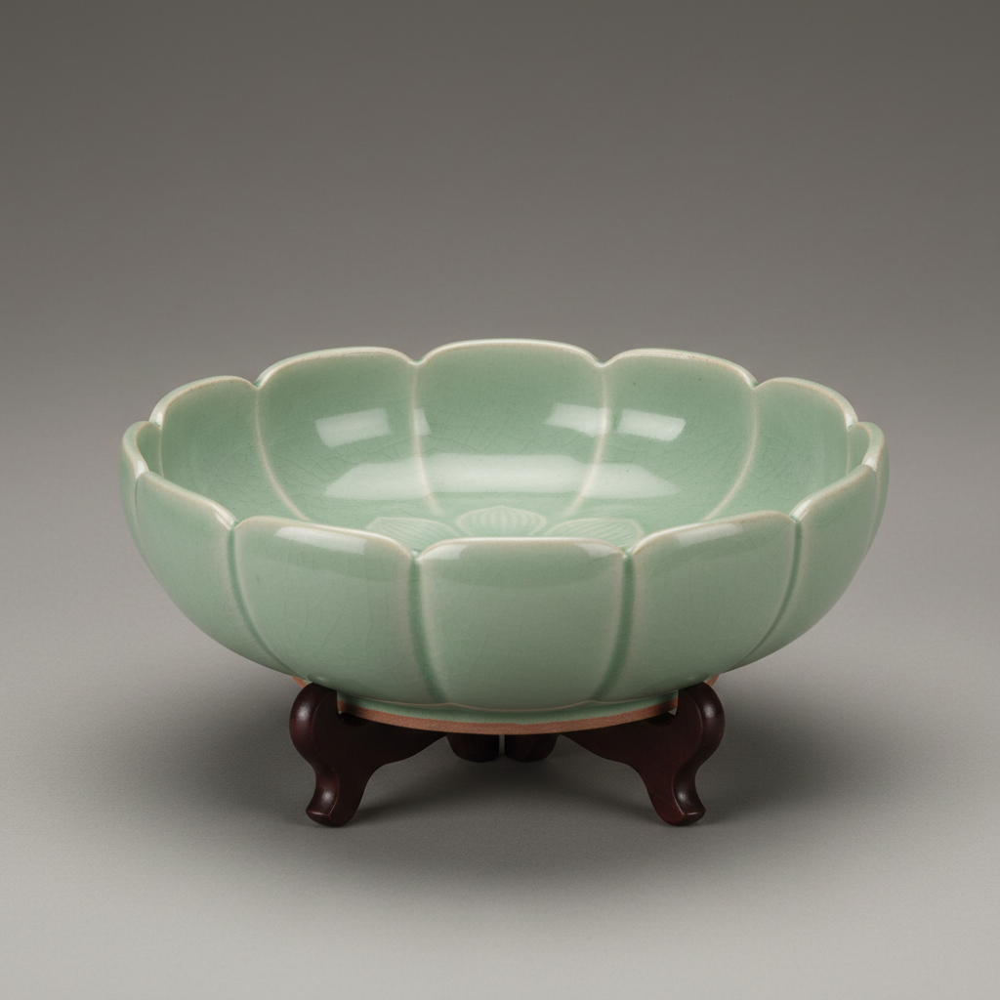

# Brush Washer Art 笔洗艺术

> "The brush washer is a lake on the scholar's desk — a shallow vessel of still water in which ink-laden brushes are swirled clean, its interior gradually staining with the ghost of ten thousand characters, its form kept low and open so the calligrapher can watch the ink dissolve into clouds, a functional object elevated by centuries of refinement into one of the most collected forms in Chinese ceramics." — Unknown

## 概述

笔洗艺术（Brush Washer Art）是一种以文房用具——笔洗——为核心的陶瓷艺术形式。笔洗是中国传统书画创作中用于清洗毛笔的浅口容器，通常造型低矮、口径较大，便于在其中涮洗毛笔。笔洗虽然功能简单，但因其在文人书房中的重要地位和长期使用的亲密关系，历代文人和陶工都在笔洗的造型、釉色和装饰上倾注了大量心血，使其成为中国陶瓷中最精致的品类之一。

笔洗艺术的核心要素包括：1）浅口造型——便于涮洗毛笔的低矮器形；2）适当容量——容纳足够清水；3）内壁光滑——便于清洗和观赏墨色变化；4）造型优雅——文人审美的体现；5）釉色讲究——温润如玉的釉面；6）把玩性——适合日常欣赏把玩；7）收藏传统——历代文人的收藏重点。

## 核心特征

| 特征 | 描述 |
|------|------|
| 浅口宽体 | 低矮宽口的器形 |
| 文房核心 | 书房中的重要器具 |
| 釉色温润 | 如玉般的釉面质感 |
| 造型多样 | 从简约到繁复 |
| 收藏价值 | 历代文人的收藏重点 |
| 日常亲密 | 每日使用的亲密器物 |

## 视觉特征

- **低矮造型**：扁平的浅碗形
- **温润釉色**：如玉般的青绿或白色
- **花口造型**：花瓣形的口沿
- **仿生造型**：荷叶、葵花等自然形
- **光滑内壁**：便于观赏墨色的光滑内壁
- **精致足底**：精心修整的底足

## 代表作品

| 作品 | 艺术家/文化 | 年代 | 意义 |
|------|-------------|------|------|
| *汝窑天青笔洗* | 中国汝窑 | 宋代 | 笔洗的巅峰之作 |
| *官窑葵口笔洗* | 中国官窑 | 宋代 | 官窑笔洗经典 |
| *龙泉窑莲瓣笔洗* | 中国龙泉 | 宋代 | 青瓷笔洗之美 |
| *景德镇青花笔洗* | 中国景德镇 | 明清 | 青花笔洗传统 |
| *当代笔洗* | 各地陶艺家 | 当代 | 笔洗的当代诠释 |

## 历史时间线

| 时期 | 事件 |
|------|------|
| 汉代 | 早期笔洗的出现 |
| 宋代 | 笔洗艺术的巅峰 |
| 明代 | 笔洗造型的丰富化 |
| 清代 | 笔洗收藏文化的繁荣 |
| 当代 | 笔洗在当代文房中的延续 |

## 中国语境

笔洗是中国文房文化最具代表性的器物之一——它的存在完全依赖于中国的毛笔书写传统。中国历代名窑都烧制过精美的笔洗：宋代汝窑的天青笔洗是中国陶瓷的至高杰作之一，一只汝窑笔洗在拍卖市场上可达数亿元人民币。笔洗的造型设计体现了中国文人"器以载道"的理念——一只好的笔洗不仅是实用器具，更是审美修养的体现。中国当代书画家仍然使用笔洗——虽然现代笔洗的材质更加多样，但陶瓷笔洗因其温润的质感和深厚的文化内涵，始终是文人的首选。

## AI生成概念图

## 与其他风格的关系

- **Scholar's Object** → 文房器
- **Celadon** → 青瓷
- **Ru Ware** → 汝窑
- **Water Dropper** → 水滴
- **Inkstone** → 砚台
- **Calligraphy** → 书法

---

*浮光艺志 | Chronicle of Artistry*
