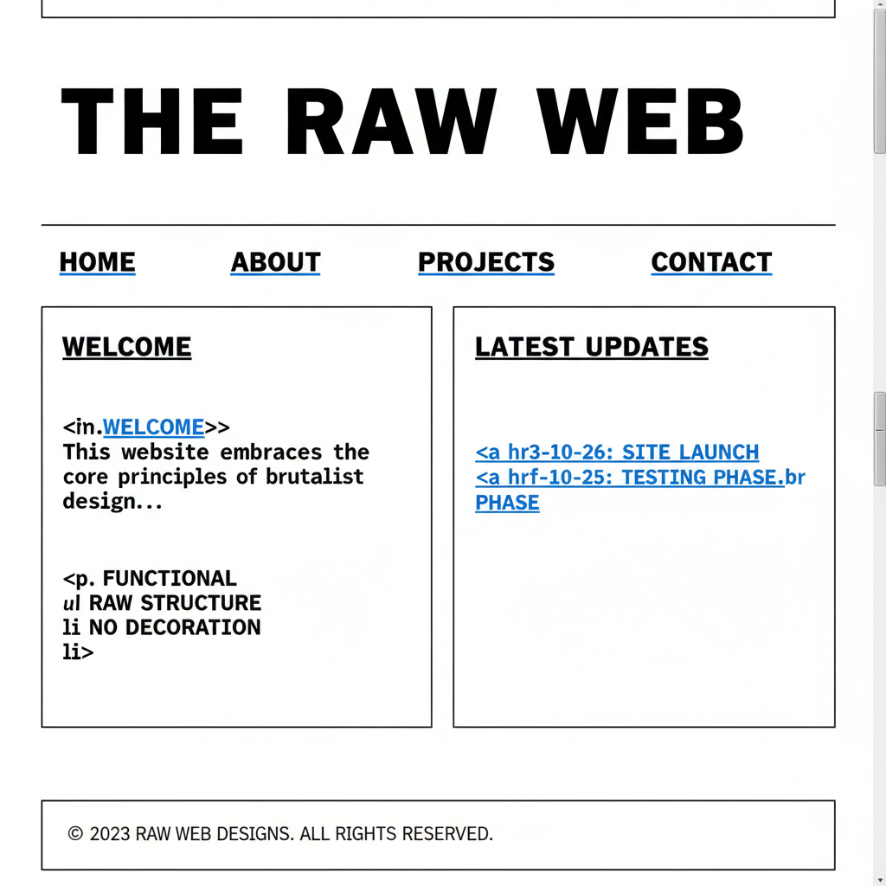

# Brutalism Design 野兽派设计



> **"裸露的结构、粗暴的排版、故意的丑——在过度设计的时代选择原始。"**

## 概述

| 维度 | 描述 |
|------|------|
| 时期 | 2014–至今（数字设计）/1950s（建筑） |
| 别名 | Brutalist Design, Brutalist Web Design, Anti-Design |
| 核心色彩 | 黑色、白色、原始灰、偶尔荧光色 |
| 关键元素 | 裸露结构、粗暴排版、无装饰、故意"丑"、功能至上 |
| 代表人物 | Bloomberg, Balenciaga (网站), Craigslist, brutalistwebsites.com |
| 关联风格 | Anti-Design, Deconstructivism, Punk, Swiss Style (反面) |

---

## 历史脉络

| 年份 | 事件 |
|------|------|
| 1950s | 建筑野兽主义——Le Corbusier, 裸露混凝土 |
| 2014 | "Brutalist Web Design" 概念出现 |
| 2016 | brutalistwebsites.com 上线——运动命名 |
| 2018 | Balenciaga 网站——高端时尚采用野兽派 |
| 2020 | Bloomberg 重新设计——主流媒体野兽派 |
| 2020s | 野兽派成为"反设计"的设计趋势 |

### 核心哲学

野兽派设计的精神是**"不要美化——让结构说话"**：
- 裸露 = 诚实（"不隐藏HTML的骨架"）
- 粗暴 = 力量（"大字体不是为了好看——是为了被看到"）
- 反装饰 = 立场（"在一切都被'设计'的时代——不设计是一种设计"）
- 功能 = 核心（"Craigslist 丑但好用——这就够了"）
- "野兽派不是不会设计——是选择不'设计'"

---

## 视觉语法

### 色彩系统

```
主色：
  黑色 (#000000) — 文字、结构
  白色 (#FFFFFF) — 背景、空间
  灰色 (#808080) — 中性

辅色（偶尔）：
  荧光色 — 强调、讽刺
  原始蓝 (#0000FF) — 默认链接色
  原始红 (#FF0000) — 警告

规则：
  - 极少颜色
  - 系统默认色
  - 不追求"和谐"
  - 颜色服务于功能

质感：
  无 — 纯平面
  系统字体 — 默认
  边框 — 1px solid
  裸HTML — 无CSS装饰
```

### 标志性元素

| 类别 | 元素 |
|------|------|
| 排版 | 超大字体、系统字体、无衬线、粗暴 |
| 布局 | 裸露网格、无装饰、功能性 |
| 交互 | 默认样式、无动画、直接 |
| 图片 | 少或无、原始尺寸、无裁切 |
| 代码 | 可见结构、最少CSS |
| 态度 | 反装饰、功能至上、诚实、粗暴 |

---

## 与千禧怀旧的关系

### 对"过度设计"的反叛
- 2010s 设计趋势：渐变、阴影、动画、微交互
- 野兽派 = 对这一切的"够了！"
- "在所有网站都长一样的时代——丑是一种个性"
- 与 Punk 精神的呼应："三个和弦就够了"

### 高端时尚的采用
- Balenciaga, Vetements——野兽派网站
- "越贵的品牌越敢用丑设计"
- 野兽派 = 新的"高级感"？
- "当所有人都在追求美——丑变成了奢侈品"

---

## 中国语境

- 中国互联网的"功能至上"传统（早期淘宝、贴吧）
- 中国设计师对野兽派的实验
- 与中国"反设计"/"去设计"讨论的交叉
- 中国独立品牌的野兽派尝试

---

## 设计应用

| 场景 | 应用方式 |
|------|----------|
| 网页 | 裸露结构+系统字体+无装饰+功能 |
| 品牌 | 反装饰+粗暴+诚实+独特+立场 |
| 出版 | 大字体+无图+结构化+直接 |
| 时尚 | 高端反设计+极简+粗暴+态度 |

---

## 相关风格

← [Flat Design 扁平设计](flat-design.md) | [Punk 朋克](punk.md) →

↑ [返回千禧怀旧目录](README.md) | [返回总目录](../README.md)
