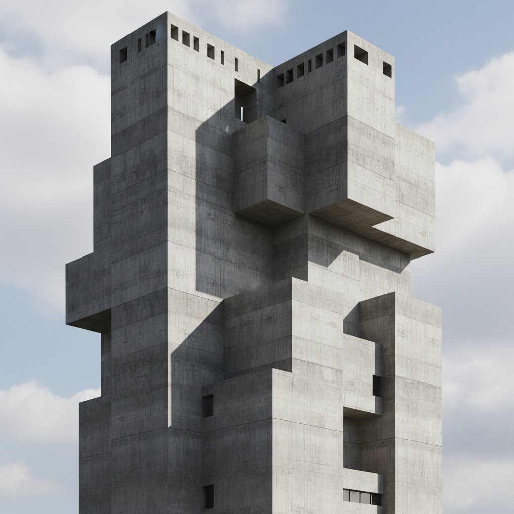

# Brutalism 粗野主义



> **"裸露混凝土、几何体块、不加修饰——建筑不需要讨好你。"**

## 概述

| 维度 | 描述 |
|------|------|
| 时期 | 1950s–1970s 建筑 / 2010s 数字复兴 |
| 别名 | Brutalism, Béton Brut, Neo-Brutalism (数字) |
| 核心色彩 | 混凝土灰、黑色、白色、偶尔原色点缀 |
| 关键元素 | 裸露混凝土、几何体块、粗糙质感、无装饰 |
| 代表人物 | Le Corbusier、Tadao Ando、Zaha Hadid |
| 关联风格 | Minimalism, Industrial, Cyberpunk, Bauhaus |

---

## 历史脉络

### 从战后重建到数字设计

| 年份 | 事件 |
|------|------|
| 1952 | Le Corbusier 马赛公寓落成 |
| 1954 | "Brutalism" 一词首次使用 |
| 1960s–70s | 全球粗野主义建筑浪潮 |
| 1980s | 后现代主义取代，粗野主义被嫌弃 |
| 2010s | Instagram 上的粗野主义建筑摄影复兴 |
| 2018 | "Neo-Brutalism" 网页设计风格出现 |
| 2020s | 粗野主义成为"酷"的代名词 |

### 它代表什么？

| 元素 | 含义 |
|------|------|
| 裸露混凝土 | 诚实、不伪装、"材料就是材料" |
| 几何体块 | 力量、秩序、理性 |
| 无装饰 | 反对虚伪、反对讨好 |
| 巨大尺度 | 集体主义、公共性 |
| 粗糙表面 | 真实、不完美的美 |

### 核心哲学

Brutalism 的精神是**"建筑/设计不需要讨好任何人"**：
- 材料的真实 > 表面的美化
- 功能决定形式
- 不隐藏结构——展示它
- "丑"也是一种美学立场
- 诚实比漂亮更重要

---

## 视觉语法

### 色彩系统

```
主色：
  混凝土灰 (#808080) — 核心
  黑色 (#000000) — 阴影、文字
  白色 (#FFFFFF) — 对比
  深灰 (#333333) — 结构

辅色（Neo-Brutalism 数字版）：
  黄色 (#FFFF00) — 警示、点缀
  红色 (#FF0000) — 强调
  蓝色 (#0000FF) — 链接

规则：
  - 灰色为主
  - 原色只用于功能标识
  - 高对比度
  - 不用渐变
  - 不用圆角（或极少）

质感：
  混凝土 — 粗糙、有纹理
  钢铁 — 冷硬、工业
  玻璃 — 透明、对比
  木模板印痕 — 建造过程的痕迹
```

### 标志性元素

| 类别 | 元素 |
|------|------|
| 建筑 | 裸露混凝土、悬挑结构、几何体块 |
| 数字 | 粗边框、大字体、高对比、无圆角 |
| 排版 | 超大字号、粗体、等宽字体 |
| 布局 | 网格、不对称、大色块 |
| 图形 | 几何形状、黑白、硬边 |

---

## Neo-Brutalism 数字设计

### 从建筑到网页

| 建筑粗野主义 | 数字粗野主义 |
|-------------|-------------|
| 裸露混凝土 | 裸露代码/结构 |
| 无装饰 | 无渐变/阴影 |
| 几何体块 | 大色块/粗边框 |
| 功能优先 | 内容优先 |
| 不讨好 | 不"用户友好" |

### 代表网站
- Craigslist（无意的粗野主义）
- Bloomberg（有意的粗野主义）
- Gumroad 新版设计
- 各种独立设计师作品集

---

## 与千禧怀旧的关系

### 对"圆角+渐变"的反叛
- 2010s = iOS 7 扁平化 → Material Design → 圆角一切
- Neo-Brutalism = "我受够了友好的设计"
- 是对过度"用户体验优化"的反叛
- "不是所有东西都需要看起来'舒服'"

---

## 中国语境

- 中国的粗野主义建筑遗产（工人文化宫、体育馆）
- "水泥风"/"工业风"在室内设计的流行
- 安藤忠雄在中国的影响力
- 数字粗野主义在中国独立设计圈的应用

---

## 设计应用

| 场景 | 应用方式 |
|------|----------|
| 网页 | 粗边框+大字体+高对比+无圆角 |
| 品牌 | 黑白+几何+粗体字+极简 |
| 空间 | 裸露混凝土+钢铁+极简家具 |
| 出版 | 大字号+网格+黑白+硬边 |

---

## 相关风格

← [Minimalism 极简主义](minimalism.md) | [Industrial 工业风](industrial.md) →

↑ [返回千禧怀旧目录](README.md) | [返回总目录](../README.md)
